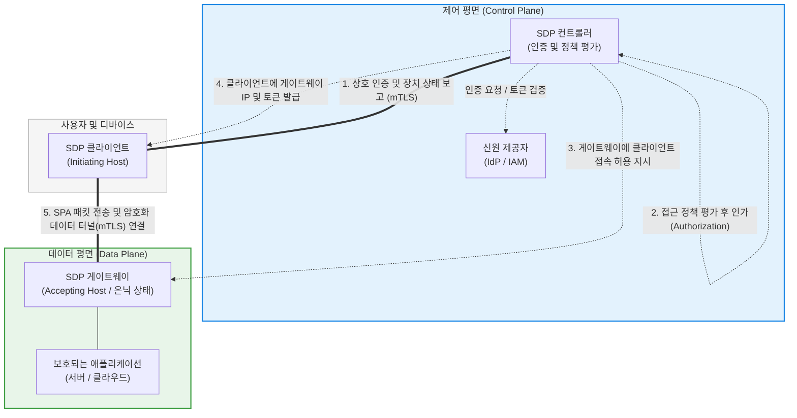

# SDP (Software Defined Perimeter)

---

## I. 제로 트러스트를 구현하는 차세대 네트워크 보안 아키텍처, SDP의 개요

* **정의**: 신원(Identity) 기반으로 접근을 통제하고, 인증받지 않은 사용자나 디바이스에게는 네트워크 인프라를 완전히 보이지 않게 은닉(Black Cloud)하는 소프트웨어 기반의 논리적 경계 보안 모델 (클라우드 보안 협회(CSA) 제안)
* **등장 배경 및 필요성**:
* 클라우드 도입과 원격 근무의 확산으로 인해 내부망(안전)과 외부망(위험)을 구분하던 기존의 물리적 네트워크 경계(Perimeter)가 붕괴됨
* 기존 [[VPN]](Virtual Private Network)은 네트워크 전체에 대한 광범위한 접근 권한을 부여하여, 해커가 내부망 진입 후 다른 서버로 이동하는 횡적 이동(Lateral Movement)에 매우 취약함

* **특징**: "선 인증, 후 연결 (Authenticate First, Connect Second)"이라는 철학을 바탕으로, [[SDN(Software Defined Network)|SDN]](소프트웨어 정의 네트워킹)처럼 제어 평면(Control Plane)과 데이터 평면(Data Plane)을 물리적으로 분리하여 강력한 마이크로 세그멘테이션을 구현함

---

## II. SDP의 아키텍처 및 핵심 구성요소

### 가. CSA (Cloud Security Alliance) 표준 SDP 동작 아키텍처

### 나. SDP의 3대 핵심 컴포넌트 및 동작 기술

| 분류 | 요소명 (키워드) | 세부 설명 및 역할 |
| --- | --- | --- |
| **구성 요소** | **SDP 컨트롤러 (Controller)** | 전체 시스템의 두뇌(제어 평면). 사용자의 신원(Identity)과 디바이스의 보안 상태(OS 버전, 백신 등)를 평가하여 **접근 정책(Policy)을 결정**하는 중앙 통제 서버 |
| **구성 요소** | **SDP 클라이언트 (IH)** | 사용자 단말에 설치되는 에이전트(Initiating Host). 컨트롤러에 접속하여 단말 정보를 제공하고 인가를 요청함 |
| **구성 요소** | **SDP [[게이트웨이]] (AH)** | 보호할 애플리케이션 앞단에 위치하는 데이터 평면(Accepting Host). 컨트롤러의 지시가 있기 전까지 모든 외부 트래픽을 무시(Drop)하여 인프라를 은닉함 |
| **핵심 기술** | **SPA (단일 패킷 인증)** 

 *Single Packet Authorization* | 클라이언트가 게이트웨이에 접속하기 전, 암호화된 단일 패킷(SPA 패킷)을 보내 자신을 증명하는 기술. **이 패킷이 없으면 게이트웨이는 [[방화벽]] 포트를 아예 열지 않아 포트 스캐닝을 원천 차단(Black Cloud)함** |
| **핵심 기술** | **mTLS (상호 TLS)** | 서버와 클라이언트가 서로의 인증서를 검증하는 기술로, 중간자 공격(MiTM)을 방지하고 암호화된 통신 터널을 생성함 |

---

## III. 전통적 원격 접속(VPN)과의 비교 및 최신 동향

### 가. 레거시 VPN vs 소프트웨어 정의 경계(SDP) 비교

| 비교 항목 | 전통적 VPN (Virtual Private Network) | SDP (Software Defined Perimeter) |
| --- | --- | --- |
| **접속 메커니즘** | **선 연결, 후 인증** (게이트웨이가 인터넷에 노출됨) | **선 인증, 후 연결** (인가 전까지 인프라 완전 은닉) |
| **접근 권한 부여** | **네트워크(서브넷) 레벨 부여** (과도한 권한) | **애플리케이션(App) 레벨 부여** (마이크로 [[세그멘테이션]]) |
| **보안 가시성** | 해커의 포트 스캐닝에 VPN 게이트웨이가 탐지됨 | **Black Cloud (인증 전에는 Ping, Scan 모두 무응답)** |
| **횡적 이동 방어** | 내부망 접속 후 다른 서버로의 이동(해킹)이 쉬움 | 허용된 특정 앱 외에는 라우팅 불가능 (횡적 이동 원천 차단) |
| **컨텍스트 인식** | 주로 ID/PW 중심 인증 | 신원, 디바이스 상태, 위치 등 다양한 동적 컨텍스트 기반 |

### 나. 현대 보안 패러다임 속 SDP의 역할과 동향

* **ZTNA([[제로 트러스트 보안모델|Zero Trust]] Network Access)의 구현 아키텍처**: "제로 트러스트(Zero Trust)"가 '아무것도 신뢰하지 않는다'는 철학 및 개념이라면, SDP는 그 제로 트러스트를 실제 네트워크 상에서 구현해 내는 가장 대표적이고 구체적인 아키텍처 모델(ZTNA)로 평가받고 있습니다.
* **SASE 및 SSE 인프라로의 통합**: 글로벌 엔터프라이즈 환경에서는 단독 SDP 솔루션을 도입하기보다는, [[SD-WAN (Software-Defined Wide Area Network)|SD-WAN]] 기반 라우팅 제어 및 SWG(시큐어 웹 게이트웨이), CASB 등과 통합된 **[[SASE(Secure Access Service Edge)]]** 플랫폼의 핵심 보안 모듈로서 SDP/ZTNA를 구독형(As-a-Service)으로 도입하는 트렌드가 지배적입니다.

---

### 🔗 연관 토픽

- **소속 도메인**: [[00_보안_MOC|🛡️ 보안]]
- **세부 분류**: `2. 현대 암호학 & 키 관리 · 전자서명`
- **핵심 연관 토픽**:
  - [[제로 트러스트 보안모델|제로 트러스트 (Zero Trust) 보안모델]]
  - [[SASE(Secure Access Service Edge)]]
  - [[방화벽]]
  - [[SDN(Software Defined Network)]]
  - [[VPN|VPN(Virtual Private Network)]]
