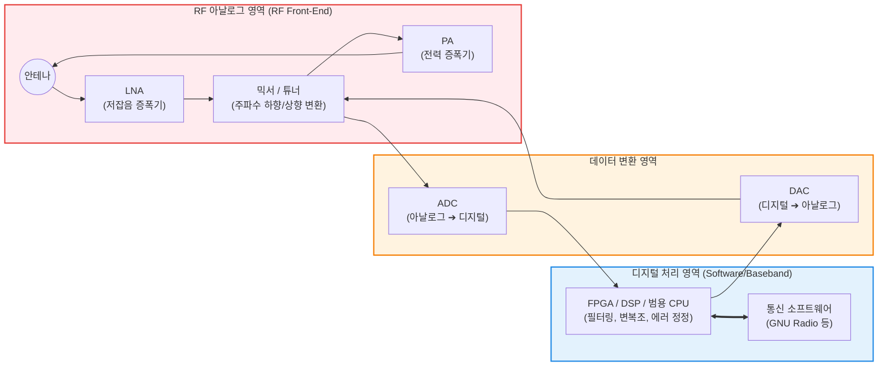

# SDR (Software Defined Radio)

---

## I. 통신 인프라의 소프트웨어화, SDR의 개요

* **정의**: 기존 무선 통신 기기에서 하드웨어(믹서, 필터, 증폭기, 변복조기 등)로 구현되었던 신호 처리 및 무선 통신 기능을 **DSP, FPGA, 혹은 범용 컴퓨터(GPP) 상의 소프트웨어 모듈로 대체하여 구현한 무선 통신 기술**
* **등장 배경 및 필요성**:
* 기존의 하드웨어 기반 무선 기기(Hardware-Defined Radio)는 특정 주파수와 통신 표준(예: 3G, 4G, Wi-Fi, 블루투스 등)에 종속된 전용 칩셋(ASIC)을 사용하므로, 새로운 표준이나 주파수 대역을 지원하려면 하드웨어 전체를 교체해야 하는 비용과 시간이 발생함.
* 다양한 통신 프로토콜을 하나의 기기에서 수용하고, 주파수 자원을 유연하게 활용하며, 원격 소프트웨어 업데이트만으로 기기의 기능을 완전히 바꿀 수 있는 통신 플랫폼의 필요성 대두 (미 국방부의 JTRS 프로젝트가 시초).

* **특징**: 안테나와 A/D(아날로그-디지털) 변환기 사이의 아날로그 RF 구간을 최소화하고, 대부분의 기저대역(Baseband) 신호 처리를 소프트웨어로 수행하여 다중 대역(Multi-band), 다중 표준(Multi-standard)을 단일 하드웨어에서 지원함.

---

## II. SDR의 아키텍처 및 핵심 구성요소

### 가. SDR 트랜시버(송수신기) 기본 아키텍처 개념도

### 나. SDR의 4대 핵심 하드웨어 및 소프트웨어 요소

| 분류 | 요소명 (키워드) | 세부 설명 및 역할 |
| --- | --- | --- |
| **아날로그** | RF Front-End (RFFE) | 안테나를 통해 들어온 미세한 아날로그 신호를 증폭(LNA)하고, 처리하기 쉬운 중간 주파수(IF)나 기저대역으로 낮추거나(Down-conversion) 높이는(Up-conversion) 역할 수행 |
| **변환 인터페이스** | **ADC / [[DAC]]** | 아날로그 신호를 디지털 데이터로 변환(ADC)하거나 역으로 변환(DAC)하는 핵심 부품. **SDR의 대역폭과 해상도(성능)를 결정짓는 가장 중요한 병목 지점**임 |
| **디지털 하드웨어** | FPGA / DSP | 범용 [[CPU]]만으로는 감당하기 어려운 초고속 실시간 데이터 스트림(고속 퓨리에 변환, 필터링 등)을 병렬로 고속 처리하는 프로그래머블 반도체 |
| **소프트웨어** | 신호 처리 [[프레임워크]] | 디지털화된 I/Q(In-phase/Quadrature) 샘플 데이터를 소프트웨어 블록 다이어그램 형태로 조립하여 변복조를 수행하는 환경 (대표적 오픈소스: **GNU Radio**) |

---

## III. 전통적 무선 시스템과의 비교 및 최신 동향

### 가. 전통적 라디오(ASIC) vs SDR 비교

| 비교 항목 | 전통적 하드웨어 라디오 (Legacy) | SDR (Software Defined Radio) |
| --- | --- | --- |
| **기능 구현 방식** | 하드웨어 칩셋(ASIC) 배선으로 고정 | **소프트웨어 프로그래밍 (코드) 기반** |
| **통신 표준 변경** | 불가능 (하드웨어 자체를 전면 교체해야 함) | **펌웨어/소프트웨어 업데이트로 즉각 변경 가능** |
| **유연성 및 호환성** | 특정 주파수 및 단일 [[프로토콜]] 전용 | **광대역 주파수 수용 및 다중 프로토콜 지원** |
| **개발 및 수정 비용** | 초기 칩셋 설계 비용(NRE)이 매우 높음 | 상용 기성품(COTS) 하드웨어 사용으로 저렴, 수정 용이 |
| **전력 소모 / 크기** | 목적에 최적화되어 작고 전력 소모가 적음 | 범용 연산 장치를 사용하여 전력 소모가 상대적으로 큼 |

### 나. SDR의 파급 효과 및 최신 통신 아키텍처 동향

* **CR (Cognitive Radio, 인지 무선)의 기반 기술**: SDR 기술을 바탕으로 AI와 머신러닝을 결합하여, 주변의 전파 환경을 실시간으로 인지하고 비어있는 주파수 대역(White Space)을 찾아 자동으로 통신 매개변수를 최적화하는 CR 기술로 진화하고 있습니다.
* **5G/6G 이동통신 인프라의 [[가상화]] (vRAN / [[O-RAN]])**: 기지국 장비(BBU)를 특정 벤더의 전용 하드웨어에서 벗어나, 범용 서버(x86) 상의 소프트웨어로 구현하는 **가상화 기지국(vRAN)** 및 **오픈랜(O-RAN)** 아키텍처는 SDR 패러다임이 이동통신 코어망을 넘어 무선 접속망(RAN) 전체로 확장된 결과입니다.
* **우주 및 군사 통신망의 필수 요소**: 발사 후 하드웨어 수리가 불가능한 인공위성 탐사선이나, 다국적군이 서로 다른 통신 장비로 연합 작전을 수행해야 하는 전술 통신망에서 원격으로 통신 프로토콜을 통일할 수 있는 SDR은 필수 표준으로 자리 잡았습니다.

---

### 🔗 연관 토픽

- **소속 도메인**: [[00_네트워크_MOC|🌐 네트워크]]
- **세부 분류**: `4. 무선 및 차세대 이동통신 (5G/6G/Wi-Fi)`
- **핵심 연관 토픽**:
  - [[O-RAN]]
  - [[프로토콜]]
  - [[가상화]]
  - [[C-RAN(Centralized Cloud RAN)|C-RAN(Centralized / Cloud RAN)]]
  - [[프레임워크]]
