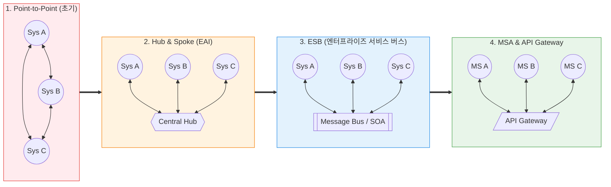

# SI (System Integration, 시스템 통합)

---

## I. 기업 IT 비즈니스의 구현체, SI의 개요

* **정의**: 기업의 비즈니스 목표를 달성하기 위해 파편화된 정보 시스템, 소프트웨어, 하드웨어, 네트워크 솔루션 등을 하나의 유기적인 시스템으로 통합(Integration)하여 최적화된 IT 인프라를 기획, 설계, 구축, 운영하는 종합 정보통신 서비스
* **등장 배경 및 필요성**:
* 기업 규모가 커짐에 따라 ERP, [[CRM]], [[SCM (Supply Chain Management)|SCM]], HR 등 다양한 이기종(Heterogeneous) 시스템이 개별적으로 도입되면서 데이터 고립(Silo)과 [[프로세스]] 단절 문제가 발생함
* 기성 소프트웨어(COTS) 패키지만으로는 특정 기업의 고유한 비즈니스 프로세스를 100% 수용할 수 없어, 맞춤형(Custom) 개발 및 이종 시스템 간의 완벽한 상호 운용성(Interoperability) 확보가 필수적임

* **특징**: 단순한 코딩(개발)을 넘어 고객의 비즈니스 프로세스 분석([[ISP (Information Strategy Plan)|ISP]]), 하드웨어 및 [[소프트웨어 아키텍처]] 설계, 구현, 테스트, 이관(Migration)에 이르는 **소프트웨어 개발 생명주기([[SDLC]]) 전체를 아우르는 B2B 프로젝트 수행 방식**을 의미함

---

## II. 시스템 통합(Integration) 아키텍처의 진화

### 가. 통합 토폴로지 발전 개념도

### 나. SI 시스템 통합의 3대 핵심 계층

성공적인 SI는 단순히 네트워크를 연결하는 것이 아니라, 다음 3가지 관점에서의 통합을 이루어내는 것입니다.

|**통합 계층**|**핵심 기술 및 솔루션**|**세부 설명**|
|---|---|---|
|**데이터 통합**      (Data Level)|**ETL, [[EAI]], MDM**|이기종 [[데이터베이스]] 간의 포맷 불일치를 해소하고 데이터를 추출/변환/적재(ETL)하거나, 기준 정보(MDM)를 일원화하여 데이터의 정합성을 보장함|
|**애플리케이션 통합**      (App Level)|**EAI, ESB, API**|서로 다른 애플리케이션 모듈(예: ERP와 쇼핑몰)이 메시지 큐, 어댑터, 혹은 REST API를 통해 실시간으로 비즈니스 로직을 호출하고 데이터를 교환함|
|**프로세스 통합**      (Process Level)|**BPM, 워크플로우 엔진**|사람의 개입 없이 시스템 간의 업무 흐름(결재, 발주, 배송 등)을 엔드투엔드([[End-to-End]])로 자동화하고 오케스트레이션(BPM)하여 비즈니스 가치를 창출함|

---

## III. SI 비즈니스 생태계 및 최신 클라우드 전환 동향

### 가. 엔터프라이즈 IT 서비스 라이프사이클 (ISP @@@PROT_1@@@ SI @@@PROT_2@@@ SM)

기업의 IT 시스템은 다음과 같은 주기를 거치며, SI는 구축(Build) 단계를 담당합니다.

1. **ISP (Information [[Strategy (알고리즘 교체)|Strategy]] Planning, 정보화 전략 계획)**: 비즈니스 목표 달성을 위한 IT 마스터플랜 수립 (현행 분석, To-Be 모델 설계, ROI 분석).
2. **SI (System Integration, 시스템 구축)**: ISP를 바탕으로 실제 하드웨어 인프라를 세팅하고, 소프트웨어를 개발 및 통합하여 런칭하는 단계.
3. **SM (System Management, 시스템 운영/[[유지보수]])**: 구축된 시스템을 장애 없이 24시간 운영(ITO)하며, 사용자 요구사항에 맞춰 지속적으로 코드를 패치하고 개선하는 단계.

### 나. 차세대 SI (Cloud SI)로의 패러다임 전환

* **On-Premise에서 Cloud Native로**: 과거의 SI가 고객사 전산실에 하드웨어(서버, 스토리지)를 납품하고 그 위에 모놀리식(Monolithic) 애플리케이션을 구축하는 방식이었다면, 현재의 SI는 AWS, Azure 기반의 클라우드 인프라(IaaS)를 설계하고 [[컨테이너]](Kubernetes) 기반의 마이크로서비스([[MSA (Micro Service Architecture)|MSA]])를 개발하는 "Cloud SI"로 급격히 전환되었습니다.
* **SaaS 연동 및 API 경제(API Economy)**: 모든 시스템을 밑바닥부터 자체 개발(Scratch)하던 관행에서 벗어나, Salesforce(CRM), Workday(HR) 등 글로벌 SaaS 솔루션을 도입하고 이를 기업의 레거시 시스템과 **API 게이트웨이를 통해 연동(Integration)하는 역량**이 현대 SI 기업의 핵심 경쟁력이 되었습니다.
* **Low-Code / No-Code 플랫폼 도입**: 개발자 부족과 긴 프로젝트 기간을 극복하기 위해, 복잡한 코딩 없이 드래그 앤 드롭으로 UI와 비즈니스 로직을 조립하여 시스템을 통합하는 로우코드 플랫폼이 SI 프로젝트의 생산성을 혁신하고 있습니다.

---

### 🔗 연관 토픽

- **소속 도메인**: [[00_경영전략_MOC|📈 경영전략]]
- **세부 분류**: `2. IT 거버넌스 & 엔터프라이즈 아키텍처 (EA/ISP)`
- **핵심 연관 토픽**:
  - [[EAI]]
  - [[ISP (Information Strategy Plan)]]
  - [[SDLC]]
  - [[MSA (Micro Service Architecture)]]
  - [[컨테이너|컨테이너 (Container)]]
