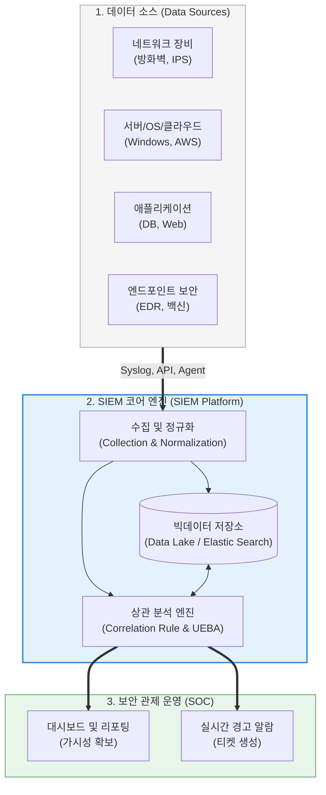

# SIEM (Security Information and Event Management)

---

## I. 이기종 보안 데이터의 중앙 집중식 통합 관제 플랫폼, SIEM의 개요

* **정의**: 시스템, 네트워크, 애플리케이션 등 엔터프라이즈 인프라 전반에서 발생하는 보안 로그와 이벤트를 중앙에서 수집하여, 실시간으로 분석하고 보안 위협을 탐지 및 대응하는 **통합 보안 관제(SOC)의 핵심 플랫폼**
* **등장 배경 및 필요성**:
* [[방화벽]], IPS, 안티바이러스 등 개별 보안 장비들이 쏟아내는 방대한 경고 알람(Alert)으로 인해 보안 담당자의 알람 피로도(Alert Fatigue)가 한계에 달함.
* 단일 장비의 로그만으로는 우회 침투를 시도하는 지능형 지속 위협(APT)이나 내부자 유출을 탐지하기 어려워, 이기종 장비 간의 로그를 연결하여 분석하는 상관 분석(Correlation Analysis)의 필요성이 대두됨.

* **특징**: 보안 정보 관리(SIM: 로그의 장기 보관 및 컴플라이언스 리포팅)와 보안 이벤트 관리(SEM: 실시간 이벤트 모니터링 및 알람 발생) 기술이 결합된 형태이며, 최근에는 AI를 접목한 Next-Gen SIEM으로 진화 중임.

---

## II. SIEM의 아키텍처 및 핵심 구성요소

### 가. SIEM 기반 통합 보안 관제 데이터 파이프라인

### 나. SIEM의 4대 핵심 기술 요소

| 분류 | 요소기술 (키워드) | 세부 설명 및 역할 |
| --- | --- | --- |
| **데이터 수집** | 파싱 및 정규화 (Normalization) | 서로 다른 벤더(Cisco, PaloAlto, MS 등)가 생성한 제각각의 로그 포맷을 통일된 표준 [[스키마]](예: Source IP, Dest Port, Timestamp)로 변환하여 분석이 가능하게 함 |
| **위협 탐지** | **상관 분석 (Correlation)** | 독립적으로 보면 정상적인 이벤트들을 시간적, 논리적 규칙으로 엮어 공격 패턴을 식별함. (예: "방화벽 접속 5회 실패(A)" 후 "성공(B)", 그리고 "대용량 DB 다운로드(C)"가 5분 내 발생 시 알람) |
| **장기 보관** | 컴플라이언스 및 포렌식 | 침해 사고 발생 시 역추적(Forensic)을 위한 장기 로그 저장 기능을 제공하며, [[ISMS-P]], GDPR, PCI-DSS 등 법적 규제 준수를 위한 자동화 리포트를 생성함 |
| **차세대 탐지** | **UEBA** (사용자 및 [[엔티티]] 행동 분석) | 정적 룰(Rule) 기반 탐지의 한계를 넘어, 머신러닝(ML)을 이용해 평소 사용자의 행동 패턴(Baseline)을 학습한 후 이를 벗어나는 이상 행위([[Anomaly(이상현상)|Anomaly]])를 탐지함 |

---

## III. 현대 보안 관제 아키텍처 비교 및 최신 동향

### 가. 3대 핵심 보안 관제 솔루션 (SIEM vs SOAR vs EDR) 비교

| 비교 항목 | SIEM (Security Info & Event Mgmt) | [[SOAR (Security Orchestration, Automation and Response)|SOAR (Security Orchestration, Automation & Response)]] | [[EDR(Endpoint Detection and Response)|EDR]] (Endpoint Detection & Response) |
| --- | --- | --- | --- |
| **핵심 목적** | 이기종 로그의 **중앙 수집 및 상관 분석을 통한 '탐지(Detection)'** | 탐지된 위협에 대한 **자동화된 '대응(Response)' 및 오케스트레이션** | PC, 서버 등 **'엔드포인트(단말)' 수준의 상세 행위 가시성 확보 및 격리** |
| **주요 역할** | 전체 인프라의 가시성 확보, 경고 발생 | 보안 분석가의 수동 반복 작업(단순 티켓 처리, 차단 등) 자동화 | 단말 내 악성 [[프로세스]] 실행, 레지스트리 변경 등 정밀 분석 |
| **핵심 기술** | 정규화, 상관 분석 엔진, 빅데이터 검색 | **플레이북 (Playbook)**, 서드파티 API 연동 (오케스트레이션) | [[커널]] 레벨 모니터링, 단말 네트워크 차단(격리) |
| **상호 관계** | 경고(Alert)를 생성하여 SOAR로 전달 | SIEM의 알람을 받아 EDR/방화벽에 차단 명령을 내림 | SIEM에 상세 로그를 제공하고, SOAR의 명령에 따라 단말을 제어함 |

### 나. 클라우드 네이티브와 차세대 관제(Next-Gen SOC) 동향

* **[[클라우드 네이티브]] SIEM의 대두**: 온프레미스 장비 기반의 SIEM(Splunk, ArcSight 등)은 폭발적으로 증가하는 로그를 저장하고 검색하는 데 막대한 비용과 성능 한계를 보였습니다. 최근에는 클라우드의 무한한 컴퓨팅 파워를 활용하는 **Microsoft Sentinel, Google Chronicle** 등의 클라우드 네이티브 SIEM이 주류로 자리 잡았습니다.
* **[[CTI]] (사이버 위협 인텔리전스) 연동**: 단순 내부 로그 분석을 넘어, 글로벌 해커 그룹의 최신 악성 IP, 도메인, 파일 해시(IoC) 정보를 실시간으로 구독(CTI 피드)하고 이를 SIEM의 기존 로그와 대조하여 알려지지 않은 위협을 선제적으로 탐지합니다.
* **[[XDR]] (Extended Detection and Response)로의 진화**: 엔드포인트(EDR), 네트워크(NDR), 클라우드 보안 로그를 사전에 통합하여 SIEM의 복잡한 연동 및 튜닝 작업을 최소화하고 즉각적인 가시성과 대응을 제공하는 XDR 플랫폼이 차세대 보안 관제의 핵심 아키텍처로 주목받고 있습니다.

---

### 🔗 연관 토픽

- **소속 도메인**: [[00_보안_MOC|🛡️ 보안]]
- **세부 분류**: `3. 네트워크 & 엔드포인트 · 인프라 보안`
- **핵심 연관 토픽**:
  - [[SOAR (Security Orchestration, Automation and Response)]]
  - [[CTI]]
  - [[XDR|XDR(eXtended Detection Response)]]
  - [[EDR(Endpoint Detection and Response)]]
  - [[위협 헌팅|위협 헌팅(Threat Hunting)]]
