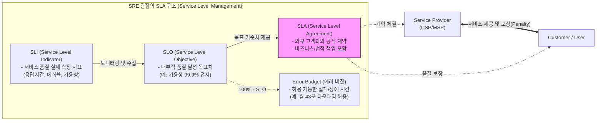

# SLA (Service Level Agreement)

---

## I. IT 서비스 품질 보장 및 신뢰도 확보를 위한 정량적 약정, SLA의 개요

* **정의**: 서비스 제공자(Provider)와 이용자(Customer) 간에 서비스 품질 수준([[HA(High Availability)|가용성]], 성능 등)을 정량적으로 측정하고, 달성 목표치 및 미달 시 보상 체계를 명시한 공식적인 협약(Contract)
* **등장 배경 및 특징**:
* **클라우드 및 [[XaaS]] 확대**: 아웃소싱 및 클라우드 환경에서 서비스 품질에 대한 책임 소재 명확화 필요성 증대
* **정량적 지표 기반**: 모호한 서비스 기준을 배제하고 SLI, SLO 기반의 측정 가능한 객관적 수치 제공
* **비즈니스 연계**: IT 인프라의 안정성을 넘어 Error Budget 등 SRE([[SRE (Site Reliability Engineering)|Site Reliability Engineering]]) 관점의 비즈니스 연속성 및 배포 속도 제어 수단으로 진화

---

## II. SLA의 핵심 개념도 및 구성 요소

### 가. SLA의 개념도 및 동작 원리

* 제공자는 SLI를 통해 현재 상태를 측정하고 내부 목표인 SLO를 모니터링하여, 고객과 약정한 SLA 위반(Penalty 발생)을 사전 예방함

### 나. SLA의 핵심 기술 및 구성 요소

| 구분 | 요소기술 (키워드) | 세부 설명 |
| --- | --- | --- |
| **핵심 지표** | SLI (Indicator) | 서비스 수준을 판단하기 위해 실제 측정하는 정량적 지표 (Latency, Throughput, Error Rate 등) |
| **핵심 지표** | SLO (Objective) | SLI 기반으로 서비스 제공자가 내부적으로 설정한 품질 목표 수치 (예: 99.99%) |
| **협약 구조** | Service Credit | SLA 목표 미달성 시 고객에게 제공하는 요금 할인 등의 재무적 보상/위약금 체계 |
| **협약 구조** | Error Budget | 완벽한 가용성(100%)을 포기하는 대신 얻는 허용 가능한 장애 범위 (신규 배포 속도 조절 용도) |
| **평가 항목** | MTBF (무고장 시간) | Mean Time Between Failures, 시스템이 고장 없이 정상 운영되는 평균 시간 |
| **평가 항목** | MTTR (평균 복구 시간) | Mean Time To Recovery, 장애 발생 후 정상 상태로 복구하기까지 소요되는 평균 시간 |
| **운영 기술** | Observability (관측성) | APM, 로그 수집(Elasticsearch), 메트릭(Prometheus/Grafana)을 통한 실시간 SLI 추적 |
| **운영 기술** | Smart Contract | [[01_IT Tech/블록체인]] 기반으로 SLA 조건 미달 시 자동으로 패널티(Credit)를 정산 및 지급하는 자동화 기술 |

---

## III. SRE 기반 핵심 관리 지표 비교 및 향후 전망

### 가. SRE 핵심 관리 지표 (SLI, SLO, SLA) 비교

| 비교 항목 | SLI (Service Level Indicator) | SLO (Service Level Objective) | SLA (Service Level Agreement) |
| --- | --- | --- | --- |
| **정의** | 서비스 상태를 나타내는 **측정값** | SLI가 달성해야 하는 **목표치** | SLO와 결합된 고객과의 **공식 계약** |
| **성격** | 기술적 / 정량적 (데이터) | 관리적 / 내부적 (목표) | 비즈니스적 / 법적 (계약) |
| **주체** | 엔지니어, 시스템 (모니터링) | 개발팀, 운영팀(SRE), PO | 비즈니스 부서, 고객, 법무팀 |
| **미달 시 영향** | 경고 알람 (Alert) 발생 | Error Budget 소진, 신규 배포 중단 | 위약금 발생 (Service Credit 지급) |
| **적용 예시** | HTTP 200 OK 응답 비율 | 한 달간 HTTP 200 응답 비율 99.9% | 99.9% 미달 시 월 요금의 10% 환불 |

### 나. SLA의 한계 및 최신 동향 (향후 발전 방향)

* **AI/ML 기반 AIOps 도입**: 장애 발생 후 보상하는 사후적 SLA 체계에서, AI를 활용해 서비스 저하를 사전 예측하고 선제 대응하는 예방형 SLA 관리로 진화
* **Multi-Cloud 통합 SLA 관리**: 단일 클라우드를 넘어 하이브리드 및 멀티 클라우드 환경에서 복합 서비스에 대한 통합된 종단간([[End-to-End]]) SLA 가시성 확보 체계 구축
* **사용자 경험(UX) 중심 지표(XLA)**: 단순 인프라 가용성(Uptime) 중심의 SLA에서 벗어나, 실제 사용자가 체감하는 애플리케이션 응답성과 경험을 측정하는 XLA(eXperience Level Agreement)로 패러다임 전환

---

### 🔗 연관 토픽

- **소속 도메인**: [[00_경영전략_MOC|📈 경영전략]]
- **세부 분류**: `5. IT 투자 성과 평가 & 비즈니스 연속성 계획 (BCP)`
- **핵심 연관 토픽**:
  - [[SRE (Site Reliability Engineering)]]
  - [[PDCA(Plan-Do-Check-Act, Deming Cycle)]]
  - [[디지털 안전 3법]]
  - [[서비스 수준 관리|서비스 수준 관리 (SLM Service Level Management)]]
  - [[DevOps|데브옵스 (DevOps)]]
