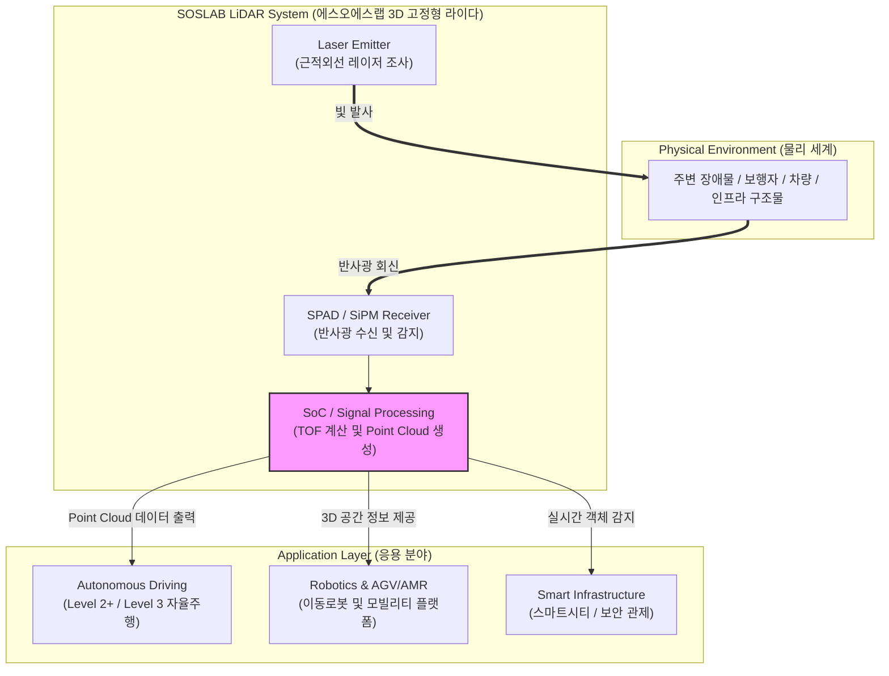

# 에스오에스랩 (SOSLAB)

---

## I. Physical AI 시대의 핵심 3D 센서 기술, 에스오에스랩의 개요

* **정의**: 광주과학기술원(GIST) 연구원 출신들이 설립하여 3D 고정형(Solid-State) 라이다(LiDAR) 센서와 공간 정보 솔루션을 개발·공급하는 국내 대표 [[Smart Car(자율주행)|자율주행]] 및 로보틱스 인프라 기업
* **등장 배경 및 특징**:
* **[[Physical AI]] 인프라 부상**: 디지털 세계를 넘어 물리적 실세계의 정밀한 공간 데이터 수집을 위한 백본(Backbone) 센서 필요성 증대
* **고정형 라이다 기술력**: 기계식 회전 구조의 한계를 극복하고 내구성 및 소형화를 달성하여 차량, 로봇, 스마트 인프라 적용 가속
* **글로벌 경쟁력**: 독자적인 광학 설계 및 특허 기술을 기반으로 완성차 티어원(Tier-1) 파트너십 및 자율주행·로봇 생태계 확장

---

## II. 에스오에스랩의 아키텍처 및 핵심 기술 요소

### 가. 에스오에스랩 라이다 시스템의 아키텍처 및 동작 원리

* 레이저 다이오드가 빛을 발사하고 물체에 부딪혀 돌아오는 비행시간(ToF)을 측정하여 3D 포인트 클라우드(Point Cloud) 데이터를 생성한 뒤, 자율주행 및 로봇 제어 시스템에 정밀 공간 정보를 제공

### 나. 에스오에스랩의 핵심 기술 및 구성 요소

| 구분 | 요소기술 (키워드) | 세부 설명 |
| --- | --- | --- |
| **센서 아키텍처** | Solid-State LiDAR | 기계적 회전 부품을 배제하고 반도체 기반으로 빔을 조향하여 내구성 및 [[신뢰성]] 확보 |
| **광학 설계** | Micro-Optics & VCSEL | 소형화와 고출력을 동시에 만족하는 마이크로 광학계 및 수직 표면 발광 레이저 설계 기술 |
| **신호 처리** | ToF (Time-of-Flight) | 빛의 왕복 시간을 측정하여 밀리미터 단위의 정밀한 거리 및 3D 공간 좌표 산출 |
| **데이터 포맷** | Point Cloud 생성 | 주변 환경을 3차원 점군 데이터로 정밀 재현하여 AI 인지 모델의 입력값으로 제공 |
| **융합 시스템** | Sensor Fusion | 카메라, 레이더와 결합하여 악천후 및 야간 환경에서의 인지 정확도 극대화 |
| **차량용 통합** | Embedded Design | 차량 그릴 및 램프 내부에 매몰형(Flush-type)으로 장착 가능한 슬림형 디자인 적용 |
| **생산 공정** | Tier-1 파트너십 (에스엘 등) | 핵심 원천 설계 기술을 보유하고 대량 양산 및 품질 관리는 글로벌 부품사와 협력 |
| **응용 확장** | MobED 및 로보틱스 연동 | 현대차 모베드(MobED) 등 자율주행 모빌리티 플랫폼 및 산업용 로봇에 탑재 |

---

## III. 카메라·레이더 센서와의 비교 및 향후 전망

### 가. 자율주행 주요 인지 센서 (카메라, 레이더, 라이다) 비교

| 비교 항목 | 카메라 (Camera) | 레이더 (Radar) | 라이다 (LiDAR, 에스오에스랩 중심) |
| --- | --- | --- | --- |
| **측정 방식** | 가시광선 기반 이미지 픽셀 분석 | 전파(Radio Wave) 반사 측정 | 레이저 빛(Laser) 반사 시간(ToF) 측정 |
| **거리 및 공간감** | 소프트웨어 추정 (정밀도 상대적 낮음) | 거리 및 속도 측정 우수, 해상도 낮음 | mm 단위의 압도적인 3D 공간 해상도 및 거리 정확도 |
| **기상 영향성** | 안개, 폭우, 야간에 인식률 저하 | 악천후에 강함 | 악천후 시 탐지 거리 일부 제한이나 높은 정밀도 유지 |
| **가격 비용** | 매우 저렴 (대중적 탑재) | 저렴함 | 상대적으로 고가이나 고정형화로 단가 급감 추세 |
| **주요 활용 영역** | 차선 인식, 표지판, 객체 분류 | 전방 차량 속도 감지, 긴급 제동 | Level 3 이상 자율주행, 정밀 로보틱스, 3D 맵핑 |

### 나. 향후 전망 및 발전 방향

* **Physical AI 생태계의 필수 인프라**: 생성형 AI가 가상 세계를 넘어 로봇, 자율주행 등 물리적 실세계로 확장됨에 따라 고정형 라이다의 수요가 인프라 및 물류 로봇 영역으로 급확대
* **원가 절감 및 폼팩터 혁신**: 반도체 공정 기반의 고정형(Solid-State) 설계 및 칩셋 내재화를 통해 가격 경쟁력을 확보하고 글로벌 공급망 다변화 추진

---

### 🔗 연관 토픽

- **소속 도메인**: [[00_경영전략_MOC|📈 경영전략]]
- **세부 분류**: `4. 기업 핵심 정보시스템 (ERP · CRM · SCM)`
- **핵심 연관 토픽**:
  - [[신뢰성]]
  - [[Smart Car(자율주행)]]
  - [[Physical AI]]
  - [[리빙랩, S.O.S랩|리빙랩(Living Lab), S.O.S랩]]
  - [[KMS]]
