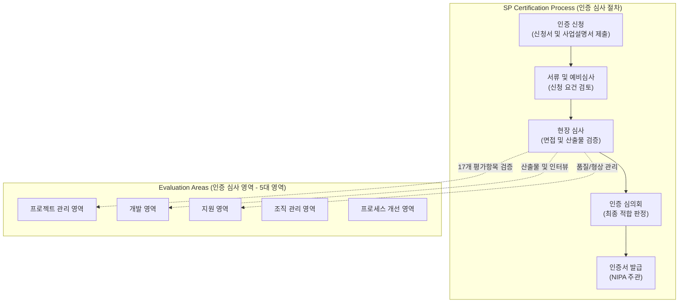

# SP 인증 (Software Process Quality Certification)

---

## I. 국내 SW 기업의 품질 역량 강화 및 부실 방지를 위한, SP 인증의 개요

* **정의**: 「소프트웨어 진흥법」 제21조에 근거하여 SW 기업 또는 개발 조직의 소프트웨어 [[프로세스]] 품질역량 수준을 심사하고 등급을 부여하는 공식 인증 제도
* **필요성 및 특징**:
* **부실 공사 방지**: 공공 SW 사업 수행 시 품질 리스크를 사전에 예방하고 개발 역량 객관적 검증
* **프로세스 체계화**: 요구사항 관리부터 테스트, 형상관리에 이르는 개발 전주기 표준 절차 정립
* **경쟁력 강화**: 중소·중견 SW 기업의 개발 프로세스 개선(SPI) 유도 및 대외 신뢰도 제고

---

## II. SP 인증의 아키텍처 및 핵심 구성요소

### 가. SP 인증의 심사 체계 및 프로세스 동작 원리

* 기업이 인증을 신청하면 정보통신산업진흥원(NIPA) 주관 하에 5개 영역 17개 평가항목을 기준으로 현장 심사를 거쳐 최종 등급을 판정함

### 나. SP 인증의 핵심 기술 및 평가 영역 구성 요소

| 구분 | 요소기술 (키워드) | 세부 설명 |
| --- | --- | --- |
| **프로젝트 영역** | 프로젝트 계획 및 통제 | 자원 산정, 일정 수립, 위험 관리 및 프로젝트 진행 상황 추적 관리 |
| **프로젝트 영역** | 협력업체 관리 | 외주 용역 및 하도급 업체의 선정, 관리, 산출물 검수 체계 점검 |
| **개발 영역** | 요구사항 관리 및 분석 | 고객 요구사항의 수집, 분석, 변경 관리 및 추적성 확보 프로세스 |
| **개발 영역** | 설계, 구현 및 테스트 | 아키텍처 설계, 코딩 표준 준수, 단위/통합/[[시스템 테스트]] 수행 검증 |
| **지원 영역** | 품질보증 (QA) | 프로세스 및 산출물이 규정된 기준과 절차를 준수하는지 독립적으로 검증 |
| **지원 영역** | 형상관리 (Configuration) | 소스 코드, 문서 등 산출물의 변경 이력 관리 및 버전 제어 체계 |
| **조직 관리 영역** | 조직 프로세스 및 교육 | 전사 차원의 표준 프로세스 정의 및 구성원 대상 직무·품질 교육 시행 |
| **개선 영역** | 프로세스 개선 관리 | 데이터 기반의 문제점 식별, 근본 원인 분석 및 지속적인 개선 활동 |

---

## III. SP 인증 등급 체계 및 향후 전망

### 가. SP 인증 등급 체계 (2등급 vs 3등급) 비교

| 비교 항목 | 2등급 (프로젝트 차원) | 3등급 (조직 차원) |
| --- | --- | --- |
| **역량 수준** | 개별 프로젝트 단위로 정의된 프로세스 수행 및 관리 역량 확보 | 조직 전사 차원의 표준 프로세스 정의 및 정량적 관리·개선 역량 확보 |
| **대상 영역** | 프로젝트 관리, 지원, 프로세스 개선 영역 일부 | 조직관리, 개발 영역을 포함한 전주기 통합 체계 |
| **관리 성격** | 개별 프로젝트 관리자의 역량에 의존하는 경향 존재 | 조직 내재화된 프로세스에 따라 일관된 품질 산출물 보장 |
| **주요 대상** | 중소규모 SW 개발 기업 및 개별 조직 | 체계적인 프로세스 성숙도가 요구되는 중견·대형 IT 서비스 기업 |

### 나. 향후 전망 및 발전 방향

* **[[CMMI]] 및 국제 표준과의 조화**: 글로벌 소프트웨어 공학 표준(CMMI V2.0 등)과의 호환성을 높이고, 클라우드·애자일 개발 환경에 부합하는 유연한 심사 체계로 진화
* **공공 SW 사업 제도 연계 강화**: SW 사업 수주 시 가점 부여 및 법적 우대 혜택을 통해 국내 IT 기업들의 자발적인 소프트웨어 품질 성숙도 제고 유도

---

### 🔗 연관 토픽

- **소속 도메인**: [[00_소프트웨어공학_MOC|🏗️ 소프트웨어공학]]
- **세부 분류**: `3. 요구사항 공학 & UML 객체지향 분석/설계`
- **핵심 연관 토픽**:
  - [[시스템 테스트]]
  - [[CMMI]]
  - [[인수 테스트]]
  - [[유즈케이스 다이어그램]]
  - [[프로세스]]
