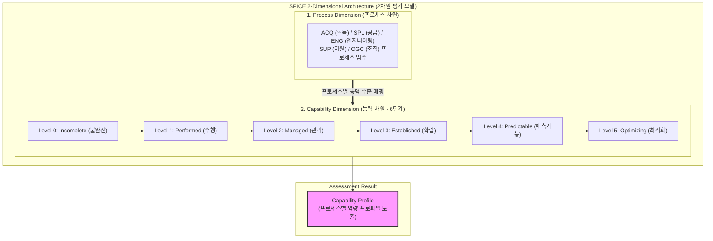

# SPICE (Software Process Improvement and Capability Determination)

---

## I. SW 프로세스 개선 및 능력 평가를 위한 국제 표준, SPICE의 개요

* **정의**: 소프트웨어 프로세스의 성숙도와 능력을 객관적으로 평가하고 지속적인 개선을 유도하기 위한 국제 표준(ISO/IEC 15504, 현재 ISO/IEC 330xx 시리즈로 진화)
* **등장 배경 및 특징**:
* **글로벌 품질 표준**: 소프트웨어 개발 조직의 [[프로세스]] 역량을 정량적으로 진단하여 개발 품질 및 생산성 극대화
* **2차원 평가 체계**: 프로세스 차원과 능력 차원을 교차하여 조직의 실제 수행 능력을 입체적으로 평가
* **객관적 능력 프로파일**: 프로세스별 성취 수준을 6단계(Level 0~5)로 진단하여 취약점 식별 및 개선 가이드 제공

---

## II. SPICE의 아키텍처 및 핵심 구성요소

### 가. SPICE의 2차원 아키텍처 및 평가 모델 동작 원리

* 프로세스 범주별 수행 주체와 6단계의 능력 수준을 교차 매핑하여 조직의 프로세스 성숙도를 정밀하게 진단하고 능력 프로파일을 도출함.

### 나. SPICE의 핵심 평가 구성 요소

| 구분 | 요소기술 (키워드) | 세부 설명 |
| --- | --- | --- |
| **평가 모델** | Process Dimension | 프로세스의 목적과 결과를 정의하는 범주 (획득, 공급, 엔지니어링, 지원, 조직) |
| **평가 모델** | Capability Dimension | 프로세스의 성취 수준을 평가하는 0단계부터 5단계까지의 능력 등급 체계 |
| **능력 단계** | Level 0 ~ Level 1 | 미달성(불완전) 상태에서 프로세스 목적이 기본적으로 달성되는 수행(Performed) 단계 |
| **능력 단계** | Level 2 ~ Level 2 | 작업 제품 관리 및 조직 내 표준 프로세스로 정의·확립되는 단계 |
| **능력 단계** | Level 4 ~ Level 5 | 정량적 관리(Quantitatively Managed) 및 지속적 프로세스 최적화(Optimizing) 단계 |
| **평가 방법** | Assessment & Rating | 국제 표준 심사원 자격 기반의 공식 심사(Assessment) 및 수행 능력 등급 판정 |
| **관련 표준** | ISO/IEC 15504 | SPICE의 근간이 되는 국제 표준 규격 (현재 ISO/IEC 330xx 시리즈로 이관) |
| **활용성** | SPI (Process Improvement) | 조직의 개발 프로세스 현주소를 객관화하고, 단계별 개선(SPI) 전략 수립에 활용 |

---

## III. CMMI와 SPICE 비교 및 최신 동향

### 가. CMMI vs SPICE 비교

| 비교 항목 | [[CMMI]] (Capability Maturity Model Integration) | SPICE (ISO/IEC 15504 / 330xx) |
| --- | --- | --- |
| **표준 성격** | 미국 SEI(CMMI Institute) 개발 모델 | 국제표준화기구(ISO) 공식 국제 표준 |
| **평가 방식** | 조직 성숙도 중심의 [[PMBOK 프로세스 그룹 (5단계)|5단계]] (Staged / Continuous) | 프로세스별 능력 수준 중심의 2차원(프로세스×능력) 평가 |
| **결과 표현** | 성숙도 등급 (Maturity Level 1~5) | 프로세스별 능력 프로파일 (Capability Profile) |
| **주요 활용** | 글로벌 대규모 시스템 통합(SI) 및 방산·항공 분야 | 국내외 공공·금융 SW 품질 평가 체계의 근간 |

### 나. 최신 동향 및 발전 방향

* **ISO/IEC 330xx 시리즈로의 전면 전환**: 기존 ISO/IEC 15504 표준이 폐지되고 ISO/IEC 33001~33020 등 330xx 시리즈로 개편되어 평가의 범용성 및 유연성 제고
* **애자일 및 [[DevOps]] 환경 융합**: 전통적인 [[폭포수 모델]] 중심의 엄격한 프로세스 심사에서 벗어나, 민첩한 소프트웨어 개발 및 클라우드 환경에 맞춘 유연한 프로세스 품질 측정 기법으로 진화

---

### 🔗 연관 토픽

- **소속 도메인**: [[00_소프트웨어공학_MOC|🏗️ 소프트웨어공학]]
- **세부 분류**: `1. 소프트웨어 개발 생명주기(SDLC) & 방법론`
- **핵심 연관 토픽**:
  - [[CMMI]]
  - [[폭포수 모델]]
  - [[SDLC]]
  - [[DevOps|데브옵스 (DevOps)]]
  - [[PMBOK 프로세스 그룹 (5단계)]]
