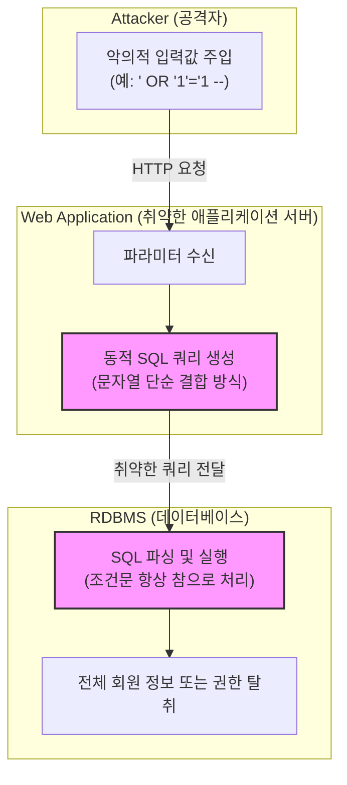

# SQL Injection (에스큐엘 인젝션)

---

## I. 웹 애플리케이션 취약점 악용을 통한 데이터베이스 무단 탈취 공격, SQL Injection의 개요

* **정의**: 웹 애플리케이션이 사용자 입력값을 검증 없이 [[Dynamic SQL (동적 SQL)|동적 SQL]] 구문에 직접 포함할 때, 공격자가 악의적인 [[SQL(Structured Query Language)|SQL]] 문장을 주입(Inject)하여 백엔드 데이터베이스를 비정상적으로 조작·탈취하는 대표적인 웹 보안 취약점
* **등장 배경 및 특징**:
* **웹 취약점의 전통적 위협**: OWASP Top 10의 최상위권에 지속적으로랭크되는 고위험 보안 취약점
* **데이터 유출 및 변조**: 인증 우회, 개인정보 탈취, [[데이터베이스]] 완전 삭제 또는 시스템 장악 가능
* **낮은 진입 장벽**: 단순한 입력 폼 조작만으로도 공격 수행이 가능하여 광범위한 피해 유발

---

## II. SQL Injection의 아키텍처 및 핵심 기술 요소

### 가. SQL Injection의 취약점 발생 메커니즘 및 동작 흐름

* 공격자가 인증 폼이나 URL 파라미터에 SQL 구문을 주입하면, 웹 서버가 문자열을 그대로 결합하여 SQL을 생성하고, DB가 이를 실행하면서 무단 데이터 조회가 발생함

### 나. SQL Injection의 취약점 유형 및 핵심 대응 기법

| 분류 (Category) | 요소기술 (키워드) | 세부 설명 |
| --- | --- | --- |
| **공격 유형** | In-band SQLi (Error/UNION) | 악성 쿼리의 결과나 에러 메시지가 화면에 직접 노출되어 데이터를 탈취하는 방식 |
| **공격 유형** | Inferential SQLi (Blind) | 참/거짓 응답이나 응답 지연(Time-based)을 통해 데이터를 점진적으로 유추하는 방식 |
| **공격 유형** | Out-of-band SQLi | DB 서버의 외부 네트워크 요청([[DNS(Domain Name System)|DNS]], HTTP)을 유도하여 데이터를 빼내는 방식 |
| **방어 기법** | Prepared Statement | 사용자 입력값을 데이터(Data) 영역으로만 취급하고 코드와 분리하여 인젝션 원천 차단 |
| **방어 기법** | ORM (Hibernate / JPA) | 객체-관계 매핑 프레임워크를 활용하여 동적 SQL 문자열 결합 방지 및 파라미터 자동 바인딩 |
| **검증 기법** | Input Validation & Escaping | 허용된 입력값만 허용(Whitelist)하고, 특수문자 및 따옴표를 이스케이프(Escape) 처리 |
| **인프라 보안** | WAF (Web Application Firewall) | 웹 방화벽의 시그니처 및 패턴 매칭을 통해 악성 SQL 구문이 포함된 트래픽 사전 차단 |
| **진단 도구** | [[SAST]] / [[DAST]] | 소스코드 정적 분석(SAST) 및 동적 취약점 스캐너(DAST)를 통한 사전 진단 및 제거 |

---

## III. 최신 보안 동향 및 대응 전망

* **공격 벡터의 다변화 ([[NoSQL (CAP 이론 BASE 속성)|NoSQL]] Injection)**: 기존의 관계형 DB 중심에서 MongoDB 등 NoSQL 환경을 타겟으로 한 [[JSON]] 기반 인젝션 공격이 증가함에 따라 NoSQL 전용 입력값 검증 체계 도입 확산
* **AI 기반 자동화 모의 해킹**: 생성형 AI와 보안 자동화([[SOAR (Security Orchestration, Automation and Response)|SOAR]]) 기술을 결합하여, 애플리케이션 배포 파이프라인(CI/CD) 단계에서 SQL Injection 등 소스코드 취약점을 실시간 탐지하고 자동 패치하는 방향으로 진화

---

### 🔗 연관 토픽

- **소속 도메인**: [[00_보안_MOC|🛡️ 보안]]
- **세부 분류**: `3. 네트워크 & 엔드포인트 · 인프라 보안`
- **핵심 연관 토픽**:
  - [[DAST]]
  - [[Dynamic SQL (동적 SQL)]]
  - [[SOAR (Security Orchestration, Automation and Response)]]
  - [[NoSQL (CAP 이론 BASE 속성)]]
  - [[CWE]]
