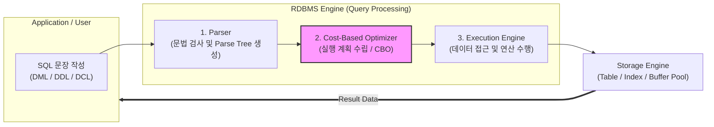

# 표준 SQL (Standard SQL) 문법

---

## I. 관계형 데이터베이스 표준 질의 언어, SQL 문법의 개요

* **정의**: 관계형 [[데이터베이스]] 관리 시스템(RDBMS)에서 데이터를 정의, 조작, 제어하기 위해 사용하는 국제 표준(ISO/IEC 9075) 기반의 비절차적 선언형 데이터 질의 언어
* **등장 배경 및 특징**:
* **상호운용성 확보**: 벤더 간(Oracle, MySQL, PostgreSQL 등) 종속성을 탈피하고 이기종 DB 간 데이터 호환성 보장
* **표준화 진화**: 전통적인 데이터 조작 기능을 넘어 최근 [[SQL(Structured Query Language)|SQL]]:2023 표준을 통해 [[JSON]] 네이티브 처리 및 속성 그래프 쿼리(SQL/PGQ) 등 신기술 수용
* **선언적 처리**: '어떻게(How)'가 아닌 '무엇(What)'을 추출할지 정의하여 생산성 향상

---

## II. SQL 문법의 아키텍처 및 핵심 구성요소

### 가. SQL 문법의 처리 아키텍처 및 실행 흐름

* 클라이언트가 작성한 SQL 문장은 파서(Parser)의 문법 검증과 [[옵티마이저]]([[OPTIMIZER|Optimizer]])의 비용 기반 최적화 단계를 거쳐 실행 엔진(Executor)에 의해 스토리지에서 데이터를 조회함

### 나. SQL 문법의 주요 분류 및 핵심 구성 요소

| 분류 (Category) | 주요 명령어 (Keywords) | 세부 설명 및 핵심 문법 특징 |
| --- | --- | --- |
| **[[DDL]]** (Data Definition) | `CREATE`, `ALTER`, `DROP`, `TRUNCATE` | 데이터베이스 구조(테이블, 뷰, 인덱스 등)를 정의하거나 변경·삭제하는 명령어 (자동 Commit) |
| **[[DML]]** (Data Manipulation) | `SELECT`, `INSERT`, `UPDATE`, `DELETE` | 테이블 내의 데이터를 조회하고 행(Row) 단위로 삽입·수정·삭제하는 데이터 조작어 |
| **[[DCL]]** (Data Control) | `GRANT`, `REVOKE` | 데이터베이스 접근 권한 및 객체 사용 권한을 사용자에게 부여하거나 회수하는 제어어 |
| **TCL** (Transaction Control) | `COMMIT`, `ROLLBACK`, `SAVEPOINT` | 트랜잭션의 영구 저장 또는 변경 사항 취소 및 중간 복원 지점을 설정하는 제어어 |
| **Advanced Query** | `JOIN`, `GROUP BY`, `HAVING` | 다중 테이블 연결, 집계 함수 그룹화 및 그룹 조건 필터링을 위한 복합 질의 문법 |
| **Window Function** | `ROW_NUMBER()`, `RANK()`, `OVER()` | 행간의 연산(순위, 누적합, 이동평균 등)을 그룹 해제 없이 수행하는 분석 함수 |
| **Modern Feature** | `WITH RECURSIVE`, `JSON_TABLE` | 계층형/재귀 쿼리 처리 및 비정형 JSON 데이터를 관계형 테이블 형태로 변환·추출 |
| **Graph Query** | `MATCH`, `PROPERTY GRAPH` (SQL:2023) | SQL:2023 표준에 도입된 관계형 데이터 기반의 속성 그래프 패턴 매칭 질의 |

---

## III. 전통적 SQL과 최신 표준 SQL(SQL:2023) 비교 및 발전 전망

### 가. 전통적 SQL vs 최신 표준 SQL(SQL:2023) 비교

| 비교 항목 | 전통적 SQL (SQL-92 / SQL:99 중심) | 최신 표준 SQL (SQL:2023 중심) |
| --- | --- | --- |
| **주요 처리 영역** | 정형 데이터(Structured Data) 중심의 CRUD 및 관계형 연산 | 정형 + 비정형(JSON) + 그래프 데이터 통합 처리 |
| **그래프 연산** | 복잡한 계층형 쿼리(`CONNECT BY`, 다중 Self-Join) 필요 | `SQL/PGQ` 도입으로 관계형 테이블 간 그래프 패턴 직접 질의 |
| **데이터 타입** | 기본 원시 타입(INT, VARCHAR, DATE 등) 위주 | 향상된 JSON [[연산자]], 불리언 타입 리터럴 간소화 지원 |
| **재귀 쿼리 문법** | 복잡한 구문 및 벤더별 상이한 구현 방식 | 표준화된 `WITH RECURSIVE` 및 사이클(Cycle) 마크 기본 지원 |

### 나. 향후 전망 및 발전 방향

* **AI 및 벡터 검색과의 네이티브 융합**: [[초거대 언어 모델|LLM]] 및 RAG 시스템 확산에 따라 벡터 데이터 검색을 위한 표준 연산자 및 인덱싱 문법(예: 고차원 벡터 거리 계산 함수)의 SQL 표준 편입 가속
* **멀티모달 데이터베이스 쿼리 표준화**: 관계형, 시계열, 공간 정보(Spatial), 그래프 데이터를 단일 SQL 인터페이스 안에서 원스톱으로 처리하는 통합 질의 언어로 진화

---

### 🔗 연관 토픽

- **소속 도메인**: [[00_데이터베이스_MOC|🗄️ 데이터베이스]]
- **세부 분류**: `1. 데이터 모델링 & 관계형 DB 설계`
- **핵심 연관 토픽**:
  - [[데이터베이스]]
  - [[DDL]]
  - [[SQL(Structured Query Language)]]
  - [[DML]]
  - [[옵티마이저|옵티마이저 (Optimizer)]]
