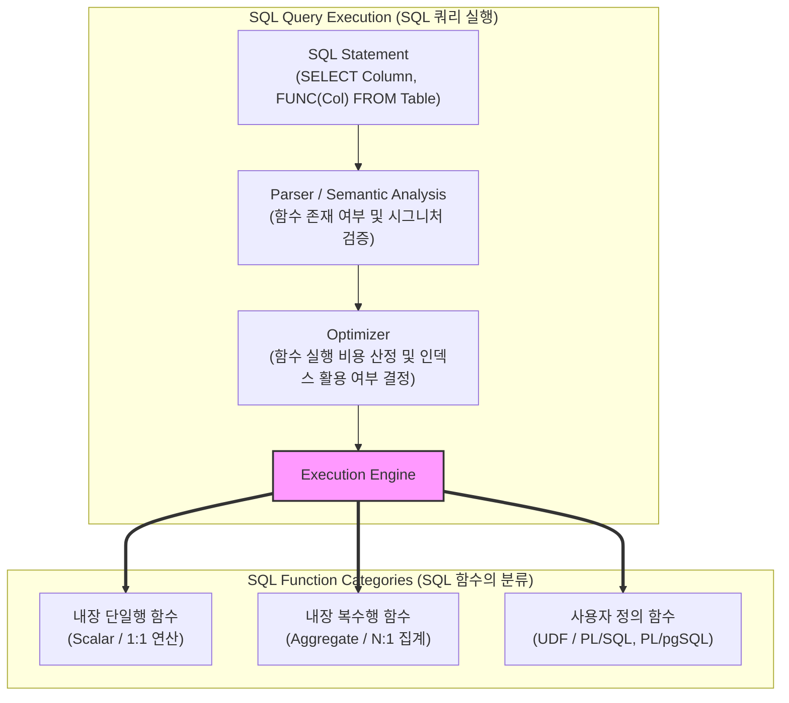

# SQL 함수 (SQL Functions)

---

## I. 데이터 가공 및 연산 처리를 위한 내장·사용자 정의 루틴, SQL 함수의 개요

* **정의**: [[데이터베이스]] 내에서 복잡한 연산, 데이터 조작, 형식 변환, 집계 작업을 수행하기 위해 [[SQL(Structured Query Language)|SQL]] 문장 내에서 호출할 수 있는 독립적인 서브프로그램(Routine)
* **필요성 및 특징**:
* **데이터 가공 효율성**: 문자열, 숫자, 날짜 등 원시 데이터를 비즈니스 로직에 맞게 즉시 변환 및 가공
* **성능 최적화**: DB 엔진 내부에서 직접 연산이 수행되므로 네트워크 전송량 감소 및 처리 속도 향상
* **재사용성 및 [[모듈화]]**: 공통 비즈니스 규칙을 함수 단위로 캡슐화하여 중복 코드 제거 및 유지보수성 제고

---

## II. SQL 함수의 아키텍처 및 핵심 구성요소

### 가. SQL 함수의 처리 아키텍처 및 동작 원리

* 클라이언트가 함수가 포함된 SQL을 요청하면, 옵티마이저는 함수의 유무와 비용을 산정하여 스칼라, 집계, 또는 사용자 정의 함수(UDF) 엔진을 통해 각 행(Row) 또는 그룹 단위로 연산을 수행함

### 나. SQL 함수의 핵심 기술 및 분류 체계

| 구분 | 요소기술 (키워드) | 세부 설명 |
| --- | --- | --- |
| **단일행 함수** | 문자열 함수 (`SUBSTR`, `CONCAT`) | 문자열 추출, 치환, 결합 등 텍스트 데이터를 가공하는 단일행 연산 함수 |
| **단일행 함수** | 숫자/날짜 함수 (`ROUND`, `SYSDATE`) | 반올림, 절대값 계산 및 날짜 간격 계산, 타임존 변환을 수행하는 함수 |
| **단일행 함수** | 형변환 함수 (`CAST`, `CONVERT`) | 데이터 타입을 명시적으로 상호 변환(예: 문자열 $\leftrightarrow$ 숫자/날짜)하는 함수 |
| **복수행 함수** | 집계 함수 (`SUM`, `AVG`, `COUNT`) | 여러 행의 입력값을 받아 하나의 요약된 값으로 반환하는 그룹 연산 함수 |
| **복수행 함수** | 윈도우 함수 (`ROW_NUMBER`, `OVER`) | 행의 그룹 해제 없이 순위, 누적 합계, 이동 평균을 산출하는 분석 함수 |
| **확장 함수** | 사용자 정의 함수 (UDF) | 시스템에 내장되지 않은 복잡한 로직을 PL/SQL, T-SQL 등으로 직접 구현한 함수 |
| **최신 트렌드** | 결정적/비결정적 함수 최적화 | 동일 입력에 항상 같은 값을 반환하는 결정적(Deterministic) 함수 결과 캐싱 |
| **최신 트렌드** | 인라인 뷰 / 파생 함수 연동 | CTE(Common Table Expression) 및 [[JSON]]/Vector 처리 내장 함수와의 결합 |

---

## III. 내장 함수와 사용자 정의 함수(UDF) 비교 및 향후 전망

### 가. 내장 함수 vs 사용자 정의 함수(UDF) 비교

| 비교 항목 | 내장 함수 (Built-in Functions) | 사용자 정의 함수 (User-Defined Functions, UDF) |
| --- | --- | --- |
| **제공 주체** | RDBMS 벤더사 기본 제공 | 개발자 및 데이터베이스 관리자가 직접 작성 |
| **실행 성능** | DB 엔진에 최적화되어 매우 우수함 | 컨텍스트 스위칭 및 내부 연산 비용으로 상대적으로 저하될 수 있음 |
| **인덱스 활용** | 스칼라 내장 함수는 인덱스 컬럼 가공 시 **인덱스 스캔 무력화(Full Scan)** 발생 가능 | 결정적(Deterministic) 속성 부여 시 일부 최적화 가능하나 제한적 |
| **유연성 및 확장성** | 정해진 문법과 기능 범위 내에서만 사용 가능 | 복잡한 비즈니스 로직, 반복문, 조건문 등을 자유롭게 구현 가능 |
| **주요 용도** | 문자열 조작, 날짜 계산, 기본 집계 연산 | 특수 [[암호화]], 도메인 맞춤형 복잡한 계산식 처리 |

### 나. 향후 전망 및 발전 방향

* **AI 및 벡터 연산 내장 함수의 고도화**: [[초거대 언어 모델|LLM]] 및 RAG 시스템의 확산에 발맞추어, SQL 내에서 고차원 벡터 간의 [[유사도]](Cosine, Euclidean)를 직접 계산하는 네이티브 함수 지원 확대
* **머신러닝 모델 인라인 통합**: 별도의 외부 서버 호출 없이, SQL 함수 호출만으로 데이터베이스 내부에서 머신러닝/[[딥러닝]] 추론(Inference)을 실시간 수행하는 인DB(In-Database) AI 함수 체계로 진화

---

### 🔗 연관 토픽

- **소속 도메인**: [[00_데이터베이스_MOC|🗄️ 데이터베이스]]
- **세부 분류**: `3. 장애 회복 기법 & 데이터 무결성`
- **핵심 연관 토픽**:
  - [[SQL(Structured Query Language)]]
  - [[데이터베이스]]
  - [[데이터 표준화]]
  - [[초거대 언어 모델|초거대 언어 모델(Large Language Model)]]
  - [[딥러닝]]
