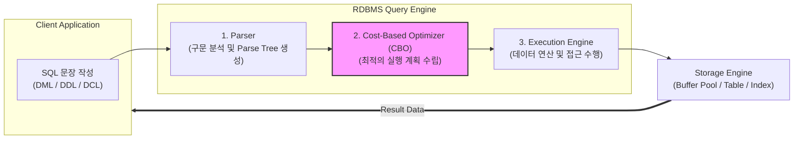

# SQL (Structured Query Language)

---

## I. 관계형 데이터베이스 표준 질의 언어, SQL의 개요

* **정의**: 관계형 [[데이터베이스]] 관리 시스템(RDBMS)에서 데이터의 정의, 조작, 제어 및 분석을 수행하기 위해 사용하는 ISO/IEC 국제 표준(최신 SQL:2023) 기반의 선언형 질의 언어
* **등장 배경 및 특징**:
* **벤더 독립성**: 오라클, MySQL, PostgreSQL 등 이기종 RDBMS 간의 호환성 및 상호운용성 보장
* **비절차적 선언 방식**: '어떻게(How)'가 아닌 '무엇(What)'을 추출할지 정의하여 데이터 접근 효율성 극대화
* **멀티모달 진화**: 전통적 정형 데이터 처리를 넘어, 최신 표준(SQL:2023)을 통해 [[JSON]] 및 속성 그래프(Graph) 통합 처리 지원

---

## II. SQL의 아키텍처 및 핵심 기술 요소

### 가. SQL 처리 아키텍처 및 동작 원리

* 클라이언트가 요청한 SQL 문장은 파서(Parser)의 문법 검증과 CBO(비용 기반 [[옵티마이저]])의 최적화 단계를 거쳐, 실행 엔진이 스토리지 엔진에서 데이터를 효율적으로 탐색·반환함

### 나. SQL의 핵심 기술 및 구성 요소

| 분류 (Category) | 요소기술 (키워드) | 세부 설명 |
| --- | --- | --- |
| **데이터 정의** | [[DDL]] (`CREATE`, `ALTER`, `DROP`) | 테이블, 뷰, 인덱스 등 데이터베이스 구조를 생성·변경·삭제하는 언어 |
| **데이터 조작** | [[DML]] (`SELECT`, `INSERT`, `UPDATE`) | 테이블 내부의 데이터를 조회하고 행(Row) 단위로 삽입·수정·삭제하는 언어 |
| **제어 및 관리** | [[DCL]] / TCL (`GRANT`, `COMMIT`) | 데이터 접근 권한을 부여·회수하고 트랜잭션의 영구 저장 및 취소 제어 |
| **고급 질의** | JOIN 및 GROUP BY | 다중 테이블 관계 연결 및 집계 함수 기반 그룹별 필터링 연산 |
| **분석 함수** | Window Function (`OVER`) | 행의 그룹 해제 없이 순위, 누적 합계, 이동 평균 등을 산출하는 분석 연산 |
| **계층형 쿼리** | 재귀 CTE (`WITH RECURSIVE`) | 조직도, BOM 등 계층형 및 트리 구조 데이터를 표준화된 방식으로 순환 탐색 |
| **비정형 처리** | JSON Functions (`JSON_TABLE`) | 관계형 테이블 내에서 비정형 JSON 데이터를 네이티브하게 추출·변환 |
| **그래프 쿼리** | SQL/PGQ (`MATCH`, 속성 그래프) | SQL:2023 표준에 도입된 관계형 테이블 기반의 속성 그래프 패턴 매칭 질의 |

---

## III. 전통적 SQL과 최신 표준 SQL(SQL:2023) 비교 및 향후 전망

### 가. 전통적 SQL과 최신 표준 SQL(SQL:2023) 비교

| 비교 항목 | 전통적 SQL (SQL-92 / SQL:99) | 최신 표준 SQL (SQL:2023) |
| --- | --- | --- |
| **처리 데이터 범위** | 정형 데이터(Structured Data) 중심 | 정형 + 비정형(JSON) + 속성 그래프(Graph) 통합 |
| **그래프/계층 연산** | 복잡한 계층형 쿼리 또는 다중 Self-Join 필요 | `SQL/PGQ` 도입으로 표준화된 그래프 패턴 직접 질의 |
| **재귀 쿼리 표준** | 벤더별 상이한 구문 (예: Oracle `CONNECT BY`) | 표준화된 `WITH RECURSIVE` 구문 전면 지원 |
| **AI 및 벡터 융합** | 미지원 (외부 애플리케이션 연동 필수) | 고차원 벡터 검색 [[연산자]] 및 머신러닝 함수 연동 확대 |

### 나. 향후 전망 및 발전 방향

* **AI 기반 자율튜닝 옵티마이저(AI CBO)**: 머신러닝 알고리즘을 결합하여 복잡한 [[조인]] 및 대규모 쿼리의 실행 계획을 실시간으로 자동 최적화하는 방향으로 진화
* **[[벡터 데이터베이스]](Vector DB) 네이티브 통합**: [[초거대 언어 모델|LLM]] 및 RAG 기반 생성형 AI 확산에 발맞추어, SQL 내에서 고차원 벡터 간 [[유사도]] 연산 및 시맨틱 검색을 직접 지원하는 표준 문법으로 확장

---

### 🔗 연관 토픽

- **소속 도메인**: [[00_데이터베이스_MOC|🗄️ 데이터베이스]]
- **세부 분류**: `6. SQL 표준 문법 & 쿼리 성능 튜닝`
- **핵심 연관 토픽**:
  - [[옵티마이저|옵티마이저 (Optimizer)]]
  - [[DCL]]
  - [[데이터베이스]]
  - [[DDL]]
  - [[벡터 데이터베이스|벡터 데이터베이스(Vector Database)]]
