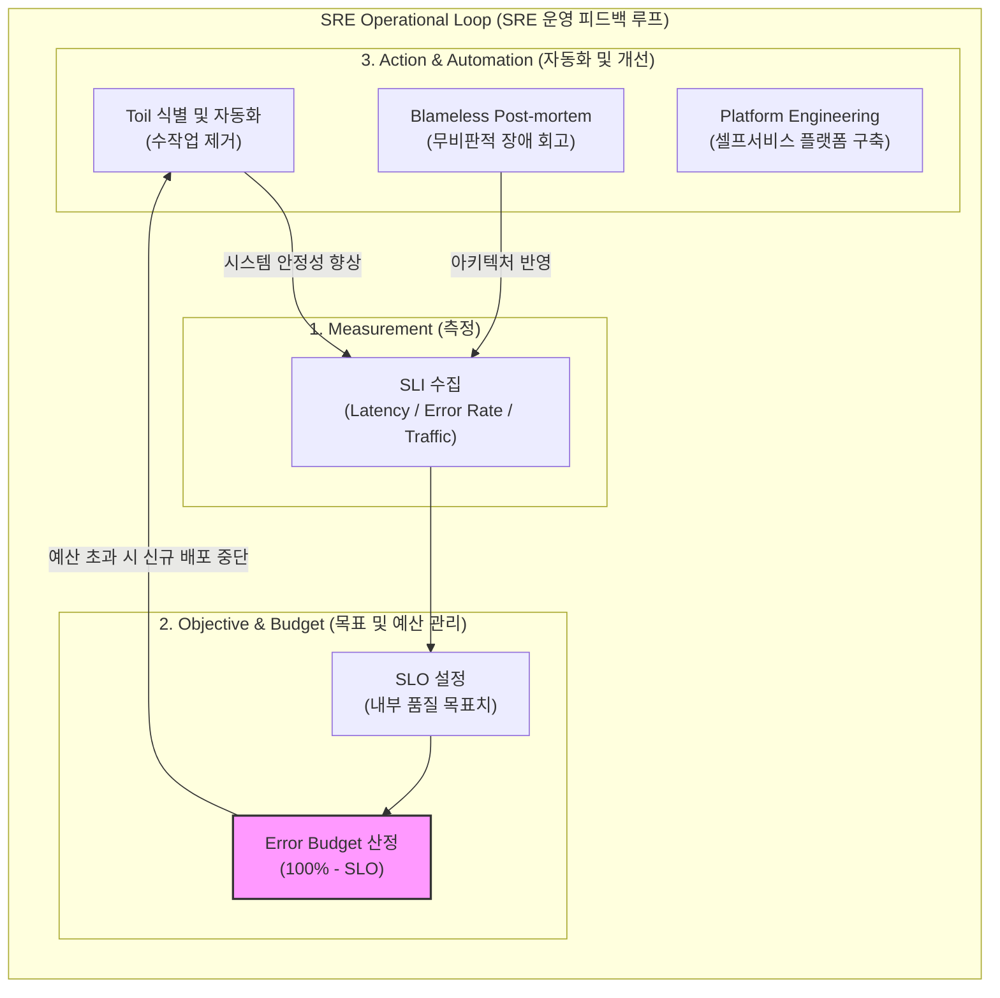

# SRE (Site Reliability Engineering)

---

## I. 대규모 시스템의 신뢰성과 확장성 확보를 위한 소프트웨어 공학 기반 운영 체계, SRE의 개요

* **정의**: 소프트웨어 공학적 방법론과 자동화 도구를 IT 운영(Operations) 영역에 적용하여, 대규모 분산 시스템의 안정성, [[HA(High Availability)|가용성]] 및 확장성을 체계적으로 보장하는 엔지니어링 패러다임
* **등장 배경 및 특징**:
* **운영 복잡도 극복**: 시스템 규모 확장 및 마이크로서비스([[MSA (Micro Service Architecture)|MSA]]) 도입에 따른 수동 운영 및 휴먼 에러 한계 극복
* **개발과 운영의 균형**: 신속한 기능 배포(Velocity)와 시스템 안정성(Reliability) 간의 균형을 Error Budget 기반으로 통제
* **자동화 중심 지향**: 반복적이고 부가가치가 낮은 수작업(Toil)을 제거하고 자동화 소프트웨어로 대체

---

## II. SRE의 개념도 및 핵심 기술 요소

### 가. SRE의 핵심 피드백 루프 및 동작 원리

* 시스템 상태를 SLI로 측정하고 SLO 및 에러 버짓을 통해 안정성을 통제하며, 토일 제거 및 무비판적 회고(Post-mortem)를 통해 지속적인 자동화 개선 수행

### 나. SRE의 핵심 기술 요소 및 구성

| 분류 | 요소기술 (키워드) | 세부 설명 |
| --- | --- | --- |
| **측정 지표** | SLI (Service Level Indicator) | 서비스 품질을 측정하는 정량적 실제 지표 (응답 시간, [[처리량]], 에러율 등) |
| **측정 지표** | SLO (Service Level Objective) | SLI를 기반으로 팀 내부적으로 설정한 구체적인 품질 달성 목표 수치 |
| **계약 기준** | [[SLA|SLA (Service Level Agreement)]] | SLO 미달성 시 비즈니스적/재무적 보상 조건이 포함된 고객과의 공식 계약 |
| **리스크 통제** | Error Budget (에러 버짓) | 허용 가능한 장애 범위 한계, 신규 기능 배포 속도 조절 및 위험 통제의 척도 |
| **운영 효율화** | Toil Reduction (토일 제거) | 수동적이고 반복적이며 가치를 창출하지 못하는 운영 업무를 자동화로 대체 |
| **장애 회고** | Blameless Post-mortem | 책임 추궁이 아닌 프로세스와 시스템 구조적 결함 개선에 집중하는 사후 회고 |
| **시스템 가시성** | Observability (관측성) | 로그, 메트릭, 트레이스(3대 필러)를 통합하여 분산 시스템의 내부 상태 실시간 파악 |
| **자동화 플랫폼** | Platform Engineering | 개발자가 인프라를 직접 안전하게 관리할 수 있도록 내부 개발자 플랫폼(IDP) 구축 |

---

## III. SRE의 최신 트렌드 및 향후 전망

* **AIOps 및 생성형 AI 기반 인시던트 자동화**: 로그 및 메트릭 분석에 생성형 AI를 결합하여 장애 원인 분석(Root Cause Analysis) 및 자가 치유(Self-Healing) 자동 복구 시스템으로 진화
* **플랫폼 엔지니어링(Platform Engineering)과의 융합**: 개별 팀별 SRE 구축 한계를 극복하고, 표준화된 인프라 및 운영 자동화 툴킷을 제공하는 내부 개발자 플랫폼(IDP) 중심으로 패러다임 전환
* **FinOps 연계 비용 최적화 SRE**: 무조건적인 가용성 100% 추구를 넘어, 클라우드 인프라 비용(FinOps)과 [[신뢰성]] 간의 최적 균형점을 찾아내는 경제적 아키텍처 설계로 발전

---

### 🔗 연관 토픽

- **소속 도메인**: [[00_소프트웨어공학_MOC|🏗️ 소프트웨어공학]]
- **세부 분류**: `2. 애자일(Agile) & 지속적 통합/배포(CI/CD)`
- **핵심 연관 토픽**:
  - [[신뢰성]]
  - [[SLA|SLA (Service Level Agreement)]]
  - [[DevOps|데브옵스 (DevOps)]]
  - [[디지털 면역 시스템|디지털 면역 시스템(DIS, Digital Immune System)]]
  - [[서비스 수준 관리|서비스 수준 관리 (SLM Service Level Management)]]
