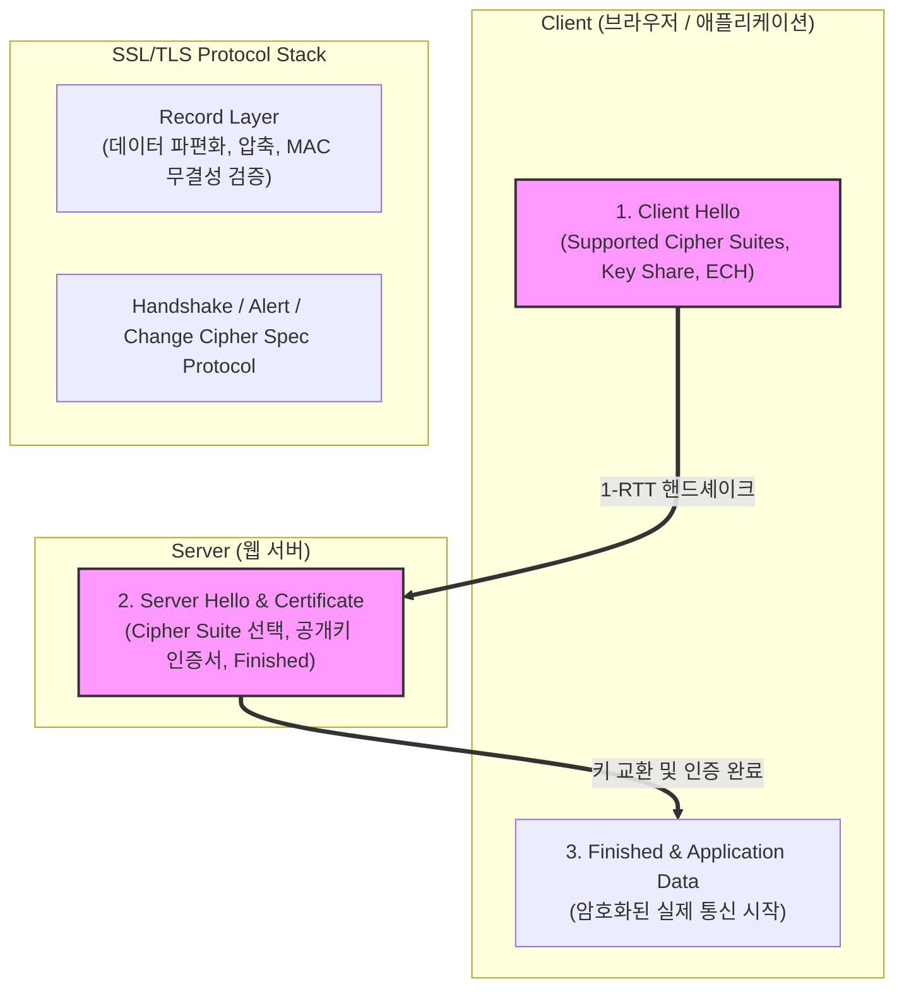

# SSL/TLS (Secure Sockets Layer / Transport Layer Security)

---

## I. 인터넷 통신 보안 및 신뢰성 보장을 위한 전송 계층 보안 프로토콜, SSL/TLS의 개요

* **정의**: 네트워크 상에서 전송되는 모든 데이터의 [[기밀성]](Confidentiality), [[무결성]](Integrity), 상호 인증(Authentication)을 보장하기 위해 설계된 표준 [[암호화]] 통신 [[프로토콜]] (현재 취약한 SSL은 폐기되고 TLS 표준 사용)
* **필요성 및 특징**:
* **도이스·스니핑 방지**: 중간자 공격(MitM) 및 패킷 도청으로부터 민감 정보 보호
* **웹 표준화 (HTTPS)**: HTTP 프로토콜 하위에 암호화 계층을 두어 안전한 웹 서비스 생태계 구축
* **최신 고도화**: TLS 1.3을 통한 핸드셰이크 지연 단축 및 [[양자 암호]] 내성(PQC) 대응 체계로 진화

---

## II. SSL/TLS의 아키텍처 및 핵심 기술 요소

### 가. SSL/TLS (TLS 1.3 기준)의 핸드셰이크 아키텍처 및 동작 원리

* 클라이언트와 서버가 `Client Hello`와 `Server Hello`를 교환하여 단 1번의 왕복(1-RTT)만으로 암호화 키를 공유하고, `Record Layer`를 통해 [[세션]] 데이터를 안전하게 암·복호화함

### 나. SSL/TLS의 핵심 기술 및 구성 요소

| 구분 | 요소기술 (키워드) | 세부 설명 |
| --- | --- | --- |
| **프로토콜 버전** | TLS 1.3 | 핸드셰이크 왕복 횟수를 1-RTT로 단축하고 취약한 암호 알고리즘을 전면 배제한 최신 표준 |
| **키 교환** | [[ECDHE]] (타원곡선 디피-헬만) | 세션마다 일회성 대칭키를 생성하여 과거 통신 기록의 복호를 막는 전방향 비밀성(PFS) 보장 |
| **대칭키 암호** | [[AES]]-GCM / ChaCha20 | 대용량 데이터의 고속 암·복호화 및 인증 무결성을 동시에 제공하는 [[암호 알고리즘]] |
| **인증서 체계** | X.509 PKI / [[RSA (Rivest Shamir Adleman)|RSA]] / ECDSA | 공인 인증기관(CA)의 디지털 서명을 통해 서버의 신원을 [[신뢰성]] 있게 검증 |
| **프라이버시 보호** | ECH (Encrypted Client Hello) | 초기 연결 시 노출되던 서버 이름(SNI)을 암호화하여 사용자의 접속 도메인 프라이버시 보호 |
| **양자 암호 내성** | PQC (Post-Quantum Cryptography) | 양자 컴퓨터의 쇼어(Shor) [[알고리즘]] 공격에 대비한 격자 기반 하이브리드 키 교환 (ML-KEM 연동) |
| **레코드 관리** | Record Layer | 상위 애플리케이션 메시지를 분할, 암호화 패킷(TLS Plaintext/Ciphertext)으로 [[캡슐화]] |
| **연결 최적화** | 0-RTT [[Session Layer|Session]] Resumption | 이전에 연결했던 세션 정보를 활용하여 핸드셰이크 지연 없이 즉시 데이터 전송 허용 |

---

## III. TLS 1.2와 TLS 1.3 비교 및 향후 전망

### 가. TLS 1.2 vs TLS 1.3 비교

| 비교 항목 | TLS 1.2 | TLS 1.3 (현대적 표준) |
| --- | --- | --- |
| **핸드셰이크 지연** | 2-RTT (최소 2번의 왕복 소요) | 1-RTT (사전 연결 시 0-RTT 지원으로 초저지연) |
| **지원 암호화 알고리즘** | RSA, CBC, RC4 등 취약한 레거시 포함 | 고도화된 AEAD 암호(AES-GCM, ChaCha20)만 허용 |
| **전방향 비밀성(PFS)** | 선택적 적용 (설정에 따라 미적용 가능) | 필수 강제 적용 (DHE / ECDHE 기반) |
| **메타데이터 보안** | 클라이언트 헬로우 평문 노출 (SNI 취약) | ECH(Encrypted Client Hello)를 통한 완벽한 프라이버시 보호 |

### 나. 향후 전망 및 발전 방향

* **양자 내성 암호(PQC)의 TLS 표준 안착**: 국가 주도 암호 현대화 계획에 따라, 웹 브라우저 및 서버 스택 전반에 격자 기반 양자 내성 알고리즘이 TLS 1.3 하이브리드 모드로 기본 탑재 가속
* **제로 트러스트([[제로 트러스트 보안모델|Zero Trust]]) 통신 인프라 연동**: 내부 네트워크 구간(East-West Traffic)에서도 암호화 통신이 기본이 되도록 mTLS(Mutual TLS) 및 서비스 메시(Service Mesh) 연계 자동화 확대

---

### 🔗 연관 토픽

- **소속 도메인**: [[00_보안_MOC|🛡️ 보안]]
- **세부 분류**: `1. 정보보안 원칙 & 거버넌스 · 인증`
- **핵심 연관 토픽**:
  - [[암호화|암호화 (Encryption)]]
  - [[제로 트러스트 보안모델|제로 트러스트 (Zero Trust) 보안모델]]
  - [[기밀성]]
  - [[암호 알고리즘]]
  - [[RSA (Rivest Shamir Adleman)]]
