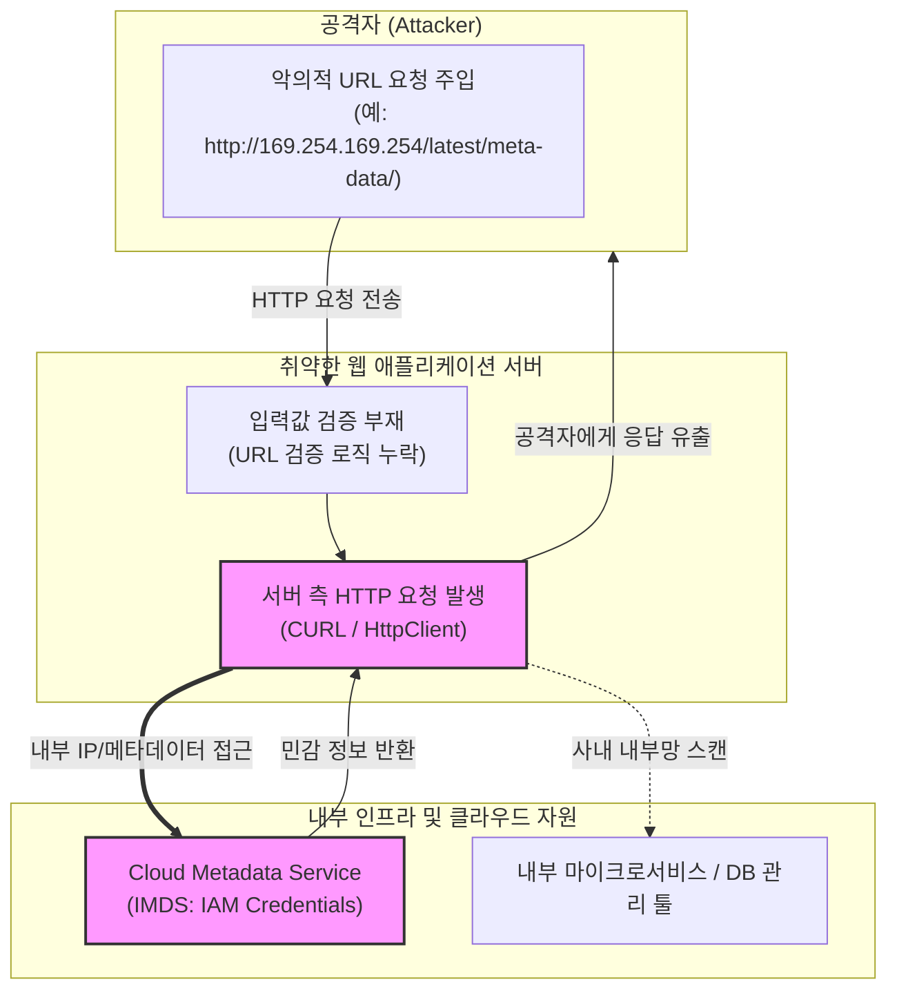

# SSRF (Server-Side Request Forgery)

---

## I. 웹 서버의 신뢰성을 악용한 내부 인프라 침해 취약점, SSRF의 개요

* **정의**: 웹 애플리케이션이 사용자로부터 입력받은 URL이나 외부 리소스 경로를 적절한 검증 없이 그대로 사용하여, 서버가 직접 임의의 외부 또는 내부 네트워크로 HTTP 요청을 발생시키도록 유도하는 웹 보안 취약점
* **등장 배경 및 특징**:
* **클라우드 및 API 연동 확대**: 마이크로서비스, 외부 API 호출, 웹훅(Webhook), 파일 다운로드 등 서버 간 통신(Server-to-Server) 기능 증가에 따른 공격 표면 확대
* **내부망 침투 경로 제공**: 외부에서 접근할 수 없는 내부 네트워크(Private Network) 및 클라우드 메타데이터 서비스에 직접 접근 가능
* **치명적 파급력**: 클라우드 [[인스턴스]] 자격 증명 탈취, 내부 시스템 정찰 및 원격 코드 실행(RCE)으로 이어지는 고위험 취약점

---

## II. SSRF의 아키텍처 및 핵심 기술 요소

### 가. SSRF의 취약점 발생 메커니즘 및 동작 원리

* 공격자가 웹 서버의 URL 입력 기능에 내부망 주소나 메타데이터 IP를 주입하고, 서버가 이를 검증 없이 실행하여 내부 민감 데이터를 취득 후 공격자에게 반환함

### 나. SSRF의 핵심 기술 및 대응 요소

| 분류 (Category) | 요소기술 (키워드) | 세부 설명 |
| --- | --- | --- |
| **취약점 유형** | Basic SSRF | 서버가 외부 공격자의 지정 서버로 요청을 보내게 하여 포트 스캔이나 응답 지연 유발 |
| **취약점 유형** | Blind SSRF | 응답 결과가 화면에 노출되지 않으나, 비동기 로그 등을 통해 내부망 상태를 유추하는 방식 |
| **주요 타겟** | Cloud Metadata (IMDS) | AWS/GCP 등 클라우드 인스턴스의 [[IAM]] 권한 토큰 및 자격 증명 탈취 |
| **우회 기법** | [[DNS(Domain Name System)|DNS]] Rebinding | 초기 검증 시에는 안전한 도메인이나 실제 연결 시 악성 내부 IP로 변조하는 공격 기법 |
| **방어 기법** | URL Whitelisting | 허용된 도메인 또는 IP 대역만 명시적으로 허용하고 사설 IP 대역(RFC 1918) 차단 |
| **방어 기법** | Egress Filtering | 방화벽을 통해 웹 서버가 외부로 나가는 아웃바운드 트래픽(Outbound)의 대역 및 포트 엄격 통제 |
| **클라우드 대응** | IMDSv2 도입 | 토큰 기반 인증 세션을 요구하여 기존의 단순한 메타데이터 접근 요청 차단 |
| **아키텍처 대응** | [[제로 트러스트 보안모델|Zero Trust]] Network | 내부 서비스 간 통신 시 상호 인증(mTLS) 및 네트워크 세분화(Segmentation) 적용 |

---

## III. CSRF와 SSRF 비교 및 향후 전망

### 가. CSRF vs SSRF 비교

| 비교 항목 | [[CSRF]] (Cross-Site Request Forgery) | SSRF (Server-Side Request Forgery) |
| --- | --- | --- |
| **공격 주체** | 피해자의 브라우저 (Victim's Browser) | 백엔드 웹 애플리케이션 서버 (Backend Server) |
| **공격 대상** | 사용자가 인증된 웹 서비스의 상태 변경 기능 | 백엔드 서버가 접근 가능한 내부 및 외부 네트워크 리소스 |
| **주요 권한** | 일반 사용자(Victim)의 [[세션]] 및 권한 | 서버(Server)가 가진 네트워크 및 클라우드 권한 |
| **주요 피해** | 사용자 계정 도용, 비밀번호 변경 등 개인 권한 남용 | 내부망 인프라 장악, 클라우드 자격 증명 탈취, RCE |

### 나. 향후 전망 및 발전 방향

* **[[클라우드 네이티브]] 환경의 보안 통제 강화**: [[쿠버네티스]](Kubernetes) 및 서버리스(Serverless) 환경에서 네트워크 정책(Network Policy)과 이그레스(Egress) 게이트웨이를 통한 철저한 아웃바운드 트래픽 제어 [[일반화]]
* **AI 기반 취약점 자동 진단([[SAST]]/[[DAST]])**: API 엔드포인트 및 웹훅 수신부를 대상으로 복잡한 DNS 리바인딩 및 SSRF 패턴을 실시간 탐지하는 자동화 보안 검증 도구 도입 확대

---

### 🔗 연관 토픽

- **소속 도메인**: [[00_보안_MOC|🛡️ 보안]]
- **세부 분류**: `2. 현대 암호학 & 키 관리 · 전자서명`
- **핵심 연관 토픽**:
  - [[IAM]]
  - [[OWASP Top 10 2025]]
  - [[CSRF]]
  - [[DAST]]
  - [[제로 트러스트 보안모델|제로 트러스트 (Zero Trust) 보안모델]]
