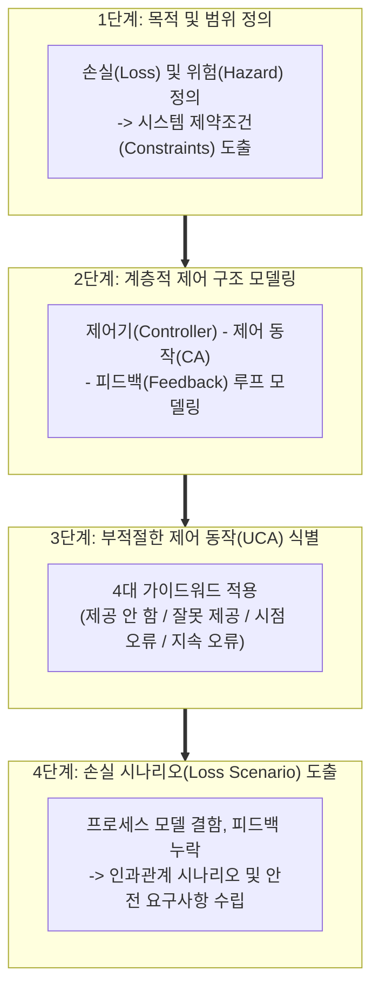

# STPA (System-Theoretic Process Analysis)

---

## I. 시스템 이론 기반 안전 분석 및 사고 예방 체계, STPA의 개요

* **정의**: MIT의 낸시 레브슨(Nancy Leveson) 교수가 주창한 STAMP(System-Theoretic Accident Model and Processes) 사고 모델에 기반하여, 시스템을 '구성 요소의 고장'이 아닌 **'제어의 상실(Loss of Control)'** 관점에서 분석하고 위험을 사전에 차단하는 시스템 안전 분석 기법
* 소프트웨어 오작동, 복잡한 컴포넌트 간 상호작용 오류, 인적 과실 및 시스템 제어 결함 대응 목적
* 특징: 전통적 [[신뢰성]] 공학의 한계 극복, 최상위(Top-Down) 시스템 제어 구조 모델링, 소프트웨어 집약적 및 AI·[[Smart Car(자율주행)|자율주행]] 시스템 표준 안전 분석 적용

---

## II. STPA의 아키텍처 및 핵심 기술 요소

### 가. STPA의 분석 프로세스 및 계층적 제어 구조

* 시스템의 잠재적 손실과 위험을 정의한 뒤(1단계), 제어 루프 구조를 시각화하고(2단계), 4가지 가이드워드를 통해 부적절한 제어 동작(UCA)을 도출한 후(3단계), 세부 인과 시나리오를 분석하는 구조

### 나. STPA의 핵심 구성 요소 및 기술 요소

| 분류 | 요소기술(키워드) | 세부 설명 |
| --- | --- | --- |
| 분석 기반 | STAMP 사고 모델 | 사고를 구성 요소 개별의 물리적 고장이 아닌 제약조건 위반과 제어 실패로 정의 |
| 구조 모델링 | 계층적 제어 구조 (Hierarchical Control Structure) | 제어기, 피드백, 제어 액션 간의 상호작용 관계를 계층적으로 표현 |
| 핵심 분석 | UCA (Unsafe Control Action) | 특정 맥락과 환경에서 시스템 사고를 유발할 수 있는 잠재적 위험 제어 명령 |
| UCA 분류 | 4대 가이드워드 (Guide-words) | 미제공, 제공 시점 오류(너무 이름/늦음), 제공 과다/과소, 잘못된 제어 동작 |
| 인과 분석 | 손실 시나리오 (Loss Scenario) | UCA가 발생하는 원인([[프로세스]] 모델 결함, 피드백 오류 등)을 추적하는 단계 |
| 적용 도메인 | 소프트웨어 및 자율 시스템 | 복잡한 소프트웨어 로직, AI 에이전트, 자율주행(SOTIF) 및 항공우주 안전 검증 |
| 자동화 연계 | Model-Based Safety Testing | STPA 결과물을 기반으로 상태 전이 모델 및 자동 테스트 케이스(TC) 생성 |
| 최신 트렌드 | 런타임 모니터링 및 [[DevOps]] 연계 | STPA에서 도출된 제약조건을 데이터/네트워크 레벨의 실시간 런타임 감시 규칙으로 전환 |

---

## III. 전통적 안전 분석 기법 vs STPA 비교 및 동향

| 비교 항목 | 전통적 분석 기법 ([[FTA (Fault Tree Analysis)|FTA]], [[FMEA (Failure Mode and Effects Analysis)|FMEA]] 등) | 차세대 STPA (System-Theoretic...) |
| --- | --- | --- |
| **사고 관점** | 물리적 컴포넌트의 개별 고장(Component Failure) 중심 | 시스템 전체 관점의 **제어 상실(Loss of Control)** 중심 |
| **소프트웨어 및 인간** | 복잡한 소프트웨어 로직 및 인적 과실 반영의 한계 존재 | 소프트웨어 제어 오류 및 운영자 상호작용 결함 포괄적 분석 |
| **분석 범위** | 단일 부품의 신뢰성 및 고장률(Probability) 산정에 집중 | 시스템 아키텍처 내 상호작용 및 동적 제약조건 검증에 특화 |

* 최근 자율주행 자동차(SOTIF), 도심항공교통([[UAM]]), [[인공지능]](AI) 등 소프트웨어와 [[알고리즘]] 중심의 고위험(High-Risk) 시스템이 급증함에 따라, 기존의 하드웨어 고장 중심 분석에서 벗어나 시스템 제어 관계를 체계적으로 검증하는 **STPA 기반 안전 엔지니어링 표준**이 핵심 방법론으로 자리 잡고 있음

---

### 🔗 연관 토픽

- **소속 도메인**: [[00_소프트웨어공학_MOC|🏗️ 소프트웨어공학]]
- **세부 분류**: `2. 애자일(Agile) & 지속적 통합/배포(CI/CD)`
- **핵심 연관 토픽**:
  - [[DevOps|데브옵스 (DevOps)]]
  - [[FMEA (Failure Mode and Effects Analysis)]]
  - [[기능안전 표준|기능안전 표준 (Functional Safety Standards)]]
  - [[SW 안전성(SW Safety) 및 분석 개념]]
  - [[인공지능]]
