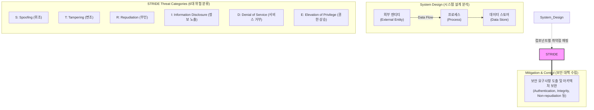

# STRIDE

---

## I. 소프트웨어 보안 위협 식별 및 모델링 기법, STRIDE의 개요

* **정의**: 마이크로소프트(MS)가 개발한 대표적인 [[위협 모델링]](Threat Modeling) 방법론으로, 소프트웨어 설계 단계에서 발생할 수 있는 보안 위협을 6가지 범주로 분류하여 체계적으로 식별하고 대응하기 위한 [[프레임워크]]
* **등장 배경 및 특징**:
* **시큐어 코딩의 한계 극복**: 개발 완료 후 사후 대응 방식에서 벗어나, 설계(Design) 단계부터 보안 취약점을 선제 차단하는 **Shift-Left** 보안 구현
* **체계적 위협 커버리지**: 시스템의 데이터 흐름(Data Flow)을 분석하여 누락 없는 일관된 위협 식별 보장
* **컴포넌트 연계성**: DFD([[데이터 흐름도]])의 요소별(외부 [[엔티티]], [[프로세스]], 데이터 스토어, 데이터 흐름)로 발생 가능한 위협을 매핑하여 분석

---

## II. STRIDE의 위협 모델링 아키텍처 및 6대 핵심 구성 요소

### 가. STRIDE 위협 모델링 프로세스 및 아키텍처

* 시스템 설계 단계의 데이터 흐름과 컴포넌트를 정의하고, 각 요소별로 STRIDE 6대 위협 요소를 대입하여 취약점을 식별한 뒤 보안 대책을 수립함

### 나. STRIDE의 6대 위협 분류 및 핵심 구성 요소

| 분류 (Category) | 요소기술 (키워드) | 세부 설명 |
| --- | --- | --- |
| **위협 요소** | S: Spoofing (위조) | 사용자의 신원(Identity)을 도용하여 다른 사용자인 것처럼 위장하는 위협 (예: 인증 우회, [[세션]] 탈취) |
| **위협 요소** | T: Tampering (변조) | 데이터나 시스템 구성 요소를 권한 없이 무단으로 수정하거나 파괴하는 위협 (예: 패킷/DB 위변조) |
| **위협 요소** | R: Repudiation (부인) | 사용자가 특정 행위를 수행하고도 이를 부인할 수 있도록 방어 메커니즘이 부재한 취약점 (예: 감사 로그 누락) |
| **위협 요소** | I: Information Disclosure (정보 노출) | 권한이 없는 자에게 민감한 데이터나 시스템 내부 정보가 유출되는 위협 (예: 평문 전송, [[암호화]] 미흡) |
| **위협 요소** | D: [[DoS (Denial of Service)|Denial of Service]] (서비스 거부) | 시스템 자원을 고갈시켜 정상적인 서비스 제공을 방해하거나 차단하는 위협 (예: 자원 과부하 유발) |
| **위협 요소** | E: Elevation of Privilege (권한 상승) | 일반 사용자가 버그나 취약점을 악용하여 관리자 등 상위 권한을 탈취하는 위협 (예: 권한 검증 누락) |
| **분석 도구** | DFD (Data Flow Diagram) | 시스템 내 데이터의 흐름과 저장소, 프로세스를 시각화하여 위협 모델링의 기반 제공 |
| **최신 트렌드** | AI 기반 자동 위협 모델링 | 생성형 AI를 결합하여 아키텍처 설계도(DFD/IaC)를 분석하고 STRIDE 위협을 자동 도출하는 최신 동향 |

---

## III. STRIDE의 한계점 및 최신 동향 (DevSecOps 연계)

### 가. 전통적 STRIDE와 AI 기반 자동 위협 모델링 비교

| 비교 항목 | 전통적 STRIDE 위협 모델링 | AI 기반 자동 위협 모델링 (최신 트렌드) |
| --- | --- | --- |
| ** 수행 방식** | 보안 전문가가 수동으로 DFD 작성 및 브레인스토밍 | IaC(Terraform) 또는 아키텍처 다이어그램 기반 AI 자동 분석 |
| **소요 시간** | 설계 초기 단계에서 수일~수주 소요 | CI/CD 파이프라인 내에서 실시간(분 단위) 식별 |
| **확장성** | 복잡한 대규모 마이크로서비스([[MSA (Micro Service Architecture)|MSA]]) 적용 시 누락 발생 가능 | 복잡한 [[클라우드 네이티브]] 아키텍처의 위협 요소를 빠짐없이 탐지 |
| **[[유지보수]]** | 아키텍처 변경 시 수동 문서 갱신 필요 | 코드 변경 시 위협 모델이 실시간 자동 동기화 |

### 나. 향후 전망 및 발전 방향

* **[[DevSecOps]] 및 CI/CD 파이프라인 통합**: 소프트웨어 개발 수명주기([[SDLC]])의 초기 설계 단계부터 위협 모델링 자동화 툴(예: Microsoft Threat Modeling Tool, OWASP Threat Dragon)을 연동하여 보안 취약점 사전 차단 체계 [[일반화]]
* **IaC(Infrastructure as Code) 기반 위협 모델링**: 클라우드 인프라 구성 코드를 입력받아 STRIDE 기반 위협 요소를 자동으로 도출하고 클라우드 보안 [[형상 관리]](CSPM)와 연계하는 방향으로 진화

---

### 🔗 연관 토픽

- **소속 도메인**: [[00_보안_MOC|🛡️ 보안]]
- **세부 분류**: `2. 현대 암호학 & 키 관리 · 전자서명`
- **핵심 연관 토픽**:
  - [[위협 모델링|위협 모델링(Threat Modeling) - Secure SDLC]]
  - [[데이터 흐름도]]
  - [[개인정보보호 중심 설계|개인정보보호 중심 설계(Privacy by Design)]]
  - [[클라우드 네이티브]]
  - [[유지보수]]
