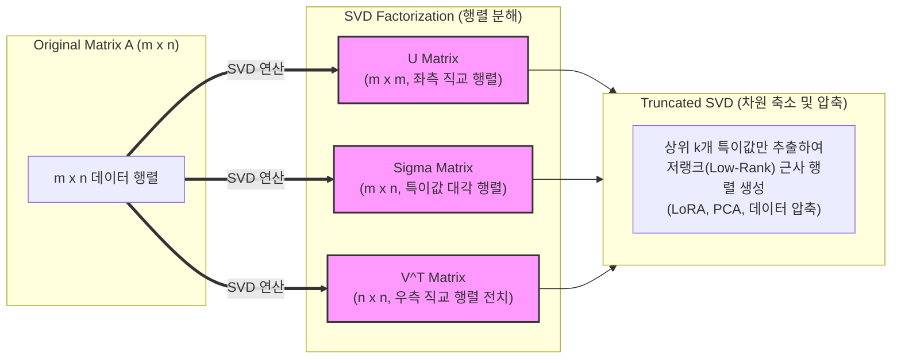

# SVD (Singular Value Decomposition, 특이값 분해)

---

## I. 임의의 직사각 행렬 분해 및 차원 축소를 위한 선형대수학 핵심 기법, SVD의 개요

* **정의**: 임의의 $m \times n$ 실수 행렬 $A$를 세 개의 행렬의 곱($A = U \Sigma V^T$)으로 분해하여 행렬의 기하학적 구조를 분석하고 핵심 정보만 추출하는 수학적 연산 기법
* **등장 배경 및 특징**:
* **정사각 행렬 한계 극복**: 고유값 분해(Eigendecomposition)가 정사각 행렬에서만 적용 가능한 한계를 극복하고 모든 직사각 행렬에 적용 가능
* **저랭크 근사(Low-Rank Approximation)**: 데이터의 분산(정보량)이 큰 주요 특이값만 선별하여 원본 데이터의 손실을 최소화하면서 대규모 행렬 압축 및 노이즈 제거
* **AI/ML의 수학적 기반**: 주성분 분석([[PCA(Principal Component Analysis)|PCA]]), 추천 시스템, 그리고 최신 [[sLLM (Smaller Large Language Model)|sLLM]]의 효율적 미세조정을 위한 LoRA([[LoRA(Low-rank adaptation)|Low-Rank Adaptation]])의 근간 기술

---

## II. SVD의 아키텍처 및 핵심 기술 요소

### 가. SVD의 분해 아키텍처 및 동작 원리

* 행렬 $A$는 좌측 특이벡터($U$), 특이값 대각행렬($\Sigma$), 우측 특이벡터 전치($V^T$)로 분해되며, Truncated SVD를 통해 상위 $k$개 성분만 추출하여 고속 [[차원 축소]] 수행

### 나. SVD의 핵심 기술 및 구성 요소

| 구분 | 요소기술 (키워드) | 세부 설명 |
| --- | --- | --- |
| **분해 구성** | Left-Singular Vectors ($U$) | 열 공간(Column Space)의 정규직교 기저를 형성하는 $m \times m$ 직교 행렬 |
| **분해 구성** | Singular Values ($\Sigma$) | 대각 원소에 내림차순으로 정렬된 음이 아닌 실수 값으로 각 성분의 중요도 표현 |
| **분해 구성** | Right-Singular Vectors ($V^T$) | 행 공간(Row Space)의 정규직교 기저를 형성하는 $n \times n$ 직교 행렬의 전치 |
| **근사 기법** | Truncated SVD | 상위 $k$개의 특이값만 선택하여 대규모 행렬을 저랭크(Low-Rank)로 근사 압축 |
| **데이터 분석** | PCA 연동 (주성분 분석) | 공분산 행렬의 고유값 분해와 수학적으로 동치이며 다차원 데이터의 주성분 추출 |
| **AI 적용** | LoRA (Low-Rank Adaptation) | [[초거대 언어 모델|LLM]] 파인튜닝 시 가중치 변화량을 저랭크 행렬 두 개($A \times B$)로 분해하여 연산량 절감 |
| **수치 연산** | Numerical Stability | 역행렬이 존재하지 않는 특이 행렬이나 비정사각 행렬 환경에서도 수치적 안정성 보장 |
| **응용 분야** | 협업 필터링 & LSI | 넷플릭스 등 추천 시스템의 평점 [[결측치]] 예측 및 잠재 의미 분석(LSI) 처리 |

---

## III. 고유값 분해와의 비교 및 최신 동향

### 가. 고유값 분해(Eigendecomposition) vs 특이값 분해(SVD) 비교

| 비교 항목 | 고유값 분해 (Eigendecomposition) | 특이값 분해 (SVD, Singular Value Decomposition) |
| --- | --- | --- |
| **적용 대상** | **정사각 행렬(Square Matrix)**만 적용 가능 | 정사각 행렬뿐만 아니라 **모든 직사각 행렬($m \times n$)** 적용 가능 |
| **벡터 성격** | 고유벡터들이 반드시 직교(Orthogonal)하지 않음 | 좌측 및 우측 특이벡터가 **항상 직교**함 |
| **대각 행렬** | 고유값들로 구성된 대각 행렬 ($\Lambda$) | 음수가 아닌 **특이값(Singular Values)**들로 구성된 $\Sigma$ |
| **수치 안정성** | 대칭 행렬이 아닐 경우 계산상 불안정성 발생 가능 | 노이즈에 강하며 수치적으로 매우 안정적임 |

### 나. 최신 트렌드 및 발전 방향

* **생성형 AI 및 sLLM의 LoRA/QLoRA 최적화 연계**: 거대 언어 모델의 파라미터 효율적 미세조정([[PEFT]]) 시 가중치 행렬을 저랭크로 분해하는 원리의 핵심 수학 도구로 활용 가속
* **확률적 SVD (Randomized SVD) 고속화**: 대규모 빅데이터 및 스트리밍 환경에서 전체 행렬을 계산하지 않고 확률적 샘플링을 통해 고속으로 특이값을 근사하는 분산 처리 파이프라인 정착

---

### 🔗 연관 토픽

- **소속 도메인**: [[00_인공지능_MOC|🤖 인공지능]]
- **세부 분류**: `1. 수학 · 통계학 & 데이터 전처리`
- **핵심 연관 토픽**:
  - [[차원 축소|차원 축소(Dimensionality Reduction)]]
  - [[PCA(Principal Component Analysis)]]
  - [[LoRA(Low-rank adaptation)]]
  - [[초거대 언어 모델|초거대 언어 모델(Large Language Model)]]
  - [[sLLM (Smaller Large Language Model)]]
