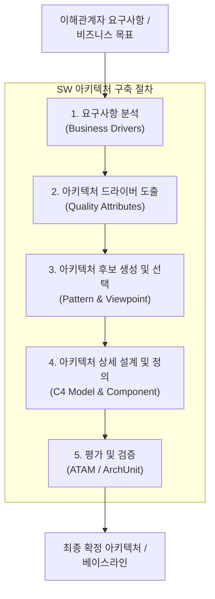

# SW 아키텍처 구축 절차 (Software Architecture Construction Process)

---

## I. 비즈니스 요구사항과 품질 속성의 체계적 구현을 위한 설계 프레임워크, SW 아키텍처 구축 절차의 개요

* **정의**: 비즈니스 목표와 이해관계자의 요구사항을 분석하여 시스템의 전체적인 구조, 컴포넌트 간 관계 및 품질 속성을 도출하고 구체화하는 일련의 공학적 설계 단계
* 이해관계자 간 이해 증진, 아키텍처 리스크 조기 식별 및 시스템 확장성·유지보수성 보장
* 특징: 아키텍처 드라이버 기반 설계, 반복적(Iterative) 정련, 시나리오 중심 품질 검증

---

## II. SW 아키텍처 구축 절차의 아키텍처 및 핵심 구성요소

### 가. SW 아키텍처 구축의 단계별 프로세스 및 동작 원리

* 비즈니스 및 품질 요구사항 분석을 통해 아키텍처 드라이버를 도출하고, 적절한 패턴을 선정하여 상세 설계 후 [[ATAM]] 등을 통해 검증하는 구조

### 나. SW 아키텍처 구축 절차의 핵심 기술 및 구성 요소

| 분류 | 요소기술(키워드) | 세부 설명 |
| --- | --- | --- |
| 분석 단계 | 비즈니스 드라이버 | 시스템이 달성해야 할 전략적 목표 및 이해관계자 요구 정의 |
| 분석 단계 | 품질 속성 시나리오 | 자극(Stimulus)과 반응(Response) 기반의 비기능적 요구사항 구체화 |
| 설계 단계 | 아키텍처 패턴 | [[MSA (Micro Service Architecture)|MSA]], [[EDA]], Layered 등 시스템 구조적 스타일 선택 |
| 설계 단계 | 뷰포인트 모델링 | C4 모델 등을 활용한 컨텍스트, [[컨테이너]], 컴포넌트 관점 설계 |
| 평가 단계 | ATAM | 품질 속성 상충관계 및 아키텍처 리스크 분석 평가 기법 |
| 검증 단계 | ArchUnit / 린터 | 코드 레벨 아키텍처 제약조건 자동 검증 및 드리프트 방지 |
| 거버넌스 | 아키텍처 베이스라인 | 변경 관리 및 형상 관리를 위한 아키텍처 표준 승인 및 고정 |
| 최신 트렌드 | AI 기반 아키텍처링 | [[초거대 언어 모델|LLM]]을 활용한 아키텍처 초안 자동 생성 및 결함 탐지 |

---

## III. 전통적 폭포수 기반 아키텍처 설계 vs 애자일/클라우드 네이티브 아키텍처 구축 비교

| 비교 항목 | 전통적 [[워터폴|폭포수]] 아키텍처 설계 | 애자일 / [[클라우드 네이티브]] 아키텍처 구축 |
| --- | --- | --- |
| **추진 방식** | 프로젝트 초기 대규모 일괄 설계 (Big Design Up Front) | 점진적·반복적 설계 (Evolutionary Architecture) |
| **변화 수용성** | 요구사항 변경 시 설계 수정 비용 큼 (High Cost) | 도메인 변화에 다른 지속적 리팩토링 및 확장 용이 |
| **검증 시점** | 프로젝트 말기 통합 단계 집중 검증 | CI/CD 파이프라인 연계형 자동화 테스트 및 아키텍처 검증 |
| **주요 활용** | 임베디드, 대규모 엔터프라이즈 레거시 시스템 | MSA, 서버리스 등 급변하는 분산 웹 서비스 환경 |

* 최근 클라우드 네이티브 및 마이크로서비스(MSA) 환경의 급격한 확장에 따라, 고정된 초기 설계에서 벗어나 진화적 아키텍처(Evolutionary Architecture) 개념과 AI 기반 자동 거버넌스 도구를 결합한 유연한 구축 절차가 주를 이루고 있음

---

### 🔗 연관 토픽

- **소속 도메인**: [[00_소프트웨어공학_MOC|🏗️ 소프트웨어공학]]
- **세부 분류**: `3. 요구사항 공학 & UML 객체지향 분석/설계`
- **핵심 연관 토픽**:
  - [[ATAM]]
  - [[MSA (Micro Service Architecture)]]
  - [[EDA|EDA (Event-Driven Architecture)]]
  - [[클라우드 네이티브]]
  - [[컨테이너|컨테이너 (Container)]]
