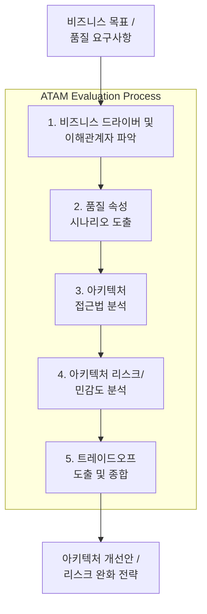

# SW Architecture 평가
# 소프트웨어 아키텍처 평가 (Software Architecture Evaluation)

---

## I. 품질 속성 달성 여부 검증 및 최적화 프로세스, 소프트웨어 아키텍처 평가의 개요

* **정의**: 시스템 구현 전·후 단계에서 성능, 보안, 유지보수성 등 핵심 품질 속성의 충족 여부를 체계적으로 분석하고 잠재적 위험을 식별하는 공학적 검증 [[프로세스]]
* 품질 속성 간 상충관계(Trade-off) 분석, 아키텍처 리스크(Risk) 조기 발견 및 대규모 재작업 비용 절감
* 특징: 품질 요구사항 기반 시나리오 분석, 이해관계자 참여형 평가, 지속적 거버넌스 체계 연계

---

## II. 소프트웨어 아키텍처 평가의 개념도 및 핵심 기술 요소

### 가. 소프트웨어 아키텍처 평가(ATAM 기준)의 프로세스 및 동작 원리

* 비즈니스 드라이버 정의 후 구체적 시나리오를 도출하여, 아키텍처의 민감도와 리스크를 분석하고 트레이드오프를 도출하는 구조

### 나. 소프트웨어 아키텍처 평가의 핵심 기술 요소

| 분류 | 요소기술(키워드) | 세부 설명 |
| --- | --- | --- |
| 평가 방법론 | [[ATAM]] | 품질 속성 상충관계 및 아키텍처 리스크 중심의 대표적 평가 기법 |
| 평가 방법론 | [[SAAM]] | 시스템의 기능 변경 용이성(Modifiability) 중심의 최초 평가 기법 |
| 평가 방법론 | [[CBAM]] | 아키텍처 투자 대비 비용과 경제적 편익을 정량 분석하는 기법 |
| 품질 모델 | ISO/IEC 25010 | 기능성, 성능 효율성, 호환성, 보안성 등 소프트웨어 품질 표준 모델 |
| 핵심 개념 | 품질 속성 시나리오 | 자극(Stimulus), 환경(Environment), 반응(Response) 기반 비기능적 요구사항 구체화 |
| 아키텍처 검증 | ArchUnit | 코드 레벨에서 아키텍처 제약조건 준수 여부를 자동 검증하는 도구 |
| 거버넌스 | 아키텍처 드리프트 방지 | 설계 의도와 실제 구현 코드 간의 괴리를 실시간 탐지 및 통제 |
| 최신 트렌드 | AI 기반 아키텍처 거버넌스 | [[초거대 언어 모델|LLM]]을 활용한 정적 코드 분석 및 아키텍처 위반 자동 탐지 |

---

## III. 전통적 수동 평가 vs AI 기반 자동화 아키텍처 평가 비교 및 동향

| 비교 항목 | 전통적 수동 평가 (Expert-led Review) | AI 기반 자동화 아키텍처 평가 (AI-Driven Gov.) |
| --- | --- | --- |
| **수행 주체** | 아키텍처 전문가 및 이해관계자 워크숍 중심 | LLM, 정적 분석 툴 및 CI/CD 파이프라인 자동화 |
| **평가 주기** | 주요 마일스톤 시점 (비정기적 일회성 수행) | 코드 커밋 및 빌드 시점 (실시간 상시 검증) |
| **장단점** | 심층적인 트레이드오프 논의 가능하나 시간·비용 과다 | 빠른 피드백과 드리프트 방지 가능하나 심층 비즈니스 맥락 이해 한계 |
| **주요 활용** | 대규모 엔터프라이즈 설계 단계 및 초기 검증 | 마이크로서비스([[MSA (Micro Service Architecture)|MSA]]) 및 [[클라우드 네이티브]] 지속적 배포 환경 |

* 최근 MSA 및 클라우드 네이티브 환경의 확장에 따라, 고비용의 사후 워크숍 중심 평가에서 벗어나 CI/CD 파이프라인과 연계된 아키텍처 자동 린터 및 AI 기반 아키텍처 드리프트(Drift) 검증 체계가 표준으로 자리 잡고 있음
---

![[notion_38a44dff397c_image.png]]

![[notion_38a44dff397c_image.png]]

![[notion_34d44dff397c_{F00C4325-3DAA-4AEC-AAC2-14FDD106EFF5}.png]]

요청하신 **'[[SW 아키텍처 평가]]'** 토픽에 대하여, 전통적인 ATAM/CBAM 모델부터 최신 진화적 아키텍처(Evolutionary Architecture)의 자동화 평가 동향까지 반영하여 1교시형(단답형) 모범답안을 작성했습니다. 작성 전 SEI(Software Engineering Institute) 아키텍처 평가 표준 및 품질 속성에 대한 사실관계와 논리 구조 검증을 2회 교차 완료하였습니다.

---

## I. 고품질 시스템 보장과 리스크 조기 식별, SW 아키텍처 평가의 개요

### 가. SW 아키텍처 평가의 정의

- 설계된(또는 설계 중인) 소프트웨어 아키텍처가 이해관계자의 비즈니스 목표와 품질 속성(Quality Attributes)을 충족하는지 정량적/정성적으로 분석하고 위험 요소를 조기에 식별하는 공학적 검증 활동임.
### 나. SW 아키텍처 평가의 필요성 및 특징

- **결함 수정 비용 최소화:** 개발 후반부나 운영 단계에서 아키텍처 변경 시 발생하는 막대한 재작업 비용(Rework Cost)을 초기 단계에서 예방
- **상충관계(Trade-off) 해결:** 보안성, 성능, [[HA(High Availability)|가용성]] 등 서로 충돌하는 품질 속성 간의 최적의 균형점(Sweet Spot) 도출
- **이해관계자 합의 도출:** 기획자, 개발자, 운영자 간의 상이한 기대 수준을 시나리오 기반으로 조율하고 의사소통 기준 제공

---

## II. SW 아키텍처 평가의 개념도 및 핵심 기술 요소

### 가. SW 아키텍처 평가 체계도 (ATAM 시나리오 기반 흐름)

![[notion_34d44dff397c_image.png]]

### 나. SW 아키텍처 평가의 핵심 평가 모델 및 분석 요소

| **구분** | **요소기술 및 지표 (키워드)** | **세부 설명 및 특징** |
| --- | --- | --- |
| **평가** | **SAAM (SW Arch. Analysis Method)** | - 최초의 아키텍처 평가 모델, **수정 용이성(Modifiability)**과 기능성 중심의 평가 - 시나리오 기반으로 아키텍처의 변경 영향을 분석 |
| **모델** | **ATAM (Arch. Trade-off Analysis)** | - SAAM을 발전시켜 다양한 **품질 속성 간의 상충관계(Trade-off)**를 중점적으로 평가하는 SEI의 표준 [[프레임워크]] |
|  | **CBAM (Cost Benefit Analysis)** | - ATAM 결과를 바탕으로 아키텍처 설계 대안들에 대한 **경제적 효용성(비용-이익, ROI)**을 분석하여 최종 의사결정 지원 |
|  | **[[ARID]] (Active Reviews for Inter. Design)** | - 아키텍처 설계가 완료되기 전, **초기/중간 단계(Intermediate)**의 특정 부분(컴포넌트)을 사전 검토하는 기법 |
| **핵심** | **품질 속성 시나리오** | - 시스템의 비기능 요구사항을 자극(Stimulus), 환경, 반응(Response)의 형태로 구체화하고 정량화한 평가 기준 명세서 |
| **평가** | **[[유틸리티 트리|유틸리티 트리 (Utility Tree)]]** | - 성능, 보안 등 품질 속성을 트리 형태로 구조화하고 비즈니스 중요도와 기술적 난이도(H/M/L)를 할당한 핵심 도구 |
| **요소** | **민감점 (Sensitivity Point)** | - 하나 이상의 품질 속성에 결정적/지배적인 영향을 미치는 아키텍처 구성 요소 (예: [[암호화]] [[알고리즘]] 수준) |
| **(ATAM)** | **상충점 (Trade-off Point)** | - 두 개 이상의 품질 속성에 영향을 주어, 하나의 속성이 향상되면 다른 속성이 저하되는 지점 (민감점의 교집합) |

---

## III. 최신 아키텍처 패러다임 변화에 따른 평가 동향 및 향후 전망

### 가. 주요 아키텍처 평가 모델 비교 (ATAM vs CBAM)

| **비교 항목** | **ATAM (상충관계 분석)** | **CBAM (비용 편익 분석)** |
| --- | --- | --- |
| **평가 목적** | 품질 속성의 충족 여부 및 상충관계 식별 | 아키텍처 설계 대안의 경제성(비용 대비 효과) 분석 |
| **주요 관점** | **기술적 관점** (Technical) | **비즈니스/재무적 관점** (Economic) |
| **핵심 산출물** | 위험, 비위험, 민감점, 상충점 | 대안별 ROI, 비용-편익 매트릭스 |
| **수행 순서** | 시스템 구조 확립 후 우선 수행 (선행) | ATAM 수행 후 도출된 대안을 바탕으로 수행 (후행) |

### 나. SW 아키텍처 평가의 향후 전망 (클라우드 네이티브 및 자동화)

- **피트니스 함수(Fitness Function) 기반 지속적 평가:** 애자일 및 MSA 환경에서는 아키텍처가 점진적으로 변화(Evolutionary Architecture)하므로, 과거처럼 일회성 회의로 평가하는 대신 CI/CD 파이프라인 내에 성능, 보안 지표를 검증하는 코드(Fitness Function)를 삽입하여 **자동화된 상시 평가 체계**를 구축하는 추세임.
- **[[CSP]] 기반 Well-Architected Framework 적용:** AWS, Azure 등 퍼블릭 클라우드 환경에서는 클라우드 사업자(CSP)가 제공하는 보안, 안정성, 성능 효율성, 비용 최적화, 운영 우수성의 5~6대 원칙(Pillar)을 기반으로 자사의 아키텍처를 진단하는 방식이 실무적 표준으로 자리 잡고 있음.

---

**💡 [학습 보조 도구] ATAM 품질 속성 상충관계(Trade-off) 시뮬레이터**

아키텍처 설계 시 하나의 품질 속성을 높일 때 다른 속성이 어떻게 저하되는지(상충점), 그리고 민감도가 어떻게 변화하는지 직관적으로 이해할 수 있는 시뮬레이션입니다.

시각 자료 표시

---

### 🔗 연관 토픽

- **소속 도메인**: [[00_소프트웨어공학_MOC|🏗️ 소프트웨어공학]]
- **세부 분류**: `4. 아키텍처 스타일 & 객체지향 설계 원리`
- **핵심 연관 토픽**:
  - [[CBAM|CBAM(Cost Benefit Analysis Method)]]
  - [[ARID]]
  - [[프레임워크]]
  - [[MSA (Micro Service Architecture)]]
  - [[ATAM]]
