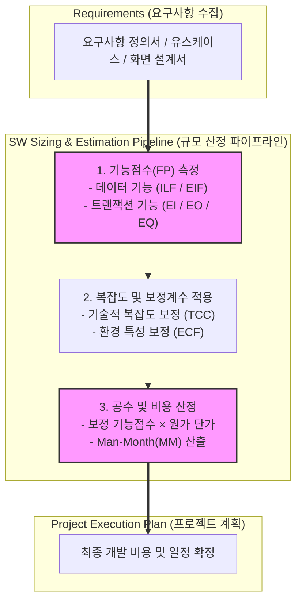

# SW 규모산정 (소프트웨어 규모산정)

---

## I. 객관적 공수 및 비용 산정을 위한 공학적 측정 기법, SW 규모산정의 개요

* **정의**: 소프트웨어 개발 프로젝트의 성공적인 수행을 위해 필요한 자원, 투입 공수(Man-Month), 비용 및 기간을 객관적으로 예측하기 위해 기능적 요구사항이나 코드 양을 측정하는 공학적 방법론
* **등장 배경 및 특징**:
* **부실 공사 및 예산 낭비 방지**: 주관적인 감에 의존한 산정을 배제하고 공공 및 민간 사업의 투명성과 [[신뢰성]] 확보
* **국내 표준 기능점수(FP) 의무화**: 국내 공공 소프트웨어 사업에서 LOC 방식의 한계를 극복하기 위해 사용자 관점의 기능점수([[Function Point]]) 산정 방식 법제화
* **AI 및 애자일 환경 적응**: 생성형 AI 개발 도구와 애자일 방법론 확산에 발맞추어 동적이고 신속한 규모 산정 체계로 진화

---

## II. SW 규모산정의 아키텍처 및 핵심 기술 요소

### 가. SW 규모산정의 처리 프로세스 및 아키텍처

* 요구사항 명세서를 바탕으로 데이터 기능과 [[트랜잭션]] 기능을 분류하여 기능점수(FP)를 산출하고, 기술 및 환경 보정계수를 반영하여 최종 투입 공수(MM)와 비용을 도출함

### 나. SW 규모산정의 핵심 기술 및 구성 요소

| 분류 (Category) | 요소기술 (키워드) | 세부 설명 |
| --- | --- | --- |
| **전통적 기법** | LOC (Lines of Code) | 원시 코드의 물리적 라인 수를 측정하여 규모를 산정하는 방식 (언어 종속성 높음) |
| **표준 기법** | FP (Function Point) | 사용자가 체감하는 소프트웨어의 기능적 요구사항을 기준으로 크기를 정량화하는 표준 방식 |
| **[[객체지향]] 기법** | UCP (Use Case Point) | 유스케이스 모델의 액터와 트랜잭션을 기반으로 객체지향 시스템의 규모 산정 |
| **데이터 기능** | ILF / EIF | 내부 논리 파일(ILF)과 외부 연계 파일(EIF)을 식별하여 데이터 저장 및 참조 규모 측정 |
| **트랜잭션 기능** | EI / EO / EQ | 외부 입력(EI), 외부 출력(EO), 외부 조회(EQ) 기능을 통해 시스템 처리 복잡도 측정 |
| **산정 모델** | COCOMO II | 프로젝트의 규모, 제품 특성, 하드웨어 제약 등을 고려한 경험적 비용 추정 모델 |
| **품질 검증** | SW 공학 성과물 검증 | 제3자 검증 기관(TTA 등)을 통한 기능점수 산정 결과의 적정성 및 품질 검토 |
| **최신 트렌드** | AI 기반 자동 FP 산출 | [[초거대 언어 모델|LLM]] 및 생성형 AI를 활용하여 요구사항 문서로부터 자동으로 기능점수를 도출하는 기술 |

---

## III. 전통적 산정 방식 비교 및 최신 동향 (AI 기반 자동 산정)

### 가. LOC 방식과 기능점수(FP) 방식 비교

| 비교 항목 | LOC (Lines of Code) 방식 | 기능점수 (Function Point) 방식 |
| --- | --- | --- |
| **측정 기준** | 개발된 소스 코드의 물리적 라인 수 | 사용자가 요구하는 기능의 개수 및 복잡도 |
| **언어 종속성** | 프로그래밍 언어(C, Java 등)에 따라 결과가 크게 달라짐 | 언어와 무관하게 동일한 기능에 대해 일관된 규모 산정 가능 |
| **측정 시점** | 구현(Coding) 단계 이후에나 정확한 측정 가능 | 요구사항 정의 및 설계 초기 단계에서 조기 산정 가능 |
| **공공 적용성** | 과거 주력 방식이었으나 현재는 제한적 적용 | 국가 공공 SW 사업 표준 산정 방식으로 의무화 적용 |

### 나. 향후 전망 및 발전 방향

* **생성형 AI 기반 자동 산정(AI-driven Sizing)**: 자연어 기반의 요구사항 명세서나 기획 문서를 LLM이 분석하여 기능점수(FP) 요소를 자동으로 추출하고 초안을 작성하는 지능형 산정 도구 도입 가속
* **애자일 및 [[DevOps]] 환경과의 융합**: 전통적인 [[폭포수 모델]] 기반의 정적 FP 산정 방식에서 벗어나, 스프린트 단위의 스토리 포인트(Story Point)와 기능점수를 상호 연계하는 유연한 하이브리드 규모 산정 체계로 진화

---

### 🔗 연관 토픽

- **소속 도메인**: [[00_소프트웨어공학_MOC|🏗️ 소프트웨어공학]]
- **세부 분류**: `3. 요구사항 공학 & UML 객체지향 분석/설계`
- **핵심 연관 토픽**:
  - [[Function Point]]
  - [[신뢰성]]
  - [[객체지향]]
  - [[추상화|추상화 (Abstraction)]]
  - [[요구 공학|요구 공학 (Requirements Engineering)]]
