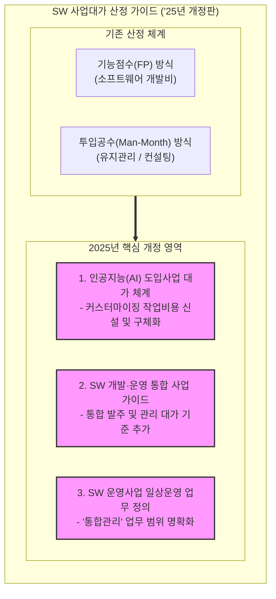

# SW 사업대가 ('25년 개정판)

---

## I. 지능형 SW 환경 및 AI 도입 확대에 따른 적정 대가 산정 기준, SW 사업대가 ('25년 개정판)의 개요

* **정의**: 국가기관 및 공공부문에서 소프트웨어 사업 추진 시 예산 수립, 사업 발주, 계약 단계에서 적정한 대가를 산정할 수 있도록 한국인공지능·소프트웨어산업협회(KOSA)가 공표한 공식 산정 기준 가이드라인
* **등장 배경 및 특징**:
* **AI 도입 가속화 대응**: 생성형 AI 및 [[초거대 언어 모델|LLM]] 등 [[인공지능]] 솔루션 도입에 따른 특화 작업 비용 산정 체계의 미비점 보완
* **개발·운영 패러다임 변화 반영**: 전통적인 분리 발주 관행을 넘어 SW 개발과 운영 통합 사업 및 일상운영 관리 체계 정립
* **공정 계약 및 SW 가치 보장**: 불합리한 과업 변경 및 저가 발주를 방지하고, 제대가 보장을 통한 SW 산업 생태계 건전성 확보

---

## II. SW 사업대가 ('25년 개정판)의 주요 구조 및 핵심 개정 요소

### 가. SW 사업대가 ('25년 개정판)의 체계 및 개정 영역 구조

* 기존의 기능점수(FP) 및 투입공수 중심의 산정 체계를 유지하면서, AI 도입, 개발·운영 통합, 일상운영 통합관리 등의 신규 가이드를 대거 보강함

### 나. SW 사업대가 ('25년 개정판)의 핵심 구성 요소 및 개정 내용

| 분류 (Category) | 요소기술 (키워드) | 세부 설명 |
| --- | --- | --- |
| **AI 대가 체계** | 커스터마이징 작업비용 | 기존 '전문작업비' 명칭을 변경하고, AI 도입 시 발생하는 특화 작업 및 모델 조정 항목 구체화 |
| **AI 대가 체계** | 데이터 및 [[프롬프트 엔지니어링]] | 인공지능 솔루션 학습을 위한 데이터 정제, 라벨링 및 [[프롬프트 튜닝]] 공수 반영 기준 수립 |
| **통합 사업** | SW 개발·운영 통합 사업 가이드 | 애자일 및 [[DevOps]] 환경에 발맞추어 개발과 운영을 연계한 복합 프로젝트의 적정 대가 산정 근거 신설 |
| **운영 관리** | 일상운영 '통합관리' 정의 | SW 운영사업 내에서 반복되는 일상운영 업무 중 [[PMO]] 및 총괄 조율 성격의 '통합관리' 업무 정의 추가 |
| **기본 산정** | 기능점수 (FP, [[Function Point]]) | 사용자의 요구사항을 기준으로 소프트웨어의 기능적 규모를 정량화하여 개발 원가 산정 |
| **기본 산정** | 투입공수 (Man-Month) | 업무량 방식 및 컨설팅([[ISP (Information Strategy Plan)|ISP]]/BPR/ITA), PMO 사업의 투입 인력 기반 단가 적용 |
| **계약 관리** | 과업내용 변경에 따른 조정 | 구현 단계에서 발주기관 요구사항 변경 시 과업 변경 및 계약금액 조정 절차 명시 |
| **제경비 산정** | 기술료 및 제경비율 반영 | 직접인건비 외에 기술부문 유지 및 연구개발을 위한 제경비, 이윤 산정 가이드 제공 |

---

## III. SW 사업대가 ('25년 제정·개정판)의 시사점 및 발전 방향

* **AI 중심 [[디지털 전환]](AX)의 현실적 예산 확보**: 생성형 AI 및 공공 LLM 도입 시 모호했던 비용 산정 기준이 '커스터마이징 작업비용' 등으로 구체화되어, 현장 실무의 예산 수립 및 계약 분쟁 소지 대폭 감소
* **발주·계약 관행의 선진화**: 개발과 운영의 칸막이를 없애는 통합 사업 가이드 도입을 통해 고품질 SW의 안정적 [[유지보수]] 및 데브옵스(DevOps) 환경 정착 가속

---

### 🔗 연관 토픽

- **소속 도메인**: [[00_소프트웨어공학_MOC|🏗️ 소프트웨어공학]]
- **세부 분류**: `6. 소프트웨어 테스팅 & 품질 보증 (QA/QC)`
- **핵심 연관 토픽**:
  - [[디지털 전환|디지털 전환(DX)]]
  - [[Function Point]]
  - [[유지보수]]
  - [[SW사업 대가산정 가이드]]
  - [[프롬프트 튜닝|프롬프트 튜닝(Prompt Tuning)]]
