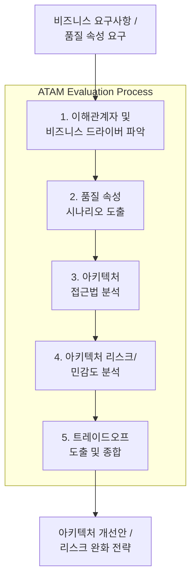

# SW 아키텍처 평가 (Software Architecture Evaluation)

---

## I. 품질 속성 달성 여부 검증 및 최적화 프로세스, SW 아키텍처 평가의 개요

* **정의**: 시스템 구현 전·후 단계에서 품질 속성(성능, 보안, 유지보수성 등)의 충족 여부를 체계적으로 분석하고 잠재적 위험을 식별하는 공학적 검증 [[프로세스]]
* 품질 속성 간 상충관계(Trade-off) 분석, 아키텍처 리스크(Risk) 조기 발견 및 비용 절감
* 특징: 품질 요구사항 기반 검증, 이해관계자 참여형 평가, 시나리오 기반 분석

---

## II. SW 아키텍처 평가의 아키텍처 및 핵심 구성요소

### 가. SW 아키텍처 평가(ATAM 기준)의 프로세스 및 동작 원리

* 비즈니스 드라이버 정의 후 구체적 시나리오를 도출하여, 아키텍처의 민감도와 리스크를 분석하고 트레이드오프를 식별하는 프로세스

### 나. SW 아키텍처 평가의 핵심 기술 및 구성 요소

| 구분 | 핵심 기술(요소) | 설명 |
| --- | --- | --- |
| 평가 방법론 | [[ATAM]] (Architecture Tradeoff Analysis Method) | 품질 속성 상충관계 및 아키텍처 리스크 중심 평가 |
| 평가 방법론 | [[SAAM]] (Software Architecture Analysis Method) | 기능 변경 용이성 및 시나리오 중심 최초 평가 기법 |
| 평가 방법론 | [[CBAM]] (Cost Benefit Analysis Method) | 아키텍처 투자 대비 비용-편익 분석 기법 |
| 평가 기준 | ISO/IEC 25010 | 기능성, [[신뢰성]], 성능 효율성 등 소프트웨어 품질 모델 |
| 핵심 개념 | 품질 속성 (Quality Attribute) | 성능, [[HA(High Availability)|가용성]], 보안성, 수정 용이성 등 비기능적 요구사항 |
| 핵심 개념 | 시나리오 (Scenario) | 자극(Stimulus), 반응(Response) 등 구체적 평가용 유스케이스 |
| 자동화 도구 | ArchUnit / 아키텍처 린터 | 코드 레벨 아키텍처 규칙 검증 및 아키텍처 드리프트 방지 |
| 최신 트렌드 | AI 기반 아키텍처 거버넌스 | [[초거대 언어 모델|LLM]]을 활용한 정적 분석 및 아키텍처 위반 자동 탐지 |

---

## III. ATAM vs SAAM 비교 및 최신 동향

| 비교 항목 | ATAM (Architecture Tradeoff Analysis Method) | SAAM (Software Architecture Analysis Method) |
| --- | --- | --- |
| **주요 목적** | 품질 속성 간 트레이드오프 및 리스크 분석 | 특정 시나리오에 대한 아키텍처 변경 용이성 평가 |
| **평가 기준** | 다중 품질 속성(성능, 보안, 가용성 등) | 특정 변경 시나리오(Modifiability 중심) |
| **이해관계자** | 아키텍트, 개발자, 비즈니스 관리자 등 광범위 | 주로 시스템 설계자 및 개발자 중심 |
| **산출물** | 리스크 매트릭스, 민감도 포인트, 트레이드오프 | 시나리오별 변경 비용 및 영향도 분석서 |

* 최근 [[MSA (Micro Service Architecture)|MSA]] 및 [[클라우드 네이티브]] 환경 확대에 따라, 정적 수동 평가를 넘어 CI/CD 파이프라인 연계형 아키텍처 자동 검증 및 AI 기반 코드-아키텍처 일치성(Drift Detection) 검증 기법으로 진화 중

---

### 🔗 연관 토픽

- **소속 도메인**: [[00_소프트웨어공학_MOC|🏗️ 소프트웨어공학]]
- **세부 분류**: `3. 요구사항 공학 & UML 객체지향 분석/설계`
- **핵심 연관 토픽**:
  - [[신뢰성]]
  - [[ATAM]]
  - [[SAAM]]
  - [[CBAM|CBAM(Cost Benefit Analysis Method)]]
  - [[클라우드 네이티브]]
