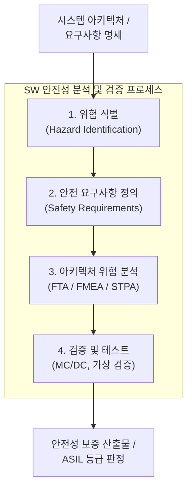

# SW 안전성 (Software Safety) 및 분석 개념

---

## I. 시스템 오작동 및 인명·재산 피해 방지를 위한 공학적 검증, SW 안전성의 개요

* **정의**: 소프트웨어 결함이나 부적절한 제어로 인해 인명, 재산, 환경에 미치는 위험을 최소화하고 허용 가능한 수준으로 관리하는 공학적 보증 활동
* 소프트웨어 복잡성 증가에 따른 시스템 오류 방지, 기능 안전(Functional Safety) 확보 및 법적·규제적 리스크 최소화
* 특징: 전 생애주기(V-Model) 적용, 정량적 위험 평가([[ASIL]] 등), 시스템 이론 기반 제어 관점 분석

---

## II. SW 안전성 분석의 아키텍처 및 핵심 구성요소

### 가. SW 안전성 분석 프로세스 및 동작 원리

* 시스템 요구사항 분석 후 잠재적 위험을 식별하고, FTA·FMEA·[[STPA]] 기법을 통해 아키텍처 결함 및 부적절한 제어를 분석하여 안전 요구사항을 도출하는 [[프로세스]]

### 나. SW 안전성 분석의 핵심 기술 및 구성 요소

| 구분 | 핵심 기술(요소) | 설명 |
| --- | --- | --- |
| 분석 기법 | [[FTA (Fault Tree Analysis)]] | 하향식(Top-down) 연역적 오류 원인 추적 기법 |
| 분석 기법 | [[FMEA (Failure Mode and Effects Analysis)]] | 상향식(Bottom-up) 귀납적 고장 영향 분석 기법 |
| 분석 기법 | STPA (Systems-Theoretic Process Analysis) | 시스템 이론 기반, 부적절한 제어(UCA) 중심 분석 |
| 분석 기법 | [[HAZOP (Hazard and Operability Study)]] | 이탈어(Guideword) 기반 가이드워드 위험성 평가 |
| 표준 및 등급 | [[ISO 26262]] / ASIL | 자동차 [[기능안전 표준]] 및 위험도 등급(A~D) 산정 |
| 표준 및 등급 | [[IEC 61508]] | 범용 전기·전자·프로그램가능 시스템 기능안전 표준 |
| 검증 기술 | MC/DC (Modified Condition/Decision) | 최고 등급 SW 결함 검증을 위한 조건/결정 커버리지 |
| 최신 트렌드 | SOTIF (ISO 21448) | [[Smart Car(자율주행)|자율주행]] 등 시스템 오작동이 아닌 의도된 기능의 한계 대응 |

---

## III. 전통적 안전 분석 vs 시스템 이론 기반 STPA 비교

| 비교 항목 | 전통적 안전 분석 (FTA / FMEA) | 시스템 이론 기반 분석 (STPA) |
| --- | --- | --- |
| **기본 가정** | 부품의 고장(Component Failure)이 사고 유발 | 부적절한 제어 작용(Unsafe Control Action)이 사고 유발 |
| **분석 관점** | 개별 컴포넌트 중심의 인과관계(Chain of Events) | 시스템 전체의 상호작용 및 제어 루프(Control Loop) |
| **소프트웨어 적용** | SW 고장률(Failure Rate) 정의 곤란으로 한계 존재 | SW의 논리적 오류, 복잡한 상호작용 및 제어 결함 분석 용이 |
| **주요 활용 영역** | 전통적 기계·하드웨어 중심 시스템 | 자율주행, AI, 복잡한 대규모 소프트웨어 시스템 |

* AI 및 자율주행 등 고도화된 소프트웨어 시스템 확장에 따라, 기존 하드웨어 중심의 고장 분석(FTA/FMEA)을 넘어 시스템 상호작용을 제어 관점에서 분석하는 STPA 및 SOTIF 기반의 통합 안전성 확보 체계가 필수적으로 요구됨

---

### 🔗 연관 토픽

- **소속 도메인**: [[00_소프트웨어공학_MOC|🏗️ 소프트웨어공학]]
- **세부 분류**: `6. 소프트웨어 테스팅 & 품질 보증 (QA/QC)`
- **핵심 연관 토픽**:
  - [[기능안전 표준|기능안전 표준 (Functional Safety Standards)]]
  - [[FTA (Fault Tree Analysis)]]
  - [[STPA|STPA (System-Theoretic Process Analysis)]]
  - [[ISO 26262]]
  - [[ASIL|ASIL (Automotive Safety Integrity Level)]]
