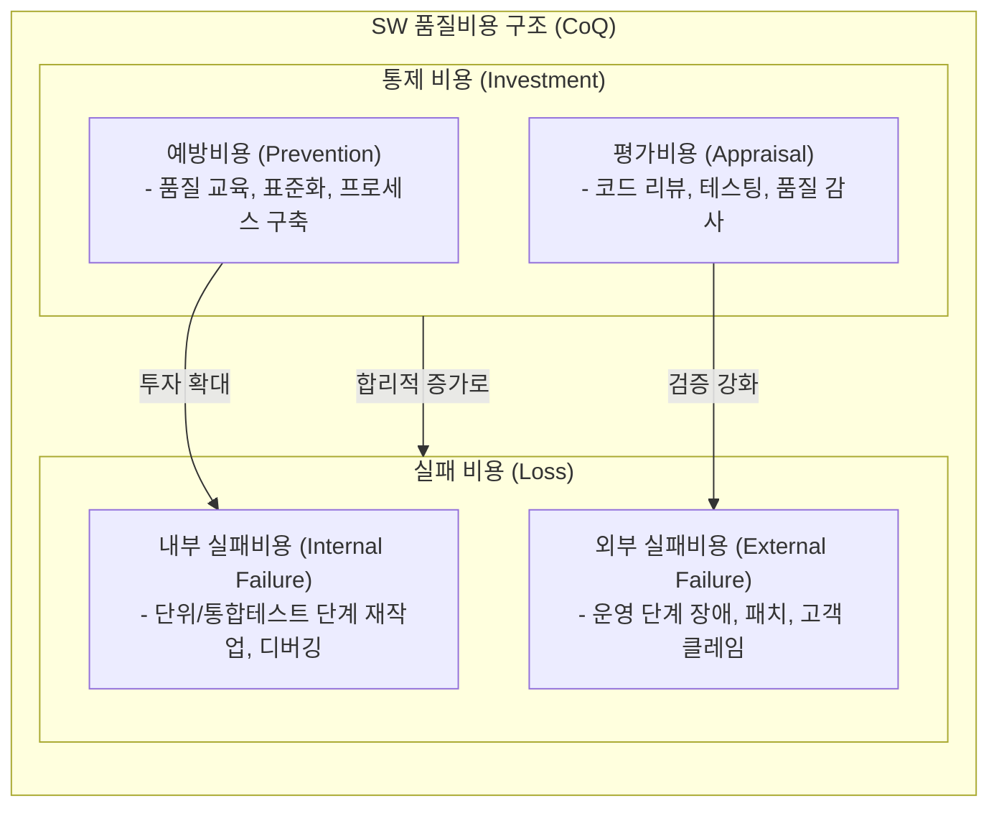

# SW 품질비용 (Software Cost of Quality, CoQ)

---

## I. 품질 보증 노력과 결함 비용의 최적화를 위한 관리 모델, SW 품질비용의 개요

* **정의**: 소프트웨어 개발 및 운영 과정에서 품질을 확보하기 위해 투입되는 비용과, 품질 결함(오류)으로 인해 발생하는 모든 손실 비용을 합산한 총 비용 관리 체계
* 사전 예방 및 평가 투자를 통한 치명적 장애 비용 절감, 품질 투자 대비 경제성(ROI) 극대화
* 특징: PAF(Prevention-Appraisal-Failure) 모델 기반 분류, 생애주기([[SDLC]]) 조기 발견 시 비용 급감(Shift-Left) 특성

---

## II. SW 품질비용의 구조 및 핵심 구성요소

### 가. SW 품질비용(PAF 모델)의 아키텍처 및 동작 원리

* 예방 및 평가 비용(통제 비용)에 적절히 투자함으로써 내부 및 외부 실패 비용을 줄이고, 전체 품질 총비용(Total CoQ)을 최적화하는 구조

### 나. SW 품질비용의 핵심 기술 및 구성 요소

| 분류 | 요소기술(키워드) | 세부 설명 |
| --- | --- | --- |
| 예방비용 | 품질 [[프로세스]] 표준화 | [[CMMI]], SP 등 프로세스 모델 수립 및 정비 비용 |
| 예방비용 | 품질 교육 및 훈련 | 개발자 대상 코딩 표준, 보안 코딩 및 테스트 기법 교육 |
| 평가비용 | 정적 분석 및 리뷰 | 동료 검토(Peer Review), 아키텍처 검토, [[정적 분석 도구]] 활용 |
| 평가비용 | 동적 테스팅 | 단위·통합·[[시스템 테스트]] 수행 및 테스트 자동화 구축 비용 |
| 내부 실패비용 | 재작업(Rework) | 테스트 단계에서 발견된 결함 수정 및 디버깅 소요 비용 |
| 내부 실패비용 | 빌드 실패 및 재테스트 | 결함 수정 후 리그레션(회귀) 테스트 및 재배포 수행 비용 |
| 외부 실패비용 | 장애 대응 및 패치 | 운영 환경 배포 후 발생한 긴급 버그 수정 및 패치 비용 |
| 외부 실패비용 | [[유지보수]] 및 배상 | 고객 클레임 처리, [[SLA]] 위반 배상 및 기업 이미지 손실 비용 |

---

## III. 품질 투자 비용에 따른 비용 곡선 및 최적화 전략

| 비교/구분 | 통제 비용 (예방 + 평가) 중심 운영 | 실패 비용 (내부 + 외부 실패) 중심 방치 |
| --- | --- | --- |
| **비용 흐름** | 초기 개발 단계(SDLC 조기) 투입 비용 증가 | 운영 및 유지보수 단계에서 천문학적 비용 발생 (Shift-Down) |
| **결함 특성** | 요구사항 및 설계 단계에서 결함 원천 차단 | 프로덕션 환경에서 장애 확산 및 복구 지연 |
| **조직 역량** | 프로세스 성숙도 향상, 예측 가능한 납기 준수 | firefighting(소방수 식 대응) 반복, [[기술 부채]] 누적 |

* 소프트웨어 공학에서는 예방 및 평가 비용을 적정 수준 이상으로 투자하여 총 품질비용의 최적점(Optimal Point)을 찾는 것이 핵심이며, 최근에는 AI 기반 자동화 테스트 및 정적 분석을 통해 평가·예방 비용 자체를 절감하는 효율화 트렌드가 대두됨

---

### 🔗 연관 토픽

- **소속 도메인**: [[00_프로젝트관리_MOC|📋 프로젝트관리]]
- **세부 분류**: `3. 소프트웨어 원가 산정 & 성과 관리 (Cost & EVM)`
- **핵심 연관 토픽**:
  - [[유지보수]]
  - [[SDLC]]
  - [[CMMI]]
  - [[기술 부채]]
  - [[품질관리]]
