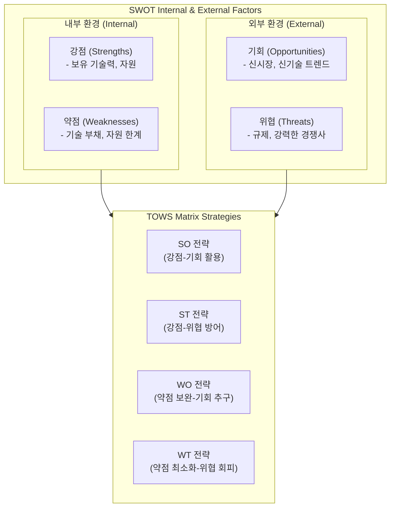

# SWOT분석

---

## I. 기업의 내·외부 환경 분석 기반 전략 도출 기법, SWOT분석의 개요

* **정의**: 기업의 내부 역량인 강점(Strengths)·약점(Weaknesses)과 외부 환경인 기회(Opportunities)·위협(Threats)을 체계적으로 분석하여 최적의 경영 전략을 수립하는 전략 기획 [[프레임워크]]
* 기업의 핵심 경쟁력 파악, 시장 기회 선점 및 잠재적 리스크(Threat) 대응 방안 마련 목적
* 특징: 내·외부 요인의 이중 매트릭스 구조, TOWS 믹스를 통한 교차 전략 도출, 직관성과 유연성 확보

---

## II. SWOT분석의 아키텍처 및 핵심 구성요소

### 가. SWOT분석의 프로세스 및 TOWS 믹스 동작 원리

* 내·외부 환경 요인을 식별한 후, TOWS 매트릭스를 통해 강점-기회(SO), 약점-위협(WT) 등 교차 전략을 도출하여 실행 과제를 수립하는 [[프로세스]]

### 나. SWOT분석의 핵심 구성 요소 및 전략 기법

| 분류 | 요소기술(키워드) | 세부 설명 |
| --- | --- | --- |
| 내부 요인 | 강점 (Strengths) | 조직이 경쟁사 대비 우위에 있는 핵심 역량, 자원 및 기술력 |
| 내부 요인 | 약점 (Weaknesses) | 조직 내부의 취약점, 프로세스 한계 및 [[기술 부채]] 요소 |
| 외부 요인 | 기회 (Opportunities) | 시장의 성장, 신기술 도입(AI 등) 및 유리한 외부 환경 변화 |
| 외부 요인 | 위협 (Threats) | 규제 강화, 경제적 불확실성 및 경쟁사 공세 등 리스크 요인 |
| 교차 전략 | SO 전략 (Maxi-Maxi) | 강점을 활용해 시장 기회를 극대화하는 공격적 성장 전략 |
| 교차 전략 | ST 전략 (Maxi-Mini) | 강점으로 외부 위협을 방어하고 리스크를 최소화하는 전략 |
| 교차 전략 | WO 전략 (Mini-Maxi) | 약점을 보완하여 외부 기회를 살리는 방향전환(Turnaround) 전략 |
| 교차 전략 | WT 전략 (Mini-Mini) | 약점을 최소화하고 위협을 회피하기 위한 방어/철수 전략 |

---

## III. 전통적 SWOT분석의 한계점 및 AI 기반 지능형 전략 수립 동향

| 비교 항목 | 전통적 SWOT분석 (Static SWOT) | AI 기반 지능형 SWOT분석 (AI-Driven SWOT) |
| --- | --- | --- |
| **데이터 수집** | 주관적 브레인스토밍 및 전문가 의견 의존 | 실시간 시장 데이터, 경쟁사 문서 및 빅데이터 자동 수집 |
| **분석 주기** | 비정기적 일회성 워크숍 형태 수행 | CI/CD 및 시장 변화 모니터링 기반 상시 업데이트 |
| **객관성 확보** | [[편향]](Bias) 및 휴리스틱 오류 발생 가능성 높음 | 데이터 기반 근거(Evidence) 중심의 정교한 매트릭스 도출 |

* 최근 데이터 기반 의사결정의 중요성이 커짐에 따라, 주관적 의견에 의존하던 기존 방식을 탈피하여 생성형 AI와 빅데이터 분석을 결합한 객관적이고 실시간성 있는 '데이터 기반 지능형 SWOT 및 전략 자동화' 트렌드로 진화 중

---

### 🔗 연관 토픽

- **소속 도메인**: [[00_경영전략_MOC|📈 경영전략]]
- **세부 분류**: `1. 경영 환경 분석 & 전략 수립 프레임워크`
- **핵심 연관 토픽**:
  - [[기술 부채]]
  - [[IT 거버넌스]]
  - [[고객여정지도|고객여정지도 (Customer Journey Map)]]
  - [[IT-ROI 투자 성과평가 모델]]
  - [[프로세스]]
