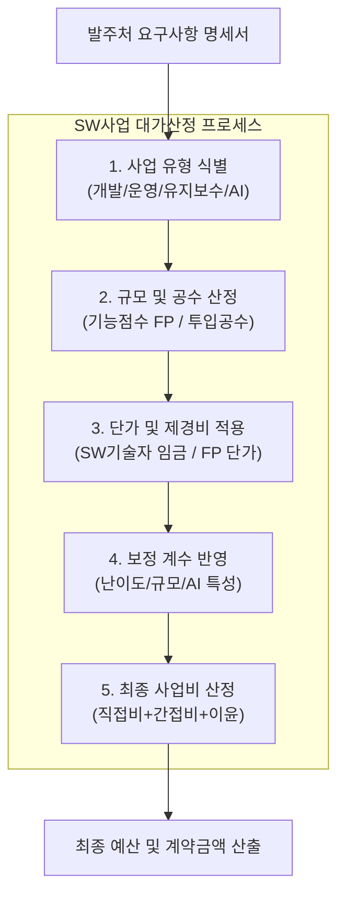

# SW사업 대가산정 가이드

---

## I. 적정 대가 산정 및 SW 산업 공정 환경 조성을 위한 산정 기준, SW사업 대가산정 가이드의 개요

* **정의**: 국가기관 및 공공부문 등에서 소프트웨어 사업 추진 시 예산 수립, 사업 발주 및 계약을 위해 적정한 비용과 대가를 산정할 수 있도록 한국인공지능·소프트웨어산업협회(KOSA)에서 제시하는 공식 지침
* SW 기술자 노임단가 및 기능점수(FP) 단가 기준 제시, 인프라 및 AI 등 신기술 도입 사업의 제값 주기 체계 확립
* 특징: 기능점수(FP) 기반 산정 중심, AI 도입 사업 및 개발·운영 통합 체계 반영

---

## II. SW사업 대가산정 가이드의 아키텍처 및 핵심 구성요소

### 가. SW사업 대가산정 가이드의 산정 프로세스 및 동작 원리

* 사업 유형에 따라 기능점수(FP) 또는 투입공수(M/M)를 산정하고, 공표된 노임·FP 단가와 제경비·이윤 및 AI 등 신기술 보정 계수를 반영하여 최종 사업비를 산출하는 구조

### 나. SW사업 대가산정 가이드의 핵심 기술 및 구성 요소

| 분류 | 요소기술(키워드) | 세부 설명 |
| --- | --- | --- |
| 산정 기준 | 기능점수 (FP, [[Function Point]]) | S/W 규모를 기능적 요구사항 기준으로 계량화하여 개발비 산정의 표준 지표로 활용 |
| 표준 단가 | 기능점수(FP) 단가 | 공공 발주 시 적용되는 기준 단가 (최신 기준 반영 605,784원/FP) |
| 인력 단가 | SW기술자 평균임금 | IT아키텍트, 응용SW개발자 등 직무별 월/일평균 임금 기준 (기본급+제수당+퇴직충당금 등 포함) |
| 산정 방식 | 투입공수 방식 (M/M) | 기획, 컨설팅, 운영 및 [[유지보수]] 사업 등 기능점수 산정이 예외인 영역에 적용 |
| 간접 비용 | 제경비 및 이윤 | 직접인건비 외에 기관 운영을 위한 간접 비용과 사업자 이윤 반영 기준 |
| 신기술 영역 | AI 도입 사업 대가산정 | [[인공지능]] 학습 데이터 구축, 모델 복잡도 및 커스텀 작업 비용 보정 체계 적용 |
| 통합 모델 | SW 개발·운영 통합 사업 | 애자일 및 클라우드 환경에 대응하기 위한 개발과 운영 연계형 대가 모델 |
| 거버넌스 | 적정 대가 지급 보장 | SW 진흥법 기반 부당한 저가 발주 방지 및 수·발주자 상생 도모 |

---

## III. 전통적 투입공수 방식 vs 기능점수(FP) 및 AI 신기술 대가 산정 비교

| 비교 항목 | 전통적 투입공수 방식 (Man/Month) | 기능점수(FP) 및 최신 대가 산정 체계 |
| --- | --- | --- |
| **산정 기준** | 투입된 인력의 M/M(공수) 중심 산정 | 소프트웨어의 기능적 규모(산출물 크기) 중심 산정 |
| **생산성 반영** | 개발 생산성 향상에 따른 비용 절감 반영 곤란 | 생산성이 높을수록 적정 규모 산정 및 객관성 확보 용이 |
| **적용 영역** | 컨설팅, 유지보수, 단순 운영 및 마이그레이션 | 신규 응용 소프트웨어 개발 및 대규모 시스템 구축 |
| **최신 트렌드** | 인력 중심 산정에서 AI·클라우드 환경 대응형 복합 모델로 진화 |  |

* 최근 인공지능(AI) 솔루션 및 [[클라우드 네이티브]] 기반 시스템 확장에 따라, 단순 투입 인력 계산을 탈피해 데이터 구축비와 AI 커스터마이징 비용을 체계적으로 반영하는 고도화된 대가 산정 체계로 정착 중

---

### 🔗 연관 토픽

- **소속 도메인**: [[00_소프트웨어공학_MOC|🏗️ 소프트웨어공학]]
- **세부 분류**: `6. 소프트웨어 테스팅 & 품질 보증 (QA/QC)`
- **핵심 연관 토픽**:
  - [[Function Point]]
  - [[유지보수]]
  - [[SW 사업대가 ('25년 개정판)]]
  - [[Debugging]]
  - [[ISO 29119-11]]
