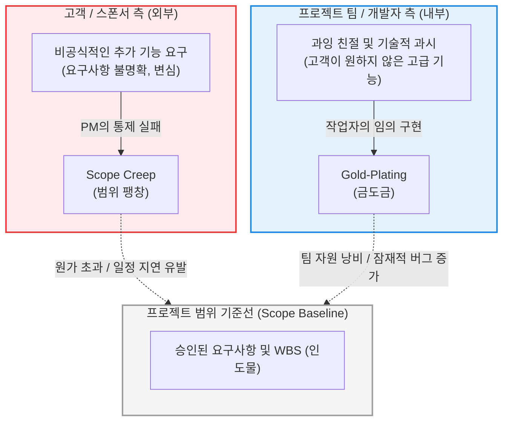

# Scope Creep vs Gold-Plating

---

## I. 프로젝트 범위 관리의 2대 리스크, 개요

* **정의**: 공식적인 변경 통제 절차(Change Control Process)를 거치지 않고 프로젝트의 범위가 무단으로 확장되거나 추가 기능이 구현되어, 자원 낭비와 일정 지연을 유발하는 대표적인 프로젝트 관리(PMBOK) 리스크
* **Scope Creep (범위 팽창)**: **고객이나 이해관계자**의 지속적인 추가 요구사항이 적절한 통제 없이 수용되어, 프로젝트의 범위가 슬금슬금 늘어나는 현상
* **Gold-Plating (금도금)**: 프로젝트 팀원(개발자)이 고객이 요구하지 않은 추가 기능이나 과도한 품질을 임의로 덧붙여 제공하여 자원을 낭비하는 현상
* **특징**: 두 현상 모두 승인된 범위 기준선(Scope Baseline)을 위반하는 행위이며, PMP(프로젝트 관리 전문가) 관점에서 고객 만족을 핑계로 허용되어서는 안 되는 절대적 통제 대상임

---

## II. 발생 메커니즘 및 구조적 차이

### 가. 변경 발생의 주체 및 영향 개념도

### 나. 방어 및 통제 수단

* **범위 정의의 구체화**: 프로젝트 헌장과 요구사항 명세서에 '할 일(In-Scope)'뿐만 아니라 '하지 않을 일(Out-of-Scope)'을 명확히 규정해야 함.
* **통합 변경 통제(Integrated Change Control)**: 변경이 필요할 경우 반드시 CCB(변경통제위원회)에 회부하여 일정, 비용, 리스크에 미치는 영향을 평가한 후 공식적인 기준선(Baseline) 수정을 거쳐야 함.

---

## III. Scope Creep과 Gold-Plating 상세 비교 분석

| 비교 항목 | Scope Creep (범위 팽창) | Gold-Plating (금도금) |
| --- | --- | --- |
| **발생 주체** | **고객 (Customer)**, 외부 이해관계자, 스폰서 | **프로젝트 팀 (Developer)**, 내부 작업자 |
| **발생 원인** | 요구사항 정의 불명확, 변경 통제 [[프로세스]] 부재 및 PM의 거절 실패 | 개발자의 기술적 과시욕, 고객을 기쁘게 하려는 작업자의 과잉 친절 |
| **제공 가치** | 고객이 원했던 가치이나(비용 미지불), 프로젝트 리스크는 전가됨 | 고객에게 불필요한 가치이며, 오히려 조작 복잡성 및 [[유지보수]] 부담 증가 |
| **잠재적 위험** | 프로젝트 일정 지연, 예산 초과, 자원 고갈 및 핵심 기능 품질 저하 | 불필요한 리소스(시간/비용) 낭비, 테스트되지 않은 코드로 인한 버그 유발 |
| **PM의 대응** | 공식적인 변경 요청(CR) 작성 유도 및 CCB 회부 (비용/일정 재협상) | 발견 즉시 중단 지시, 남는 자원은 일정 단축이나 다른 크리티컬 패스에 투입 |
| **예방 도구** | 요구사항 추적 매트릭스(RTM), WBS, 이해관계자 관리 프로세스 | 품질 보증(QA), 엄격한 코드 리뷰(Peer Review) 및 산출물 검수 |

---

## IV. PMBOK 기반의 예방 아키텍처

* **RTM (요구사항 추적 매트릭스, Requirement Traceability Matrix)**: 설계, 개발, 테스트의 모든 산출물이 초기 비즈니스 요구사항과 1:1로 매핑되는지 추적하는 문서. 근거 없는 기능 추가(Gold-Plating)와 무분별한 요구(Scope Creep)를 식별하고 차단하는 가장 강력한 무기입니다.
* **WBS (작업 분류 체계, [[WBS|Work Breakdown Structure]])**: 인도물 중심의 분할 트리로, 100% 규칙(100% Rule)에 따라 WBS에 명시되지 않은 작업은 프로젝트 범위가 아님을 상호 합의하는 물리적 기준점 역할을 합니다.

---

### 🔗 연관 토픽

- **소속 도메인**: [[00_프로젝트관리_MOC|📋 프로젝트관리]]
- **세부 분류**: `1. PMBOK 표준 & 프로젝트 거버넌스`
- **핵심 연관 토픽**:
  - [[SCRUM]]
  - [[PMBOK 프로세스 그룹 (5단계)]]
  - [[WBS|WBS (Work Breakdown Structure)]]
  - [[ISO 21500]]
  - [[프로세스]]
