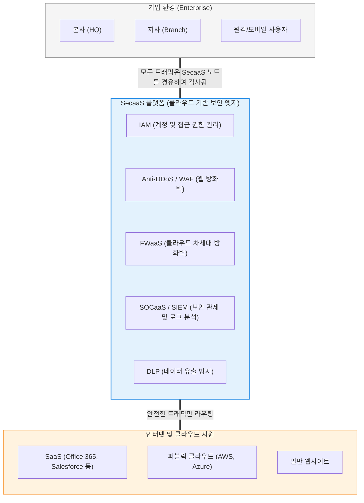

# SecaaS (Security as a Service)

---

## I. 클라우드 시대를 위한 구독형 보안 패러다임, SecaaS의 개요

* **정의**: [[방화벽]], 안티바이러스, 침입 탐지 등 다양한 보안 솔루션을 기업 내부 네트워크에 하드웨어 장비(On-Premise)로 자체 구축하는 대신, **클라우드 서비스 제공자([[CSP]])나 보안 전문 업체를 통해 인터넷 기반의 서비스 형태로 구독하여 사용하는 모델**
* **등장 배경 및 필요성**:
* 기업 인프라가 클라우드(IaaS/SaaS)로 이전하고 원격 근무가 확산됨에 따라, 물리적인 사내망 경계(Perimeter)를 방어하던 기존 장비 중심 보안의 실효성이 상실됨.
* 고도화되는 사이버 공격([[랜섬웨어]], 제로데이 위협)을 방어하기 위한 최신 보안 장비의 막대한 초기 구축 비용(CapEx)과, 이를 운영할 전문 보안 인력 구인의 어려움을 해소할 필요성 대두.

* **특징**: 서비스 제공자가 글로벌하게 수집한 최신 위협 인텔리전스(Threat Intelligence)와 보안 패치를 중앙에서 실시간으로 자동 적용하므로, 기업은 인프라 관리 부담 없이 항시 최신 보안 상태를 유지할 수 있습니다.

---

## II. SecaaS의 아키텍처 및 핵심 구성요소

### 가. 클라우드 기반 SecaaS 인프라 개념도

### 나. SecaaS의 대표적인 서비스 유형 (CSA 분류 기준)

클라우드 보안 협회(CSA, Cloud Security Alliance)는 SecaaS의 영역을 다음과 같이 분류합니다.

| 서비스 유형 | 약어 / 명칭 | 세부 설명 및 역할 |
| --- | --- | --- |
| **계정 보안** | **[[IAM]]** (Identity & Access Management) | 사용자의 신원을 인증(SSO, MFA)하고, 직무에 따른 접근 권한을 중앙에서 통제하여 비인가 접속을 차단 |
| **네트워크 보안** | **FWaaS** (Firewall as a Service) | 물리적 방화벽 장비 없이 클라우드 상에서 트래픽을 필터링하고 L7 애플리케이션 계층까지 통제하는 차세대 방화벽 서비스 |
| **웹/앱 보안** | **WAF & Anti-[[DDOS|DDoS]]** | 대규모 트래픽 볼류메트릭 공격(DDoS)을 클라우드 엣지에서 흡수하고, 웹 취약점([[SQL(Structured Query Language)|SQL]] 인젝션 등) 공격을 방어 |
| **보안 관제** | **[[SIEM]] / SOCaaS** | 전사적 인프라에서 발생하는 보안 로그와 이벤트를 실시간으로 수집, 분석하여 위협을 탐지하는 보안 관제 서비스 |
| **데이터 보안** | **[[DLP]]** (Data Loss Prevention) | 이메일, 클라우드 스토리지 등을 통해 기업의 민감한 정보(개인정보, 기밀 문서)가 외부로 유출되는 것을 감시하고 차단 |

---

## III. 전통적 보안과의 비교 및 최신 동향

### 가. 전통적 보안 (On-Premise) vs SecaaS 비교

| 비교 항목 | 전통적 On-Premise 보안 | SecaaS (Security as a Service) |
| --- | --- | --- |
| **도입 및 구축 방식** | 고가의 물리적 H/W 보안 어플라이언스 구매 및 설치 | **별도 장비 없이 클라우드 서비스 구독 (에이전트/API 연동)** |
| **비용 구조** | **CapEx (자본적 지출)**: 초기 구축 비용이 막대함 | **OpEx (운영적 지출)**: 사용량 및 유저 수 기반 월/연 과금 |
| **확장성 및 탄력성** | 장비의 물리적 처리 한계량(Capacity)에 종속됨 | **클라우드 인프라를 활용한 무제한에 가까운 탄력적 스케일 아웃** |
| **[[유지보수]] 주체** | 기업 내부 IT 인력이 직접 패치 및 라이선스 관리 | **SecaaS 벤더가 최신 위협 시그니처 및 엔진 업데이트 일괄 수행** |
| **적합한 환경** | 망분리가 엄격한 폐쇄형 금융/국방 인프라 | **클라우드 마이그레이션 기업, 원격 근무 환경, 스타트업 및 중소/중견기업** |

### 나. 현대 SecaaS 플랫폼의 발전 동향

* **SASE / SSE로의 통합과 수렴**: 단순한 단위 보안 기능(안티바이러스, WAF 등)의 클라우드화를 넘어, 네트워크([[SD-WAN (Software-Defined Wide Area Network)|SD-WAN]])와 핵심 SecaaS 모듈(ZTNA, SWG, CASB)을 단일 벤더의 통합 플랫폼으로 제공하는 **[[SASE(Secure Access Service Edge)]]** 아키텍처로 시장이 강력하게 재편되고 있습니다.
* **MDR (Managed Detection and Response)의 부상**: 솔루션(SaaS)만 제공하는 것을 넘어, 보안 전문가 그룹이 직접 24/365 [[위협 헌팅]](Threat Hunting)과 침해 사고 발생 시 원격 대응 조치까지 대행해 주는 능동형 보안 서비스(MDR)가 SecaaS의 핵심 경쟁력으로 부상하고 있습니다.
* **CNAPP 생태계로의 진화**: 기업의 인프라가 컨테이너와 쿠버네티스로 넘어가면서, 클라우드 [[형상 관리]](CSPM), 클라우드 워크로드 보호(CWPP), 인프라 코드(IaC) 스캐닝 등을 하나로 묶어 [[클라우드 네이티브]] 환경 전체의 라이프사이클을 보호하는 **CNAPP (Cloud-Native Application Protection Platform)** 모델이 확산 중입니다.

---

### 🔗 연관 토픽

- **소속 도메인**: [[00_보안_MOC|🛡️ 보안]]
- **세부 분류**: `3. 네트워크 & 엔드포인트 · 인프라 보안`
- **핵심 연관 토픽**:
  - [[DDOS]]
  - [[방화벽]]
  - [[SIEM]]
  - [[위협 헌팅|위협 헌팅(Threat Hunting)]]
  - [[SASE(Secure Access Service Edge)]]
