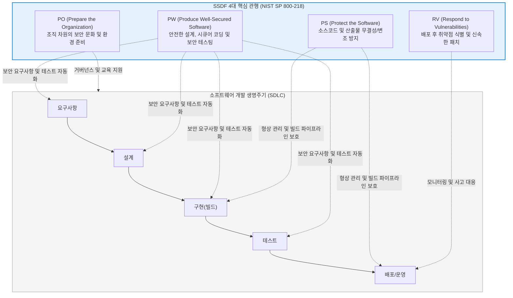

# SSDF (Secure Software Development Framework)

---

## I. 소프트웨어 공급망 보안의 글로벌 표준, SSDF의 개요

* **정의**: 미국 국립표준기술연구소(NIST)가 제정(SP 800-218)한 가이드라인으로, 소프트웨어 개발 생명주기([[SDLC]]) 전반에 걸쳐 보안을 내재화하기 위한 **기본적이고 핵심적인 안전한 소프트웨어 개발 실천 관행(Practices)의 집합**
* **등장 배경 및 필요성**:
* SolarWinds 사태, Log4j 취약점 등 소프트웨어 빌드 및 배포 파이프라인 자체를 노리는 공급망 공격([[공급망 공격|Supply Chain Attack]])이 국가 안보를 위협하는 수준으로 급증함
* 2021년 미국 바이든 행정부의 사이버 보안 행정명령(EO 14028)에 따라, 연방 정부에 납품되는 모든 소프트웨어의 보안 품질을 보장하고 검증할 통일된 기준이 필요해짐

* **특징**: 특정 프로그래밍 언어나 개발 방법론(애자일, [[워터폴|폭포수]] 등)에 종속되지 않는 상위 수준의 지침이며, 조직이 이미 사용 중인 기존 SDLC 및 [[DevSecOps]] 프로세스에 통합되도록 설계됨

---

## II. SSDF의 아키텍처 및 4대 핵심 관행(Practices)

### 가. SSDF 핵심 구성 요소 및 SDLC 통합 개념도

### 나. SSDF의 4가지 주요 관행 그룹 (Practices Group)

| 관행 그룹 (약어) | 세부 실천 과제 (Tasks) 및 역할 | 구현 예시 (Implementation Examples) |
| --- | --- | --- |
| **조직 준비** (PO) | 경영진의 지원 확보, 보안 역할 정의, 개발자 시큐어 코딩 교육, 안전한 개발 도구(IDE, CI/CD) 환경 구축 | 연간 시큐어 코딩 교육 의무화, 승인된 공식 패키지 저장소만 사용 설정 |
| **소프트웨어 보호** (PS) | 소스코드 접근 통제, 승인되지 않은 코드 변경 차단, 릴리스된 소프트웨어의 [[무결성]] 검증 체계 마련 | 소스코드 저장소(Git) MFA 적용, 릴리스 바이너리에 대한 코드 서명(Code Signing) 적용 |
| **안전한 소프트웨어 생산** (PW) | 보안 요구사항 도출, [[위협 모델링]] 기반 아키텍처 설계, 컴포넌트(오픈소스) 검증, 정적/동적 보안 테스트([[SAST]]/[[DAST]]) 수행 | 아키텍처 설계 시 [[STRIDE]] 위협 모델링 수행, CI/CD 파이프라인에 취약점 스캐너 연동 |
| **취약점 대응** (RV) | 신규 위협 모니터링 체계 구축, 서드파티 라이브러리 취약점 추적, 취약점 패치 및 근본 원인 분석 | 취약점 공개 프로그램(VDP) 운영, NVD(국가 취약점 DB) 피드 실시간 연동 모니터링 |

---

## III. 유사 보안 프레임워크 비교 및 최신 산업 동향

### 가. 소프트웨어 보안 성숙도 모델 비교 (SSDF vs BSIMM vs SAMM)

| 비교 항목 | NIST SSDF | BSIMM (Building Security In Maturity Model) | OWASP SAMM (Software Assurance Maturity Model) |
| --- | --- | --- | --- |
| **목적** | 미국 정부 납품 요건 및 **필수 보안 관행 지침 제공** | 글로벌 선도 기업들의 **실제 보안 활동 데이터 관찰 및 통계** | 조직의 소프트웨어 보안 **성숙도 평가 및 로드맵 수립** |
| **주요 활용** | 규제 준수(Compliance) 및 공급망 보안 강화 기준 | 동종 업계 타 기업과의 보안 수준 비교(벤치마킹) | 사내 보안 프로세스의 점진적 개선 및 감사(Audit) |
| **특징** | 행정명령(EO 14028)에 따른 법적 강제성을 띰 | 규범적(Prescriptive)이 아닌 서술적(Descriptive) 모델 | 평가 템플릿과 체크리스트가 체계적으로 오픈소스로 제공됨 |

### 나. SSDF 기반 공급망 보안 패러다임 동향

* **[[SBOM]](소프트웨어 자재 명세서)의 필수 불가결한 융합**: SSDF의 '안전한 소프트웨어 생산(PW)' 관행을 준수하기 위해서는 애플리케이션에 포함된 모든 오픈소스와 서드파티 라이브러리의 출처 및 버전을 투명하게 기록하는 **SBOM(SPDX, CycloneDX) 추출 및 관리가 필수적**으로 요구되고 있습니다.
* **[[클라우드 네이티브]] 개발 환경(CDE)으로의 확장**: 개발자의 로컬 PC에서 소스코드가 유출되거나 감염되는 것을 원천 차단하기 위해, 브라우저 기반의 중앙 통제된 클라우드 개발 환경(예: GitHub Codespaces)을 도입하여 SSDF의 '조직 준비(PO)' 및 '소프트웨어 보호(PS)' 요건을 시스템적으로 강제하는 엔터프라이즈 기업이 증가하고 있습니다.

---

### 🔗 연관 토픽

- **소속 도메인**: [[00_보안_MOC|🛡️ 보안]]
- **세부 분류**: `3. 네트워크 & 엔드포인트 · 인프라 보안`
- **핵심 연관 토픽**:
  - [[공급망 공격|공급망 공격(Supply Chain Attack)]]
  - [[DevSecOps]]
  - [[위협 모델링|위협 모델링(Threat Modeling) - Secure SDLC]]
  - [[STRIDE]]
  - [[SDLC]]
