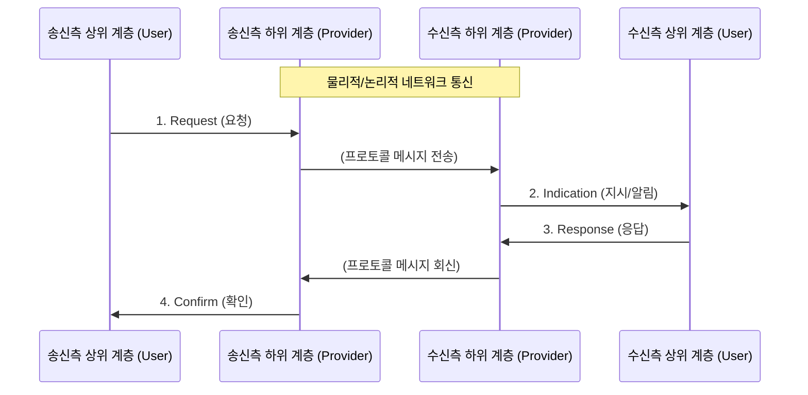

# 서비스 프리미티브 (Service Primitive)

---

## I. 계층 간 상호작용의 추상적 단위, 서비스 프리미티브의 개요

* **정의**: OSI 7계층과 같은 계층화된 네트워크 아키텍처에서, **인접한 두 계층(상위 계층과 하위 계층) 간에 서비스를 요청하고 제공하기 위해 주고받는 기본적인 명령어나 상호작용의 단위**입니다.
* **등장 배경 및 필요성**:
* [[네트워크 계층]] 모델은 모듈화를 위해 각 계층이 독립적으로 동작하도록 설계되었습니다.
* 상위 계층(서비스 사용자, Service User)이 하위 계층(서비스 제공자, Service Provider)의 기능을 호출하거나, 하위 계층이 상위 계층으로 이벤트를 전달하기 위한 **표준화된 인터페이스 규격**이 필요합니다.

* **특징**: 특정 프로그래밍 언어나 운영체제에 종속되지 않는 추상적인 개념이며, 두 계층이 만나는 논리적 접점인 SAP (Service Access Point)를 통해 교환됩니다.

---

## II. 서비스 프리미티브의 4가지 핵심 유형

서비스 프리미티브는 상위 계층과 하위 계층 사이의 정보 흐름 방향과 목적에 따라 4가지 기본 동작으로 분류됩니다.

| 프리미티브 유형 | 방향 (주체 $\rightarrow$ 객체) | 세부 설명 및 역할 | 구현 예시 (연결 설정) |
| --- | --- | --- | --- |
| **Request (요청)** | 상위 계층 $\rightarrow$ 하위 계층 | 상위 계층이 하위 계층에게 특정 작업(연결 설정, 데이터 전송 등)을 수행해 달라고 **명령을 내릴 때** 사용 | `CONNECT.request` (서버에 접속해 줘) |
| **Indication (지시/알림)** | 하위 계층 $\rightarrow$ 상위 계층 | 하위 계층이 네트워크를 통해 외부로부터 특정 이벤트나 데이터가 수신되었음을 상위 계층에 **알려줄 때** 사용 | `CONNECT.indication` (외부에서 접속 요청이 왔어) |
| **Response (응답)** | 상위 계층 $\rightarrow$ 하위 계층 | 상위 계층이 `Indication`으로 전달받은 이벤트에 대해, 수락/거절 등의 **반응을 하위 계층으로 내려보낼 때** 사용 | `CONNECT.response` (접속 요청을 수락할게) |
| **Confirm (확인)** | 하위 계층 $\rightarrow$ 상위 계층 | 이전에 상위 계층이 요청(`Request`)했던 작업이 성공적으로 완료되었는지, 혹은 실패했는지를 **최종적으로 보고할 때** 사용 | `CONNECT.confirm` (서버 접속에 성공했어) |

---

## III. 서비스 유형별 프리미티브 동작 방식

네트워크가 제공하는 통신 방식([[신뢰성]] 여부)에 따라 4가지 프리미티브가 모두 사용되거나, 일부만 사용됩니다.

### 가. 확인형 서비스 (Confirmed Service)

* **특징**: 수신 측이 요청을 제대로 받았는지 반드시 확인하는 신뢰성 높은 연결 지향형 통신 방식입니다. (예: [[TCP]] 연결 설정, 파일 전송)
* **사용되는 프리미티브**: `Request` $\rightarrow$ `Indication` $\rightarrow$ `Response` $\rightarrow$ `Confirm` (4가지 모두 사용)
* **동작 흐름**: 송신자가 요청(Request)하면 수신자에게 알림(Indication)이 가고, 수신자의 응답(Response)이 다시 송신자에게 확인(Confirm)으로 돌아와야 프로세스가 완료됩니다.

### 나. 비확인형 서비스 (Unconfirmed Service)

* **특징**: 수신 측의 응답을 기다리지 않고 데이터를 전송하는 데 목적을 두는 빠르고 단순한 통신 방식입니다. (예: UDP 기반 데이터 전송, 실시간 스트리밍)
* **사용되는 프리미티브**: `Request` $\rightarrow$ `Indication` (2가지만 사용)
* **동작 흐름**: 송신자가 데이터 전송을 요청(Request)하고, 수신자 측에 데이터가 도착하여 알림(Indication)을 발생시키면 그것으로 통신이 종료됩니다.

---

### 🔗 연관 토픽

- **소속 도메인**: [[00_네트워크_MOC|🌐 네트워크]]
- **세부 분류**: `1. OSI 7계층 & 데이터링크 계층 (L1/L2)`
- **핵심 연관 토픽**:
  - [[TCP]]
  - [[네트워크 계층|네트워크 계층 (Network Layer)]]
  - [[게이트웨이]]
  - [[BGP|BGP(Border Gateway Protocol)]]
  - [[Session Layer|Session]]
