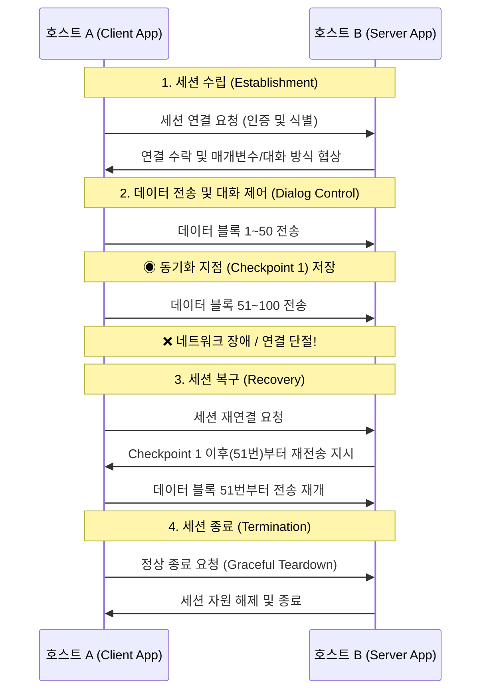

# 세션 계층 (Session Layer - OSI 5계층)

---

## I. 애플리케이션 간의 논리적 대화 제어자, 세션 계층의 개요

* **정의**: OSI 7계층 모델의 제5계층으로, 서로 다른 호스트에 위치한 애플리케이션([[프로세스]]) 간의 **통신 [[세션]](Session)을 설정(Establish), 유지(Maintain), 동기화(Synchronize) 및 종료(Terminate)하는 역할을 수행하는 [[네트워크 계층]]**
* **등장 배경 및 필요성**:
* 하위 계층인 전송 계층(L4)이 단순히 호스트 간의 데이터 전달(배달)만을 책임진다면, L5는 **"누가 언제 말할 것인가?"**, "통신이 끊겼을 때 처음부터 다시 보낼 것인가, 중간부터 보낼 것인가?"와 같은 통신의 규칙과 맥락을 관리할 필요가 있음
* 대용량 파일 전송이나 화상 회의 등에서 네트워크 장애 발생 시, 데이터 손실을 최소화하고 복구하기 위한 체계가 요구됨

* **특징**: 데이터 스트림에 '동기점(Checkpoint)'을 삽입하여 통신 단절 시 효율적인 복구를 지원하며, 권한 부여(Authorization) 및 논리적 연결 상태 관리를 전담함

---

## II. 세션 계층의 통신 라이프사이클 및 핵심 구성요소

### 가. 세션 관리 및 동기화(Checkpoint) 메커니즘 개념도

### 나. 세션 계층의 4대 핵심 제어 기능

| 분류 | 요소기술 (키워드) | 세부 설명 및 역할 |
| --- | --- | --- |
| **순서 제어** | 대화 제어 (Dialog Control) | 데이터 전송의 방향과 순서를 결정함. **단방향(Simplex), 반이중(Half-Duplex), 전이중(Full-Duplex)** 모드를 조율하여 통신 충돌을 방지함. (데이터 토큰(Token) 사용) |
| **오류 복구** | 동기화 (Synchronization) | 대용량 데이터 전송 시 스트림 중간에 **체크포인트(동기점)**를 삽입. 장애 발생 시 처음부터가 아닌 마지막으로 확인된 동기점부터 데이터를 재전송하여 효율성을 극대화함. |
| **보안/접근** | 인증 (Authentication) 및 인가 | 애플리케이션 간의 논리적 연결 전, 사용자의 신원을 식별(로그인)하고 세션 유지 기간 동안 해당 권한을 지속적으로 증명(세션 식별자)함. |
| **[[프로토콜]]** | 주요 서비스 프로토콜 | **RPC** (원격 [[프로시저]] 호출), **NetBIOS** (윈도우 네트워크 기본 입출력), **PPTP** ([[VPN]] 터널링), **SOCKS** (프록시 세션) 등 |

---

## III. 인접 계층 비교 및 최신 네트워크 아키텍처 동향

### 가. 헷갈리기 쉬운 L4 (전송) vs L5 (세션) 계층 비교

| 비교 항목 | Layer 4: [[전송 계층|전송 계층 (Transport Layer)]] | Layer 5: 세션 계층 (Session Layer) |
| --- | --- | --- |
| **핵심 목적** | 프로세스(Port) 간 **[[신뢰성]] 있는 물리적 데이터 전송 보장** | 애플리케이션 간 **논리적 대화(Context)의 흐름 관리 및 유지** |
| **주요 기능** | 세그먼트 분할, 오류 제어, 흐름 제어, [[혼잡 제어]] | 대화 방식 협상(Half/Full-Duplex), 동기점(Checkpoint) 삽입, 복구 |
| **대표 프로토콜** | [[TCP]], UDP, [[SCTP (Stream Control Transmission Protocol)|SCTP]] | RPC, NetBIOS, PPTP |
| **비유적 표현** | 우체국 시스템 (도로망을 통해 소포가 무사히 도착하는지 확인) | 회의 사회자/서기 (누가 발언할지 통제하고 회의록을 저장하여 중단 시 재개) |

### 나. TCP/IP 모델로의 진화와 세션 계층의 현대적 의미

* **TCP/IP 4계층 모델에서의 통합**: 현대 인터넷의 표준인 TCP/IP 모델에서는 OSI의 5계층(세션), 6계층(표현), 7계층(응용)이 하나의 응용 계층(Application Layer)으로 완전히 통폐합되었습니다. 즉, 오늘날 L5의 기능은 별도의 하드웨어나 OS 모듈이 아닌, 애플리케이션 소프트웨어 자체(웹 브라우저, 앱)가 직접 구현합니다.
* **HTTP 세션 및 TLS의 역할 대행**: 상태가 없는(Stateless) HTTP 프로토콜의 약점을 보완하기 위해, 웹 환경에서는 **[[쿠키]](Cookie), JWT([[JSON]] Web Token)** 등이 세션 상태를 유지하는 논리적 L5의 역할을 수행합니다. 또한, **TLS(Transport Layer Security)** 세션 핸드셰이크가 암호화된 통신 세션을 수립하고 재개(Session Resumption)하는 등 보안 세션 관리를 담당하고 있습니다.

---

### 🔗 연관 토픽

- **소속 도메인**: [[00_네트워크_MOC|🌐 네트워크]]
- **세부 분류**: `1. OSI 7계층 & 데이터링크 계층 (L1/L2)`
- **핵심 연관 토픽**:
  - [[세션]]
  - [[쿠키]]
  - [[프로토콜]]
  - [[TCP]]
  - [[전송 계층|전송 계층 (Transport Layer)]]
