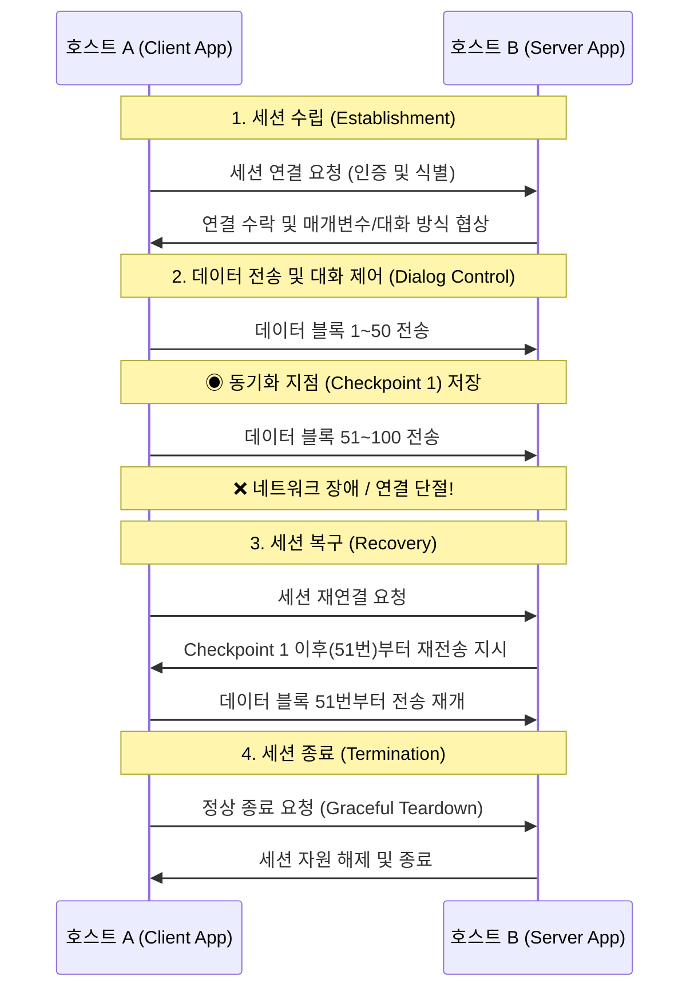

---

## I. 현대 대칭키 암호 설계의 근간, Shannon의 원칙 개요

* **정의**: '정보 이론의 아버지'로 불리는 클로드 섀넌(Claude Shannon)이 1945년 논문을 통해 제시한 안전한 암호 시스템을 구축하기 위한 두 가지 필수 수학적 성질이자 설계 원칙
* **등장 배경 및 필요성**:
* 과거의 고전 암호(예: 시저 암호)는 문자 발생 빈도 등의 통계적 분석(Statistical Analysis)을 통해 키와 평문이 쉽게 해독되는 취약점이 존재함
* 공격자가 암호문으로부터 평문이나 [[암호화]] 키를 유추할 수 없도록, **데이터의 규칙성을 철저히 파괴하고 복잡성을 극대화할 설계 기준**이 필요해짐

* **특징**: '혼돈(Confusion)'과 '확산(Diffusion)'이라는 두 가지 원칙으로 구성되며, 현대의 모든 안전한 블록 암호([[DES]], AES 등)는 이 두 가지 원칙을 다중 라운드(Multi-round)에 걸쳐 반복 적용하여 보안성을 달성함

---

## II. 2대 핵심 원리: 혼돈(Confusion)과 확산(Diffusion)

섀넌의 암호 설계 원칙은 평문의 구조를 지우고 키의 단서를 감추기 위해 다음 두 가지 독립적인 연산을 결합합니다.

| 분류 | 혼돈 (Confusion) | 확산 (Diffusion) |
| --- | --- | --- |
| **핵심 목적** | **키(Key)와 암호문(Ciphertext) 간의 관계를 은닉** | **평문(Plaintext)과 암호문(Ciphertext) 간의 관계를 은닉** |
| **동작 원리** | 키의 1비트가 변경되면 암호문이 어떻게 변할지 전혀 예측할 수 없도록 **복잡한 비선형(Non-linear) 관계를 형성**함 | 평문의 단 1비트만 변경되어도 암호문 전체의 절반 이상의 비트가 바뀌도록 **통계적 패턴을 분산시킴 (눈사태 효과, Avalanche Effect)** |
| **방어 대상** | 암호문과 키 사이의 통계적 의존성을 이용한 분석 방어 (예: 차분 암호 공격) | 언어적 특성이나 문자의 출현 빈도를 이용한 통계적 분석 방어 (예: 빈도 분석 공격) |
| **구현 기법** | **치환 (Substitution)**  - 입력값을 완전히 다른 출력값으로 교체 | **순열 / 전치 (Permutation)**  - 입력값들의 비트 위치나 순서를 뒤섞음 |
| **현대 암호 적용** | **S-Box (Substitution Box)** | **P-Box (Permutation Box)**, ShiftRows, MixColumns |

---

## III. 현대 암호 알고리즘 아키텍처로의 적용

단일 혼돈 연산이나 단일 확산 연산만으로는 완벽한 보안을 달성할 수 없습니다. 따라서 현대 암호학에서는 이 두 연산을 결합하여 하나의 라운드(Round)로 구성하고, 이를 여러 번 반복 실행하는 합성 암호(Product Cipher) 구조를 사용합니다.

### 가. SPN (Substitution-Permutation Network) 구조

* 혼돈을 담당하는 S-Box(치환) 계층과 확산을 담당하는 P-Box(순열) 계층을 교대로 배치하여 데이터를 병렬로 처리하는 아키텍처입니다.
* **적용 사례**: 미국 연방 표준 암호인 **AES([[AES|Advanced Encryption Standard]])**, ARIA 등

### 나. Feistel (파이스텔) 네트워크 구조

* 평문을 좌우 두 블록으로 나눈 뒤, 한쪽 블록과 서브키(Subkey)를 혼돈/확산 함수(F 함수)에 통과시키고 그 결과를 다른 쪽 블록과 XOR(배타적 논리합) 연산하는 과정을 교차로 반복하는 아키텍처입니다.
* 암호화와 복호화의 [[알고리즘]] 구조가 동일하여 하드웨어/소프트웨어 구현이 용이하다는 장점이 있습니다.
* **적용 사례**: 구 표준 암호인 **DES(Data Encryption Standard)**, SEED 등

---

### 🔗 연관 토픽

- **소속 도메인**: [[00_보안_MOC|🛡️ 보안]]
- **세부 분류**: `2. 현대 암호학 & 키 관리 · 전자서명`
- **핵심 연관 토픽**:
  - [[AES]]
  - [[암호화|암호화 (Encryption)]]
  - [[DES]]
  - [[RSA (Rivest Shamir Adleman)]]
  - [[ECC|ECC(Elliptic Curve Cryptography)]]
