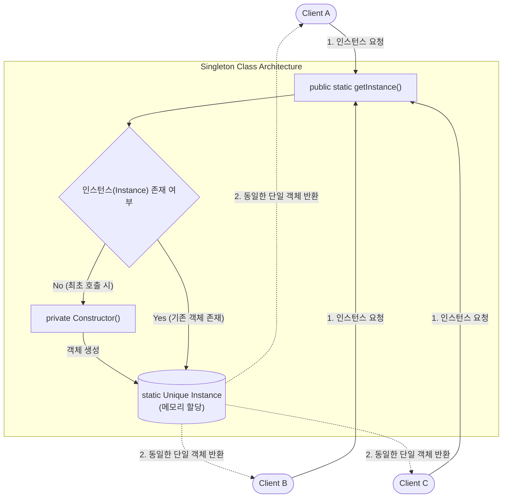

# Singleton Pattern (전역 인스턴스)

---

## I. 단일 객체 보장, Singleton Pattern의 개요

* **정의**: 시스템 내에서 특정 클래스의 인스턴스가 오직 1개만 생성됨을 보장하고, 이에 접근할 수 있는 전역적인 접근점(Global Access Point)을 제공하는 GoF 생성(Creational) [[디자인 패턴]]
* **필요성/특징**: 공통 자원(DB 커넥션 풀, 로거 등)에 대한 메모리 낭비 방지, 전역 상태(Global State) 관리, 지연 초기화(Lazy Initialization)를 통한 성능 최적화, 멀티스레드 환경의 데이터 동기화

---

## II. Singleton Pattern의 개념도 및 핵심 기술 요소

### 가. Singleton Pattern의 개념도 및 동작 원리

* 외부에서의 `new` 객체 생성을 차단하고(`private`), 최초 호출 시 객체를 생성(Lazy)하며, 이후 호출 시에는 메모리에 기 할당된 단일 객체를 반환하여 자원 공유함.

### 나. Singleton Pattern의 핵심 기술 요소

| 구분 | 요소 기술 (키워드) | 세부 설명 |
| --- | --- | --- |
| **기본 구조** | Private 생성자 | 외부 클래스에서의 `new` 키워드를 통한 임의 객체 생성 원천 차단 |
| **기본 구조** | Static 멤버 변수 | [[클래스]] 로드 시점 또는 최초 호출 시점에 단 한 번 Method Area 메모리에 할당 |
| **기본 구조** | 전역 접근 메서드 | `getInstance()` 등 정적 메서드를 통한 단일 [[인스턴스]] 접근점 제공 |
| **스레드 안전** | Synchronized | `getInstance()` 메서드 동기화로 멀티스레드 환경의 Race Condition 방지 (성능 저하 주의) |
| **스레드 안전** | [[DCL]] (Double-Checked [[Locking]]) | 인스턴스 존재 여부를 2번 체크하여 동기화 오버헤드 최소화 (`volatile` 키워드 필수) |
| **권장 구현** | Bill Pugh Singleton | Static Inner Class(Holder)를 활용하여 동기화(lock) 없이 스레드 안전한 지연 초기화 구현 |
| **보안 강화** | Enum Singleton | 리플렉션(Reflection) 및 직렬화(Serialization) 공격에 의한 싱글톤 파괴 원천 방지 (가장 안전) |
| **최적화** | Lazy Initialization | 객체가 실제 사용되는 시점까지 메모리 할당을 지연시켜 초기 구동 속도 개선 |

---

## III. Singleton Pattern의 한계점 및 모던 아키텍처에서의 활용 전망

### 가. 전통적 Singleton의 한계 및 프레임워크 기반(DI) 해결 방안

| 구분 | 한계점 및 문제점 | 모던 아키텍처(Spring 등) 기반 해결 방안 및 트렌드 |
| --- | --- | --- |
| **[[결합도]]** | 전역 상태 공유로 인한 클래스 간 강한 결합도(Tight Coupling) 발생 | **DI(Dependency Injection) [[컨테이너]] 활용**: 객체 간 의존성을 외부에서 주입하여 결합도 최소화 |
| **테스트** | 전역 인스턴스 종속성으로 인해 [[단위 테스트]](Unit Test) 시 Mock 객체 생성 난해 | **인터페이스 분리 및 IoC**: 인터페이스 기반 설계 및 프레임워크가 제공하는 싱글톤을 주입하여 테스트 용이성 확보 |
| **라이프사이클** | 개발자가 직접 동시성(Thread-Safe) 및 객체 생명주기를 관리해야 하는 부담 | **[[프레임워크]] 위임 (Spring `@Singleton`)**: IoC 컨테이너가 Bean의 생성부터 소멸까지 단일 객체 생명주기를 자동 관리함 |
| **객체 지향** | 단일 책임 원칙(SRP), 개방 폐쇄 원칙(OCP) 등 SOLID [[객체지향]] 원칙 위배 우려 | 순수 자바 구현을 지양하고, **프레임워크(Spring, Guice)의 컨텍스트 레벨 싱글톤 패턴**을 표준 아키텍처로 채택 |

* **향후 전망**: 전통적인 하드코딩 방식의 싱글톤 구현(안티 패턴으로 인식되기도 함)은 점차 축소되고 있으며, 현대의 마이크로서비스 및 엔터프라이즈 환경에서는 Spring IoC 컨테이너 기반의 싱글톤 레지스트리(Singleton Registry)를 통한 객체 관리가 사실상의 표준(De facto standard)으로 자리 잡음.

---

### 🔗 연관 토픽

- **소속 도메인**: [[00_소프트웨어공학_MOC|🏗️ 소프트웨어공학]]
- **세부 분류**: `4. 아키텍처 스타일 & 객체지향 설계 원리`
- **핵심 연관 토픽**:
  - [[디자인 패턴|디자인 패턴 (Design Pattern)]]
  - [[프레임워크]]
  - [[인스턴스]]
  - [[Design Pattern (23개 패턴)]]
  - [[싱글턴 패턴|싱글턴 패턴 (Singleton pattern)]]
