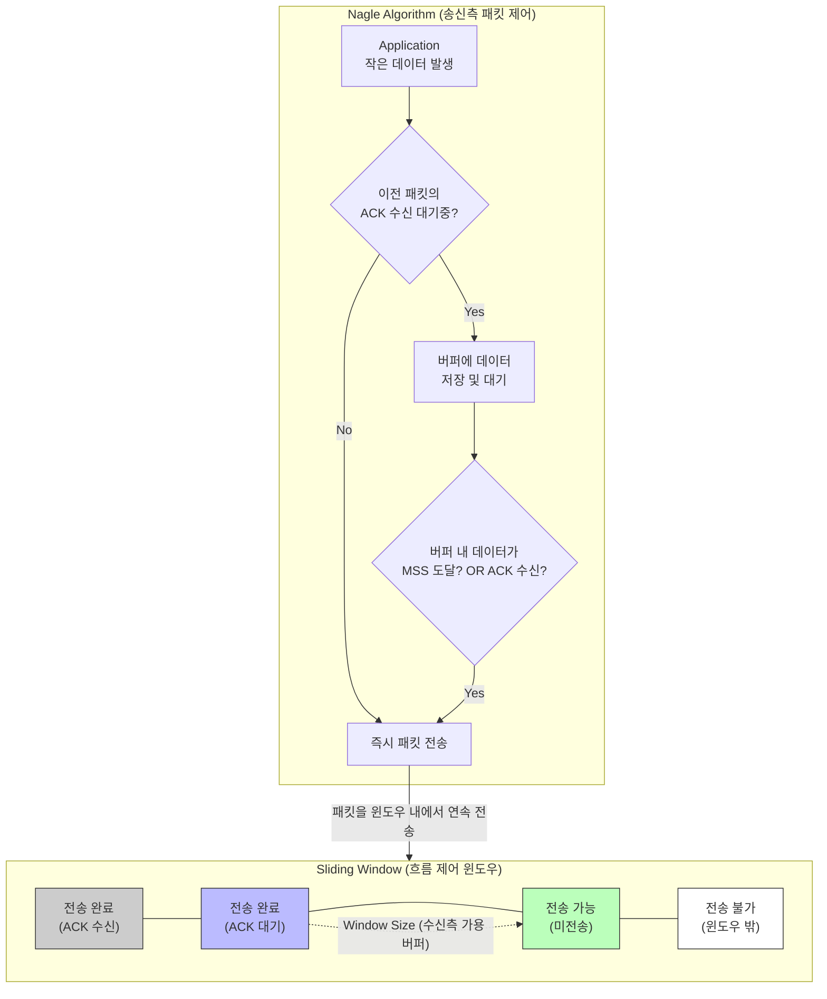

# Sliding Window 및 네이글(Nagle's) 알고리즘

---

## I. TCP 통신 효율성 극대화를 위한, Sliding Window와 Nagle 알고리즘 개요

* **정의**: 안정적이고 효율적인 [[TCP]] 데이터 전송을 위해, 수신 버퍼 크기 내에서 연속적으로 패킷을 전송하는 흐름 제어 기법(Sliding Window)과 작은 크기의 패킷 발생을 억제하여 헤더 오버헤드를 줄이는 **[[혼잡 제어]] [[알고리즘]](Nagle)**
* **등장배경 및 특징**:
* **대역폭 낭비 방지**: Stop-and-Wait 방식의 비효율성 극복(Sliding Window) 및 Tinygram(초소형 패킷)으로 인한 네트워크 혼잡 방지(Nagle)
* **Silly Window Syndrome 해결**: 송신측의 작은 데이터 전송을 Nagle 알고리즘으로 제어하여 네트워크 효율성 보장
* **상호 보완적 동작**: Sliding Window는 전송량(Throughput)을 늘리고, Nagle 알고리즘은 전송 단위(Payload)를 최적화함

---

## II. Sliding Window와 Nagle 알고리즘의 동작 원리 및 핵심 기술 요소

### 가. Sliding Window와 Nagle 알고리즘의 개념도 및 동작 원리

* 송신측은 Nagle 알고리즘을 통해 자잘한 데이터를 하나의 세그먼트(MSS)로 모아서 전송함
* 전송된 패킷은 Sliding Window 메커니즘에 따라 수신측의 확인응답(ACK) 대기 없이 Window Size만큼 연속적으로 네트워크에 투입됨

### 나. 핵심 기술 및 구성 요소

| 구분 | 요소기술 (키워드) | 세부 설명 |
| --- | --- | --- |
| **Sliding Window** | 수신 윈도우 (rwnd) | 수신측이 처리할 수 있는 버퍼의 여유 공간, TCP 헤더에 담아 송신측에 통보 |
| **Sliding Window** | 송신 윈도우 (cwnd) | 네트워크 혼잡 상태를 고려하여 송신측이 동적으로 조절하는 전송 가능 패킷 수 |
| **Sliding Window** | ACK (Acknowledge) | 수신측이 데이터를 정상적으로 받았음을 알리고 윈도우 경계를 이동시키는 응답 |
| **Nagle 알고리즘** | MSS (Max Segment Size) | TCP 계층에서 전송할 수 있는 최대 페이로드 크기 (일반적으로 MTU - 40Byte) |
| **Nagle 알고리즘** | Tinygram 억제 | 1바이트 데이터 전송을 위해 40바이트 헤더가 붙는 비효율성(Overhead) 방지 |
| **Nagle 알고리즘** | ACK 대기 버퍼링 | 미수신 ACK가 존재할 경우, 새로운 데이터는 버퍼에 축적 후 일괄 전송 (조건부 지연) |
| **이슈 및 제어** | Delayed ACK | 수신측에서 패킷 수신 후 즉시 ACK를 보내지 않고, 데이터와 함께 보내기 위해 지연 대기 |
| **이슈 및 제어** | TCP_NODELAY | 소켓 프로그래밍 시 Nagle 알고리즘을 강제 비활성화하여 즉시 전송을 보장하는 옵션 |

---

## III. Nagle 알고리즘의 한계 및 최신 네트워크 환경의 대응 동향

### 가. Nagle 알고리즘과 Delayed ACK의 충돌 (Deadlock 현상)

| 비교 항목 | 발생 원인 및 동작 충돌 메커니즘 | 해결 방안 |
| --- | --- | --- |
| **송신측 (Nagle)** | ACK가 올 때까지 버퍼에 데이터를 모으며 전송 대기 (버퍼 미달 시) | Application 레벨 강제 플러시 |
| **수신측 (Delayed ACK)** | 데이터 수신 후 피기배킹(Piggybacking)을 위해 ACK 전송 지연 (약 200~500ms) | ACK 타이머 만료 전 응답 강제 |
| **충돌 결과** | 송신측은 ACK를 기다리고, 수신측은 다음 데이터를 기다리는 **응답 지연(Latency)** 발생 | 소켓 옵션 **`TCP_NODELAY = 1`** 적용하여 Nagle 비활성화 |

### 나. 최신 네트워크 트렌드 및 향후 전망

* **실시간 애플리케이션의 Nagle 비활성화**: 클라우드 게이밍, HFT(고빈도 매매), [[MSA (Micro Service Architecture)|MSA]] 기반 gRPC / REST API 통신 환경에서는 초저지연(Ultra-Low Latency) 달성을 위해 Nagle 알고리즘을 기본적으로 비활성화(Disable)하는 추세
* **QUIC 프로토콜의 진화**: HTTP/3의 기반이 되는 QUIC 프로토콜은 TCP의 HoL(Head of Line) Blocking을 극복하고, 스트림(Stream) 단위의 세밀하고 독립적인 Sliding Window 기반 흐름 제어를 적용하여 전송 효율을 극대화함

---

### 🔗 연관 토픽

- **소속 도메인**: [[00_네트워크_MOC|🌐 네트워크]]
- **세부 분류**: `3. 전송 계층 & 트래픽 / 혼잡 제어 (L4)`
- **핵심 연관 토픽**:
  - [[혼잡 제어]]
  - [[TCP]]
  - [[QoS|QoS (Quality of Service)]]
  - [[TCP 혼잡제어]]
  - [[알고리즘]]
