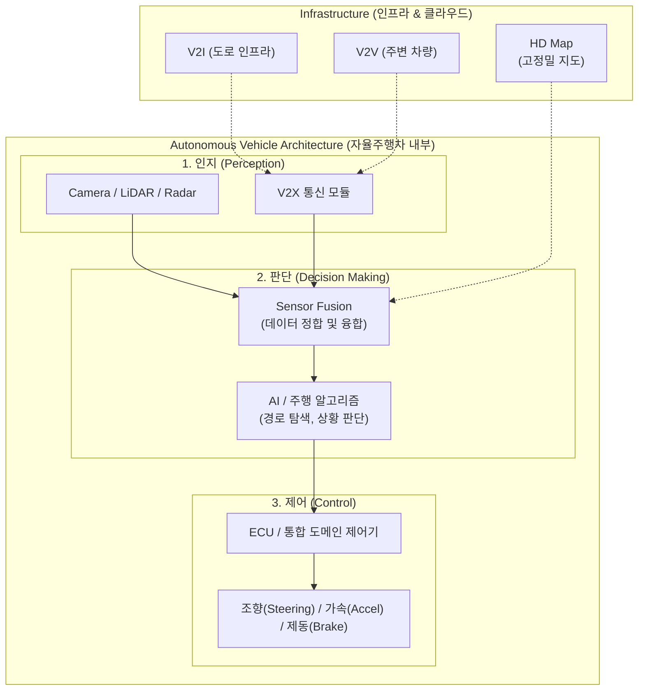

# Smart Car (자율주행)

---

## I. 지능형 모빌리티 혁신의 핵심, Smart Car(자율주행)의 개요

* **정의**: ICT 기술과 자동차를 융합하여 인지, 판단, 제어 과정을 통해 운전자의 개입 없이 독립적으로 주행 상황을 인식하고 능동적으로 제어하는 지능형 모빌리티 시스템
* **필요성 및 주요 특징**:
* **안전성 향상**: 인적 오류(Human Error)로 인한 교통사고 감소 및 예방
* **편의성 및 효율성**: 운전 피로도 극복, 교통 흐름 최적화를 통한 체증 완화, 모빌리티 서비스 혁신(MaaS)
* **첨단 기술의 집약**: 고성능 센서, AI, V2X(초저지연 네트워크), 고정밀 지도 등 4차 산업혁명 핵심 기술의 융합체

---

## II. Smart Car(자율주행)의 개념도 및 핵심 기술 요소

### 가. Smart Car(자율주행)의 아키텍처 및 동작 원리

* 주변 환경 정보(다기종 센서, V2X)를 수집하여 통합 분석(Sensor Fusion) 후, AI 기반으로 주행 상황을 판단하고 차량의 구동계를 능동 제어함

### 나. Smart Car(자율주행)의 핵심 기술 요소

| 구분 | 요소기술(키워드) | 세부 설명 |
| --- | --- | --- |
| **인지** | LiDAR / Radar | 레이저(LiDAR) 및 전파(Radar)를 이용한 3D 공간, 사물, 거리, 속도 등 정밀 탐지 |
| **인지** | Vision Camera | AI 비전 기술을 활용하여 차선, 신호등, 표지판, 보행자 등 시각적 객체 인식 |
| **판단** | Sensor Fusion | 다기종 센서 데이터를 융합하여 각 센서의 인식 한계를 보완하고 정확도를 극대화하는 기술 |
| **판단** | 주행 [[알고리즘]] | [[딥러닝]] 기반 객체 추적, [[강화학습]] 기반 최적 경로 생성 및 충돌 회피 알고리즘 |
| **제어** | By-Wire System | 기계적 연결 구조를 배제하고 전기적 신호(Steer-by-Wire 등)만으로 차량 구동계 제어 |
| **인프라** | V2X (Vehicle to Everything) | V2V, V2I, V2P 등 차량과 모든 외부 요소를 연결하여 초저지연(5G/6G) 정보 교환 |
| **인프라** | HD Map (고정밀 지도) | cm 단위의 정밀도를 가지며 차선 정보, 노면 상태, 구조물 위치 등을 포함하는 3D 기반 지도 |
| **플랫폼** | OTA (Over-The-Air) | 무선 네트워크를 통한 자율주행 소프트웨어, AI 모델, 펌웨어의 원격 무선 업데이트 기술 |

---

## III. 자율주행의 발전 단계 (SAE) 및 향후 전망

### 가. SAE(미국자동차기술자협회) 기준 자율주행 6단계 레벨 비교

| 레벨 | 명칭 (자동화 수준) | 제어 주체 | 주요 특징 및 운전자 역할 |
| --- | --- | --- | --- |
| **Level 0** | 비자동화 (No Automation) | 운전자 | 시스템 개입 없음, 모든 운전은 사람이 직접 수행 |
| **Level 1** | 운전자 보조 (Driver Assistance) | 운전자 | 조향(LKAS) 또는 가감속(ACC) 중 단일 기능만 지원 |
| **Level 2** | 부분 자동화 (Partial) | 운전자 | 조향과 가감속의 동시 제어 지원, 운전자의 지속적인 전방 주시 필수 |
| **Level 3** | 조건부 자동화 (Conditional) | 시스템 (조건부) | 특정 조건(고속도로 등)에서 시스템 제어, 위급 시 운전자에게 개입 요청(Take-over Request) |
| **Level 4** | 고도 자동화 (High) | 시스템 | 특정 지역(ODD) 내에서 운전자 개입 없이 시스템이 완벽히 자율 주행 수행 |
| **Level 5** | 완전 자동화 (Full) | 시스템 | 모든 조건 및 환경에서 운전자 탑승 없이도 100% 자율 주행 가능한 무인차 |

### 나. Smart Car 및 자율주행 기술의 향후 전망 및 동향

* **SDV(Software Defined Vehicle)로의 진화**: 하드웨어 중심 아키텍처에서 소프트웨어 중심(E/E 아키텍처)으로 패러다임이 전환되며, OTA를 통해 차량의 자율주행 성능이 지속 진화
* **통신 인프라 고도화 (C-V2X)**: 5G/6G 기반 셀룰러 V2X 적용이 확대되어 초저지연 실시간 협력 주행(Cooperative Driving) 및 스마트시티 교통 인프라와의 융합 가속
* **사이버 보안 및 윤리적 합의**: 차량 해킹 방지를 위한 [[무결성]] 검증, PKI 기반 인증 등 자동차 사이버 보안(UNECE WP.29) 준수가 필수화되며, AI 판단 알고리즘에 대한 윤리적 가이드라인 마련 시급

---

### 🔗 연관 토픽

- **소속 도메인**: [[00_디지털서비스_MOC|🚀 디지털서비스]]
- **세부 분류**: `3. 사물인터넷 (IoT) & 스마트 플랫폼 · 메타버스`
- **핵심 연관 토픽**:
  - [[강화학습]]
  - [[ISO 26262]]
  - [[물리적 AI]]
  - [[CPS]]
  - [[ASIL|ASIL (Automotive Safety Integrity Level)]]
