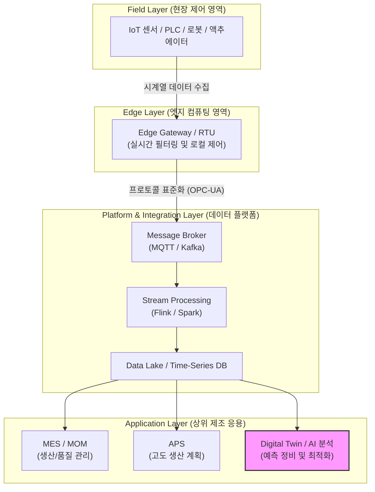

# Smart Factory/스마트 팩토리(공장)!!# Smart Factory (스마트 팩토리)

---

## I. 데이터 기반 제조 혁신 및 지능형 생산 체계, 스마트 팩토리의 개요

* **정의**: 전통적인 제조 공정에 IIoT(사물인터넷), [[인공지능]](AI), 빅데이터, 디지털 트윈 등 ICT를 융합하여 기획·설계, 생산, 유통 등 전 과정을 실시간으로 통합 제어하고 최적화하는 지능형 공장
* **등장 배경 및 특징**:
* **다품종 대량생산 체계 전환**: 소비자의 개인화된 요구에 대응하기 위한 유연 생산 시스템 필요
* **OT와 IT의 융합**: 현장 제어 영역(OT)과 정보 시스템(IT)의 유기적 결합을 통한 실시간 가시성 확보
* **자율 운영 및 최적화**: 수동 개입을 최소화하고, AI와 데이터를 기반으로 스스로 판단하는 자율 공장 지향

---

## II. 스마트 팩토리의 아키텍처 및 핵심 기술 요소

### 가. 스마트 팩토리의 다층 아키텍처 및 데이터 흐름도

* 현장 설비(OT)의 데이터가 엣지와 메시지 브로커를 거쳐 스트림 처리된 뒤, [[MES]] 및 디지털 트윈(AI) 영역으로 전달되어 폐루프(Closed-loop) 최적화 제어 수행

### 나. 스마트 팩토리의 핵심 기술 및 구성 요소

| 구분 | 요소기술 (키워드) | 세부 설명 |
| --- | --- | --- |
| **현장 연결** | IIoT / 센서 네트워크 | 공정 내 온도, 진동, 전류 등 물리적 상태를 실시간 수집하는 사물인터넷 인프라 |
| **통신 표준** | OPC-UA / [[MQTT (Message Queuing Telemetry Transport)|MQTT]] | 이기종 제조 설비 및 시스템 간 상호운용성을 보장하는 표준 산업용 통신 [[프로토콜]] |
| **데이터 처리** | 스트림 파이프라인 (Kafka) | 대규모 센서 데이터 스트림을 유실 없이 실시간으로 수집·전파하는 메시징 브로커 |
| **제조 응용** | MES / MOM | 생산 현장의 실시간 모니터링, 공정 관리, 품질 추적 및 작업 지시를 수행하는 핵심 시스템 |
| **생산 계획** | APS (Advanced Planning) | 제약 조건을 고려하여 최적의 생산 [[스케줄링]] 및 자재 소요량을 시뮬레이션하는 시스템 |
| **지능화** | [[디지털 트윈|디지털 트윈 (Digital Twin)]] | 물리적 공장을 가상 공간에 쌍둥이로 구현하여 실시간 동기화 및 가상 시뮬레이션 수행 |
| **예측 진단** | PdM (Predictive Maintenance) | AI 기반 시계열 분석을 통해 설비 고장을 사전에 예측하고 잔여 수명(RUL) 추정 |
| **보안 체계** | OT 사이버 보안 ([[제로 트러스트 보안모델|Zero Trust]]) | IT와 OT 영역 분리, 네트워크 세분화 및 제로트러스트 기반 보안 아키텍처 적용 |

---

## III. 공장자동화(FA)와 스마트 팩토리 비교 및 향후 전망

### 가. 공장자동화(FA) vs 스마트 팩토리 비교

| 비교 항목 | 전통적 공장자동화 (FA, Factory Automation) | 스마트 팩토리 (Smart Factory) |
| --- | --- | --- |
| **핵심 목표** | 생산성 향상, 인건비 절감, 단순 무인화 | 데이터 기반 자율 최적화, 맞춤형 유연 생산 |
| **제어 방식** | 하드코딩된 PLC 로직 및 폐쇄형 개별 자동화 | IIoT, 클라우드, AI 기반 통합 네트워크 제어 |
| **데이터 활용** | 제한적 활용 (실시간 집계 및 사후 분석 미흡) | 빅데이터 및 AI 기반 실시간 분석 및 예측 제어 |
| **대응 유연성** | 대량 생산에 최적화, 다품종 소량생산 대응 곤란 | 디지털 트윈 및 APS를 통한 급격한 공정 변경 대응 |
| **시스템 연계** | 부서별, 설비별 독립적 구축 (Silo 구조) | 공급망([[SCM (Supply Chain Management)|SCM]]) 및 기업 전사 시스템(ERP)과의 실시간 연동 |

### 나. 향후 전망 및 발전 방향

* **생성형 AI 및 로보틱스 융합**: 휴머노이드 로봇과 대형 비전-언어 모델(VLM)이 결합되어 자율 이동 및 복잡한 수작업 공정까지 자동화 영역 확장
* **탄소중립 및 에너지 스마트 그리드(EMS)**: 탄소 배출 규제 대응을 위해 공장 내 전력 및 자원 소비를 실시간 모니터링하고 최적화하는 친환경 그린 팩토리 전환 가속

---

![[notion_f8c44dff397c_image.png]]

![[notion_0dd44dff397c_image.png]]

![[notion_52c44dff397c_{F4E2EBE1-1FB3-4B9C-88A1-B2E64E6192D0}.png]]

![[notion_52244dff397c_{05F2DF43-C181-4C5A-A26C-8CE689E49946}.png]]

제시해주신 **‘스마트 팩토리 (Smart Factory)’**에 대한 정보관리기술사 1교시형 모범답안입니다.

최근 2026년 기준 스마트 팩토리 산업은 단순한 자동화를 넘어 **생성형 AI(산업용 [[초거대 언어 모델|LLM]])의 도입**, 하드웨어와 소프트웨어가 분리되는 **소프트웨어 정의 제조(SDM)**, 그리고 탄소 중립을 위한 **그린 팩토리**로 그 패러다임이 진화하고 있습니다. 이러한 최신 기술 동향을 III 단락에 집중적으로 반영하였으며, 지시하신 대로 표의 행과 열 형식을 철저히 검수하여 작성했습니다.

---

# IT 융합 / 인더스트리 4.0

카테고리: 산업 융합 / 스마트 제조

## 스마트 팩토리 (Smart Factory)

**분류:** 융합 IT > 스마트 제조 > [[인더스트리 4.0 5.0|인더스트리 4.0]]

**키워드:** [[CPS]]([[가상물리시스템]]), 디지털 트윈(Digital Twin), IIoT, 예지보전(PdM), 이음5G(특화망), 산업용 생성형 AI, 자율 제조(Autonomous Manufacturing), SDM(소프트웨어 정의 제조)

---

## I. 4차 산업혁명의 핵심, 스마트 팩토리의 개요

**정의:** 제품의 기획, 설계, 생산, 유통, 물류 등 제조 전 과정에 IIoT, 인공지능, 빅데이터, 클라우드 등의 첨단 ICT 기술을 적용하여, 수집된 데이터를 바탕으로 스스로 공정을 제어하고 최적화하는 '지능형 자율 유연 생산 체계'를 갖춘 공장

**개념도:**

![[notion_53644dff397c_17757163236682699164580653534784.png]]

---

## II. 스마트 팩토리 구현을 위한 핵심 기술 요소

| **구분** | **주요 기술 요소** | **상세 설명 및 특징** |
| --- | --- | --- |
| **연결 및** **수집** | **IIoT** (산업용 사물인터넷) | 생산 설비와 부품에 센서를 부착하여 온도, 진동, 압력 등의 데이터를 실시간으로 수집하고 통신하는 기술 |
|  | **이음5G** ([[5G 특화망]]) | 공장 내 수많은 기기와 로봇(AMR) 간의 통신을 위해 기업이 직접 구축하는 초저지연, 초연결, 고보안의 맞춤형 무선 네트워크 |
| **지능 및** **분석** | **[[EDGE|Edge]] Computing** (엣지 컴퓨팅) | 클라우드로 모든 데이터를 보내지 않고, 데이터가 발생하는 현장(Edge)에서 즉시 분석하여 실시간 제어와 대역폭 절감을 구현 |
|  | **예지보전 (PdM)** (Predictive Maint.) | 설비의 진동, 소음 데이터를 AI로 분석하여 고장 발생 시기를 사전에 예측하고 선제적으로 부품을 교체하는 핵심 AI 응용 기술 |
| **[[가상화]] 및** **제어** | **CPS** (가상물리시스템) | 물리적 제조 설비와 사이버 공간의 소프트웨어를 1:1로 밀결합하여, 현실의 변화를 가상에 반영하고 가상의 분석 결과를 현실에 제어 명령으로 내리는 기술 |
|  | **Digital Twin** (디지털 트윈) | 현실의 공장 라인과 장비를 컴퓨터 가상 세계에 쌍둥이처럼 똑같이 구현하여, 신제품 생산이나 공정 변경 시 사전 시뮬레이션으로 리스크를 최소화 |

---

## III. 스마트 팩토리의 최신 발전 동향 및 패러다임 변화 (2025~2026년 기준)

### 1. 산업용 생성형 AI 및 제조 특화 sLLM 도입 (Industrial Copilot)

- 과거 시각 데이터(머신비전) 분석에 머물렀던 AI가 생성형 AI로 진화함에 따라, 2026년 현재 현장 작업자가 자연어로 "3번 라인의 진동 이상 원인과 조치 방법을 알려줘"라고 물으면 **제조 특화 [[sLLM (Smaller Large Language Model)|sLLM]](소형 대규모 언어 모델)** 매뉴얼과 과거 정비 이력을 바탕으로 즉각적인 해결책을 제시하거나 PLC 코드를 자동 생성해 주는 산업용 코파일럿(Copilot) 생태계가 정착되었습니다.
### 2. 자율 제조(Autonomous Manufacturing)와 SDM(소프트웨어 정의 제조)

- 다품종 소량 생산의 극대화를 위해, 고정된 컨베이어 벨트 대신 AMR(자율이동로봇)이 공정을 유연하게 연결하고 있습니다. 또한, 테슬라의 기가캐스팅이나 SDV(소프트웨어 정의 차량) 개념이 공장 전체로 확장된 **SDM(Software-Defined Manufacturing)**이 도입되어, 하드웨어 장비 교체 없이 소프트웨어 업데이트만으로 새로운 공정 프로세스를 동적으로 재구성하는 완전 자율 공장(Level 5)으로 진화 중입니다.
### 3. 지속 가능한 친환경 제조 (Green Factory & Net-Zero)

- 글로벌 ESG 규제 및 탄소 국경세에 대응하기 위해, 스마트 팩토리는 단순 생산성 향상을 넘어 공장 전체의 에너지 흐름을 디지털 트윈으로 추적하고 최적화하는 **탄소 배출량 추적(Carbon Footprint Tracking)** 기능이 필수적인 아키텍처로 편입되었습니다.
끝.

---

### 🔗 연관 토픽

- **소속 도메인**: [[00_디지털서비스_MOC|🚀 디지털서비스]]
- **세부 분류**: `3. 사물인터넷 (IoT) & 스마트 플랫폼 · 메타버스`
- **핵심 연관 토픽**:
  - [[인더스트리 4.0 5.0|인더스트리 4.0 5.0 (Industry 4.0 5.0)]]
  - [[5G 특화망]]
  - [[CPS]]
  - [[디지털 트윈|디지털 트윈 (Digital Twin)]]
  - [[가상화]]
