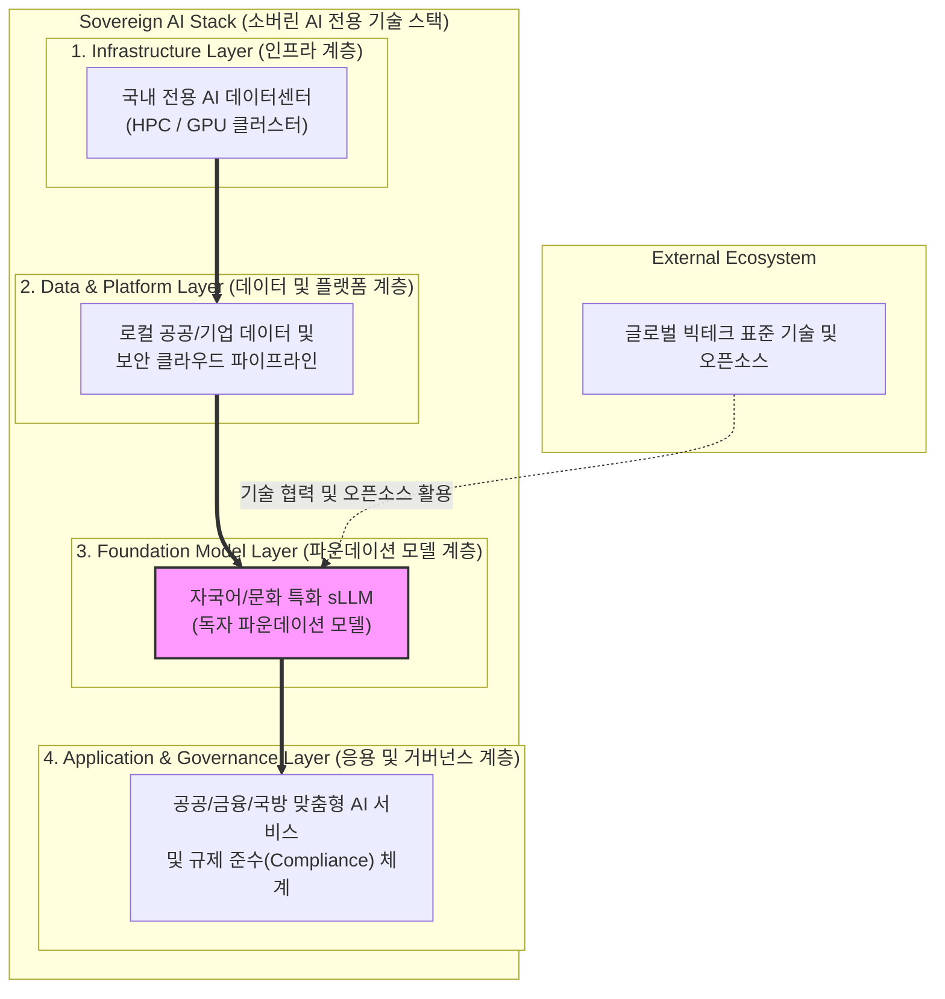

# Sovereign AI (소버린 AI)

---

## I. 국가 및 기업의 데이터 주권 확보를 위한 자립형 AI 인프라, 소버린 AI의 개요

* **정의**: 특정 국가나 기업이 자체적인 인프라, 데이터, [[파운데이션 모델]], 운영 역량을 기반으로 타국의 기술 종속에서 벗어나 AI 주권(Sovereignty)을 확보하고 통제하는 [[인공지능]] 체계
* **등장 배경 및 특징**:
* **디지털 식민지화 방지**: 글로벌 빅테크 기업의 거대 언어 모델 및 클라우드 독점에 따른 문화·안전 종속성 우려 해소
* **데이터 주권 및 보안**: 국가 안보 자산, 공공 데이터, 기업 기밀 등 민감 정보의 해외 유출 방지 및 현지 법규(GDPR 등) 준수
* **로컬 문화 및 언어 반영**: 자국의 고유한 역사, 가치관, 언어적 뉘앙스를 정확히 이해하는 맞춤형 AI 서비스 제공

---

## II. 소버린 AI의 아키텍처 및 핵심 기술 요소

### 가. 소버린 AI의 계층별 아키텍처 및 구축 모델

* 해외 빅테크에 전적으로 의존하지 않고, [[GPU]] 인프라부터 로컬 데이터, 독자 모델, 응용 서비스에 이르는 전 단계를 자국 관할권 내에 통제·구축함

### 나. 소버린 AI의 핵심 기술 및 구성 요소

| 구분 | 요소기술 (키워드) | 세부 설명 |
| --- | --- | --- |
| **인프라 자립** | AI Data Center / HPC | 대규모 GPU 클러스터(예: NVIDIA Blackwell 등)를 국내에 구축하여 연산 자원 자주권 확보 |
| **모델 국산화** | Foundation [[sLLM (Smaller Large Language Model)|sLLM]] | 자국 언어와 문화적 맥락을 학습한 고성능 소형/대형 언어 모델 독자 개발 (예: 국내 A.X, 업스테이지 등) |
| **데이터 통제** | Data Residency & Pipeline | 데이터의 물리적 저장 위치를 자국 내로 한정하고, 정제 및 학습 데이터 파이프라인의 보안 통제 |
| **맞춤형 미세조정** | [[PEFT]] / Domain Adaptation | 공공, 금융, 국방 등 특수 도메인의 전문 지식을 안전하게 주입하는 로컬 파인튜닝 기술 |
| **보안 아키텍처** | On-Premise / Air-gapped | 외부 인터넷망과 완전히 차단된 폐쇄망 환경에서 AI 시스템을 구동하여 기밀 유출 원천 차단 |
| **규제 준수** | [[AI 거버넌스|AI Governance]] & Compliance | 국가별 AI 법안(EU AI Act 등) 및 보안 규정을 실시간으로 감시하고 충족하는 [[프레임워크]] |
| **오픈소스 활용** | Open Weight Model [[Strategy (알고리즘 교체)|Strategy]] | 완전 자우리즘의 한계를 극복하기 위해 오픈 웨이트 모델(Llama 등)을 커스터마이징하여 주권 확보 |
| **에코시스템** | AI Service Package | 인프라-모델-서비스를 패키지화하여 산업 전반의 [[디지털 전환]](AX)을 안전하게 가속화 |

---

## III. 글로벌 소버린 AI 동향 및 향후 전망

### 가. 주요 국가 및 기업의 소버린 AI 추진 현황 비교

| 비교 항목 | 한국 (K-AI / SKT, 네이버 등) | 유럽연합 (EU) | 싱가포르 및 아시아권 |
| --- | --- | --- | --- |
| **핵심 전략** | 민관 합동 '국가대표 AI' 프로젝트 및 독자 sLLM/인프라 생태계 구축 | 강력한 AI 규제(EU AI Act) 및 범유럽 데이터 공간(GAIA-X) 연계 | 동남아 지역 특화 언어 모델(SEA-LION) 개발 및 인프라 허브화 |
| **주요 초점** | 제조업, 통신, 공공 행정 중심의 실무형 AX 및 글로벌 레퍼런스 확보 | 기본권 보호, 데이터 프라이버시, 플랫폼 독점 규제 | 지역 다민족 언어 수용 및 국가 경쟁력 제고 |
| **구축 방식** | 오픈소스 결합 하이브리드 및 자체 클라우드 연계 | 엄격한 관할권 통제 및 온프레미스 지향 | 정부 주도 컨소시엄 및 글로벌 파트너십 병행 |

### 나. 향후 전망 및 발전 방향

* **하이브리드 소버린 클라우드 확산**: 완벽한 자립형 구축 비용의 한계를 극복하기 위해, 핵심 데이터와 모델은 로컬(On-Premise)에 두고 확장 연산은 신뢰할 수 있는 소버린 클라우드와 연동하는 하이브리드 모델 대세화
* **산업별 버티컬 소버린 AI 심화**: 국가 단위의 거대 모델을 넘어 금융, 의료, 국방, 법률 등 고도의 보안과 정확도가 요구되는 버티컬 영역별 맞춤형 소버린 AI 솔루션으로 고도화

---

### 🔗 연관 토픽

- **소속 도메인**: [[00_인공지능_MOC|🤖 인공지능]]
- **세부 분류**: `6. 설명가능한 AI (XAI) & AI 윤리 · 거버넌스`
- **핵심 연관 토픽**:
  - [[소버린 AI|소버린 AI(Artificial Intelligence)]]
  - [[AI 기본법]]
  - [[초대규모 AI 모델|초대규모 AI 모델 (Hyperscale AI Model)]]
  - [[인공지능]]
  - [[sLLM (Smaller Large Language Model)]]
