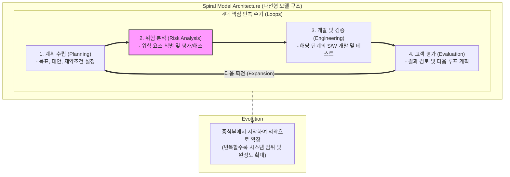

# 나선형 모델 (Spiral Model)

---

## I. 위험 관리 기반 점진적 소프트웨어 개발 방법론, 나선형 모델의 개요

* **정의**: 대규모 고위험 프로젝트에서 [[워터폴|폭포수]] 모델과 프로토타입 모델의 장점을 결합하고, 매 루프마다 체계적인 위험 분석(Risk Analysis)을 수행하여 점진적으로 시스템을 완성하는 [[SDLC]](Software Development Life Cycle) 모델
* **등장 배경 및 특징**:
* **초기 요구사항 불확실성 극복**: 대형 프로젝트 진행 중 발생하는 기술적 리스크와 변경 요구 대응
* **위험 주도형 개발(Risk-Driven)**: 프로젝트 실패 요인을 사전에 식별하고 각 반복(Iteration) 단계에서 통제
* **점진적 프로토타이핑**: 나선형 회전을 거듭하며 완성도를 높이고 고객 피드백을 지속 반영

---

## II. 나선형 모델의 아키텍처 및 핵심 기술 요소

### 가. 나선형 모델의 아키텍처 및 4대 핵심 주기 동작 원리

* 안쪽 원의 작은 프로토타입에서 출발하여 바깥쪽으로 나선을 그리며 회전할 때마다 계획 수립 $\rightarrow$ 위험 분석 $\rightarrow$ 개발 $\rightarrow$ 평가 단계를 거쳐 시스템을 고도화함

### 나. 나선형 모델의 핵심 기술 및 구성 요소

| 구분 | 요소기술 (키워드) | 세부 설명 |
| --- | --- | --- |
| **주기 영역** | 계획 수립 (Planning) | 각 루프별 프로젝트 목표, 대안 선택, 관리 제약조건 명확화 |
| **주기 영역** | 위험 분석 (Risk Analysis) | 기술적 결함, 성능 한계, 비용 초과 등 핵심 리스크 식별 및 프로토타입 기반 검증 |
| **주기 영역** | 개발 및 검증 (Engineering) | 해당 루프에서 정의된 요구사항에 따른 설계, 구현, 단위/[[통합 테스트]] 수행 |
| **주기 영역** | 고객 평가 (Evaluation) | 개발 결과물을 기반으로 고객 및 이해관계자의 피드백 수렴 및 다음 단계 승인 |
| **핵심 기법** | Risk-Driven Approach | 비용과 실패 확률이 높은 요소를 우선적으로 식별하고 제거하는 메커니즘 |
| **핵심 기법** | Prototyping | 불확실한 요구사항이나 아키텍처를 검증하기 위한 모형 사전 제작 및 실험 |
| **관리 기법** | Milestone & Review | 각 나선 주기의 종료 시점에 명확한 진척도 측정 및 단계별 산출물 검토 |
| **적용 요건** | 대규모/고위험 시스템 | 미션 비 crítica 시스템, 대형 국방/우주/금융 프로젝트 등 철저한 검증이 필수인 환경 |

---

## III. 전통적 SDLC 모델 비교 및 향후 전망

### 가. 나선형 모델 vs 폭포수 모델 vs 애자일 모델 비교

| 비교 항목 | 나선형 모델 (Spiral) | [[폭포수 모델]] (Waterfall) | 애자일 모델 ([[Agile]]) |
| --- | --- | --- | --- |
| **개발 방식** | 반복적 + 위험 분석 중심 | 순차적, 단계별 선형 진행 | 반복적 + 수평적 소통 중심 |
| **위험 관리** | 매 루프마다 철저한 위험 분석 | 사후 대응 취약, 변경 관리 곤란 | 짧은 스프린트를 통한 즉각적 대응 |
| **요구사항 변경** | 중간 루프에서 유연한 수용 가능 | 변경 수용 매우 어려움 (비용 급증) | 변화에 매우 유연하고 개방적 |
| **문서화 수준** | 철저하고 상세한 문서화 요구 | 매우 엄격하고 방대한 문서화 | 최소한의 작동하는 소프트웨어 중심 |
| **주요 적합성** | 대규모, 고비용, 고위험 프로젝트 | 소규모, 요구사항이 명확한 프로젝트 | 중소규모, 빠른 시장 출시가 필요한 프로젝트 |

### 나. 향후 전망 및 시사점

* **복합형 방법론(Hybrid SDLC)으로의 진화**: 현대의 대규모 엔터프라이즈 시스템 및 국방 체계에서는 나선형 모델의 철저한 위험 분석 및 계획 구조와 애자일의 빠른 반복 속도를 결합한 하이브리드 아키텍처로 발전
* **AI 기반 리스크 예측 융합**: 복잡한 시스템 개발 시 인공지능을 활용해 잠재적 아키텍처 병목과 프로젝트 실패 요인을 선제 예측하는 지능형 위험 관리 체계로 결합 중

---

### 🔗 연관 토픽

- **소속 도메인**: [[00_소프트웨어공학_MOC|🏗️ 소프트웨어공학]]
- **세부 분류**: `1. 소프트웨어 개발 생명주기(SDLC) & 방법론`
- **핵심 연관 토픽**:
  - [[SDLC]]
  - [[폭포수 모델]]
  - [[Agile]]
  - [[워터폴]]
  - [[소프트웨어 개발 방법론]]
