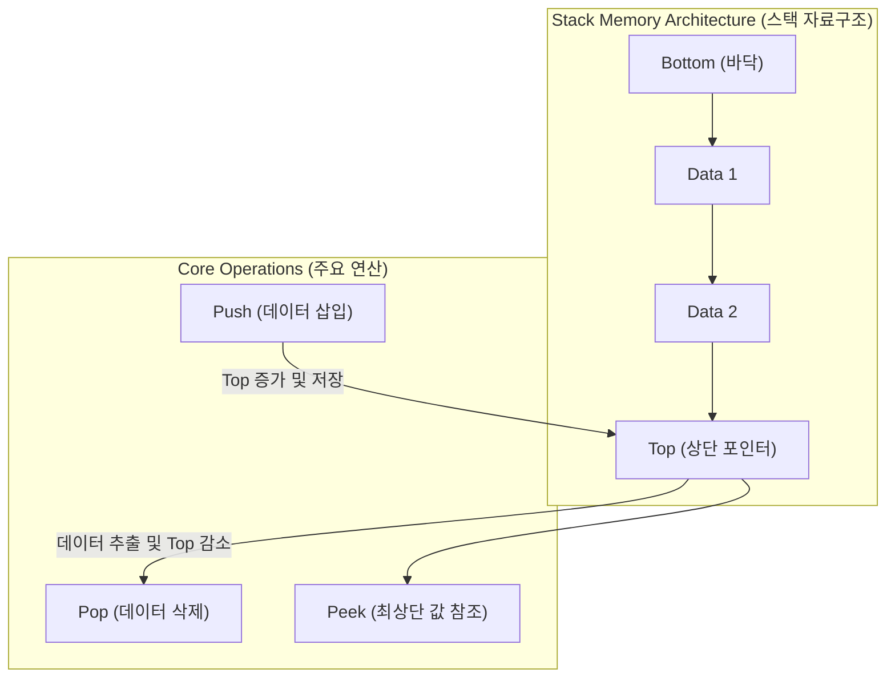

# 스택 (Stack)

---

## I. 데이터 구조 및 메모리 관리를 위한 후입선출(LIFO) 자료구조, 스택(Stack)의 개요

* **정의**: 리스트의 한쪽 끝(Top)에서만 데이터의 삽입(Push)과 삭제(Pop)가 이루어지도록 제한된, 가장 나중에 들어온 데이터가 먼저 나가는 **후입선출(Last In, First Out, LIFO)** 방식의 선형 자료구조
* **필요성 및 특징**:
* **순서 역전 및 역추적**: 함수 호출, 수식 계산, 실행 취소(Undo) 등 이전 상태의 복원이 필요한 연산에 최적화
* **시스템 자원 관리**: [[프로세스]] 실행 시 지역 변수와 복귀 주소를 저장하는 [[메모리 관리]](Call Stack)의 핵심 기반 제공

---

## II. 스택의 아키텍처 및 핵심 기술 요소

### 가. 스택의 연산 메커니즘 및 아키텍처

* 데이터가 삽입(Push)되면 Top 포인터가 위로 이동하여 저장되고, 삭제(Pop) 시 최상단 데이터가 반환되면서 Top이 아래로 이동하는 LIFO 원리로 동작

### 나. 스택의 핵심 기술 및 구성 요소

| 분류 | 요소기술 (키워드) | 세부 설명 |
| --- | --- | --- |
| **기본 연산** | Push / Pop | Top 위치에서 데이터를 삽입하거나 제거하는 핵심 제어 연산 |
| **상태 확인** | Peek (Top) / IsEmpty / IsFull | 데이터를 삭제하지 않고 상단 값을 조회하거나, 오버플로우/언더플로우 예방 |
| **메모리 구조** | Call Stack (호출 스택) | 함수 호출 시 매개변수, 지역 변수, 복귀 주소(Return Address)를 저장하는 영역 |
| **구현 방식** | Array-based Stack | 고정 크기를 가지며 인덱스로 빠른 접근이 가능하나 크기 확장에 제약 존재 |
| **구현 방식** | Linked List Stack | 동적 메모리 할당으로 크기 제한이 없으나 포인터 저장을 위한 추가 오버헤드 발생 |
| **응용 [[알고리즘]]** | DFS / 백트래킹 | [[그래프 순회]] 시 경로 추적 및 이전 탐색 상태로 되돌아가기 위해 활용 |
| **시스템 보안** | Stack Overflow / Underflow | 스택 영역이 할당된 메모리를 초과하거나 비어있는 상태에서 접근 시 발생하는 예외 |
| **하드웨어 지원** | Stack Pointer (SP) | [[CPU]] 레지스터 내에서 스택의 최상단 메모리 주소를 실시간으로 가리키는 포인터 |

---

## III. 스택과 큐 비교 및 최신 보안 동향

### 가. 스택(Stack)과 큐(Queue) 비교

| 비교 항목 | 스택 (Stack) | 큐 ([[Queue]]) |
| --- | --- | --- |
| **데이터 처리 원리** | 후입선출 (LIFO, Last In, First Out) | 선입선출 ([[FIFO]], First In, First Out) |
| **입출력 위치** | 한쪽 끝 (Top)에서만 삽입과 삭제 수행 | 양쪽이 분리됨 (삽입은 Rear, 삭제는 Front) |
| **주요 활용 사례** | 함수 호출(Call Stack), 수식 괄호 검사, DFS | 프로세스 대기열(Ready Queue), BFS, 프린터 버퍼 |
| **구현 데이터 구조** | 1차원 배열, 단순 연결 리스트 | 원형 큐(Circular Queue), 연결 리스트 |

### 나. 최신 보안 동향 및 발전 방향 (Shadow Stack)

* **메모리 취약점 방어 (Control-flow Enforcement Technology, CET)**: 버퍼 오버플로우를 이용해 함수의 복귀 주소를 변조하는 ROP(Return-Oriented Programming) 공격을 차단하기 위해, 하드웨어 수준에서 복귀 주소를 별도로 안전하게 보관하는 **Shadow Stack** 도입 확대

---

### 🔗 연관 토픽

- **소속 도메인**: [[00_컴퓨터구조_MOC|💻 컴퓨터구조]]
- **세부 분류**: `2. 캐시 & 메모리 계층 구조 · 스토리지`
- **핵심 연관 토픽**:
  - [[메모리 관리]]
  - [[그래프 순회|그래프 순회 (Graph Traversal)]]
  - [[Queue]]
  - [[FIFO]]
  - [[프로세스]]
