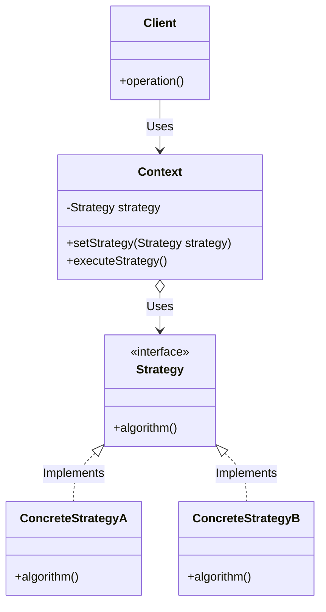

# 전략 패턴 (Strategy Pattern)

---

## I. 객체의 행위를 동적으로 교체하기 위한 디자인 패턴, Strategy의 개요

* **정의**: 동일 계열의 [[알고리즘]] 군을 정의하고, 각각을 캡슐화하여 상호 교환이 가능하도록 만드는 행위(Behavioral) [[디자인 패턴]]
* **등장 배경 및 특징**:
* **OIDC 및 조건문 제거**: 복잡한 `if-else` 또는 `switch-case` 분기문을 제거하여 코드의 가독성 및 유지보수성 향상
* **개방 폐쇄 원칙(OCP) 준수**: 기존 코드의 수정 없이 새로운 알고리즘 전략을 쉽게 추가·확장 가능
* **행위의 동적 [[캡슐화]]**: 클라이언트와 독립적으로 알고리즘을 변경할 수 있어 런타임에 전략 유연성 확보

---

## II. 전략 패턴의 아키텍처 및 핵심 구성요소

### 가. 전략 패턴의 아키텍처 및 동작 원리

* 클라이언트가 컨텍스트(Context)에 특정 전략(Strategy)을 주입하면, 컨텍스트는 내부의 공통 인터페이스를 통해 구체화된 전략 클래스의 알고리즘을 동적으로 실행함

### 나. 전략 패턴의 핵심 기술 및 구성 요소

| 구분 | 요소기술 (키워드) | 세부 설명 |
| --- | --- | --- |
| **인터페이스** | Strategy Interface | 공통 알고리즘의 규격을 정의하여 구현체 간 상호 교환성을 보장하는 인터페이스 |
| **구현체** | Concrete Strategy | 전략 인터페이스를 상속받아 실제 세부 알고리즘 로직을 독립적으로 구현한 [[클래스]] |
| **실행 주체** | Context | 전략 객체를 유지하고 있으며, 클라이언트의 요청을 받아 해당 전략의 알고리즘 호출 |
| **유연성** | 런타임 교체 (DI) | 프로그램 실행 중에 Setter 등을 통해 전략 객체를 동적으로 변경하여 행위 유연성 제공 |
| **설계 원칙** | OCP (개방 폐쇄 원칙) | 새로운 알고리즘 추가 시 기존 컨텍스트 코드 변경 없이 전략 클래스만 추가 가능 |
| **관련 패턴** | 팩토리 패턴 융합 | 클라이언트가 직접 전략을 생성하지 않고, Factory를 통해 적절한 Concrete Strategy 생성 |
| **함수형 적용** | 람다(Lambda) 표현식 | 최신 언어(Java 8+)에서는 복잡한 클래스 생성 없이 함수형 인터페이스 기반으로 전략 주입 |
| **적용 사례** | 결제 및 할인 시스템 | PG사별 결제 모듈 연동, 회원 등급별 할인율 계산 등 동적 분기 로직 처리 |

---

## III. 템플릿 메서드 패턴 비교 및 향후 전망

### 가. 전략 패턴 vs 템플릿 메서드 패턴 비교

| 비교 항목 | 전략 패턴 (Strategy Pattern) | 템플릿 메서드 패턴 (Template Method) |
| --- | --- | --- |
| **결합 방식** | **구성(Composition)**을 통한 위임 방식 | **상속(Inheritance)**을 통한 공통 골격 정의 |
| **유연성** | 런타임에 동적으로 알고리즘 교체 가능 | 컴파일 타임(상속 구조)에 고정되어 유연성 낮음 |
| **제어 흐름** | 클라이언트나 컨텍스트가 전략을 선택하여 실행 | 상위 클래스가 전체 알고리즘 흐름을 쥐고 하위가 일부 구현 |
| **주요 활용** | 알고리즘 자체가 완전히 독립적으로 교체될 때 | 공통된 로직의 뼈대를 유지하고 일부 단계만 변경할 때 |

### 나. 향후 전망 및 발전 방향

* **[[MSA (Micro Service Architecture)|MSA]] 및 함수형 프로그래밍과의 결합**: 마이크로서비스 아키텍처 환경에서 비즈니스 룰 엔진(Rule Engine)의 동적 라우팅 및 람다 기반 함수형 전략 주입 기법으로 진화
* **AI 기반 동적 전략 최적화**: 트래픽 부하 및 사용자 성향 데이터를 분석하여 시스템이 런타임에 최적의 알고리즘 전략을 자율 선택하는 지능형 패턴으로 확장

---

### 🔗 연관 토픽

- **소속 도메인**: [[00_소프트웨어공학_MOC|🏗️ 소프트웨어공학]]
- **세부 분류**: `4. 아키텍처 스타일 & 객체지향 설계 원리`
- **핵심 연관 토픽**:
  - [[디자인 패턴|디자인 패턴 (Design Pattern)]]
  - [[캡슐화|캡슐화 (encapsulation)]]
  - [[Design Pattern (23개 패턴)]]
  - [[MSA (Micro Service Architecture)]]
  - [[CBAM|CBAM(Cost Benefit Analysis Method)]]
