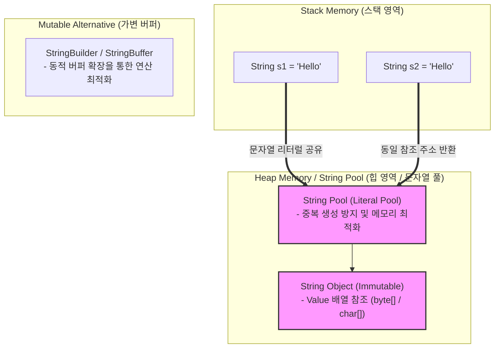

# String Type (문자열 타입)

---

## I. 텍스트 데이터 표현 및 처리를 위한 기본 데이터 타입, String Type의 개요

* **정의**: 프로그래밍 언어, [[데이터베이스]] 및 시스템에서 일련의 문자(Character)들의 집합을 표현하기 위해 사용하는 대표적인 복합 데이터 타입
* **등장 배경 및 특징**:
* **텍스트 정보 처리**: 숫자 외에 자연어, 기호, 코드 등 비정형 텍스트 정보를 메모리 및 저장소에 효율적으로 저장하기 위해 도입
* **불변성(Immutability) 및 가변성**: 많은 현대 언어(Java, Python 등)에서 데이터 무결성과 스레드 안전성을 위해 불변 객체로 설계
* **인코딩(Encoding) 의존성**: 물리적 저장 시 문자 세트(ASCII, UTF-8, UTF-16 등) 규격에 따른 바이트 변환 과정 필수

---

## II. String Type의 메모리 아키텍처 및 핵심 기술 요소

### 가. String Type의 메모리 할당 및 내부 아키텍처

* 문자열 리터럴 생성 시 힙 내의 String Pool에 저장되어 참조를 공유하며, 불변(Immutable) 특성으로 인해 값 변경 시 새로운 객체가 생성되므로 대량 연산 시 가변 버퍼(StringBuilder 등) 사용 필수

### 나. String Type의 핵심 기술 및 구성 요소

| 구분 | 요소기술 (키워드) | 세부 설명 |
| --- | --- | --- |
| **메모리 최적화** | String Interning | 동일한 문자열 리터럴의 중복 생성을 막고 메모리 풀(Pool)의 주소를 공유하는 기법 |
| **가변성 제어** | StringBuilder / StringBuffer | 문자열 연산 시 객체 생성을 줄이고 내부 버퍼를 동적으로 조작하여 성능 최적화 |
| **인코딩 방식** | UTF-8 / UTF-16 | 가변 길이(1~4바이트) 유니코드 인코딩(UTF-8) 및 고정/가변 혼용 인코딩(UTF-16) 규격 |
| **메모리 압축** | Compact Strings (Java 9+) | 영문/ASCII 위주의 문자열은 1바이트(Latin-1)로 압축 저장하여 메모리 효율성 제고 |
| **패턴 매칭** | 정규 표현식 (Regex) | 특정한 규칙을 가진 문자열 집합을 검색, 추출, 치환하기 위한 강력한 패턴 검증 도구 |
| **보안 취약점** | Format String / Injection | 사용자 입력값이 형식 지정자나 [[SQL(Structured Query Language)|SQL]] 구문으로 직접 해석되어 발생하는 취약점 및 방어 |
| **DB 스토리지** | VARCHAR / TEXT / CLOB | 관계형 데이터베이스에서 가변 길이 텍스트 및 대용량 객체를 저장하는 데이터 타입 |
| **최신 동향** | Zero-Copy String | 메모리 간 데이터 복사(Copy) 과정을 생략하고 포인터만 전달하여 고속 처리하는 구조 |

---

## III. 불변(Immutable) 문자열과 가변(Mutable) 문자열 비교 및 향후 전망

### 가. Immutable String vs Mutable String (Buffer/Builder) 비교

| 비교 항목 | Immutable String (`String`) | Mutable String (`StringBuilder`) |
| --- | --- | --- |
| **객체 상태** | 생성 후 내부 값 변경 불가 (불변) | 내부 버퍼(Buffer)를 통해 값의 수정·추가 가능 (가변) |
| **메모리 영향** | 문자열 연산(`+`) 시 매번 새로운 객체 생성으로 가비지(GC) 유발 | 객체 재생성 없이 기존 버퍼 내에서 수정되어 메모리 효율적 |
| **스레드 안전성** | 불변성으로 인해 멀티스레드 환경에서 **Thread-Safe** 보장 | 동기화 처리가 없어 멀티스레드 환경에서 안전하지 않음 (StringBuffer는 안전) |
| **주요 활용** | 고정된 텍스트, Map의 Key 값, 설정 정보 관리 | 반복적인 문자열 조작, 동적 쿼리 생성, 로그 수집 처리 |

### 나. 향후 전망 및 발전 방향

* **메모리 안전성 및 제로코피(Zero-Copy) 최적화**: 고성능 시스템 프로그래밍(Rust, Go 등)에서 문자열 슬라이싱(Slice) 시 메모리 복사를 원천 차단하는 안전한 참조 모델 표준화
* **AI 기반 자연어 텍스트 벡터화 연동**: 전통적인 바이트/유니코드 기반 String Type에서 나아가, [[초거대 언어 모델|LLM]] 및 RAG 처리를 위해 임베딩(Vector) 데이터 타입과 긴밀히 연계되는 하이브리드 문자열 처리 아키텍처로 진화

---

### 🔗 연관 토픽

- **소속 도메인**: [[00_컴퓨터구조_MOC|💻 컴퓨터구조]]
- **세부 분류**: `2. 캐시 & 메모리 계층 구조 · 스토리지`
- **핵심 연관 토픽**:
  - [[데이터베이스]]
  - [[SQL(Structured Query Language)]]
  - [[메모리 반도체|메모리 반도체 (Memory Semiconductor)]]
  - [[선형 자료구조와 비선형 자료구조]]
  - [[초거대 언어 모델|초거대 언어 모델(Large Language Model)]]
