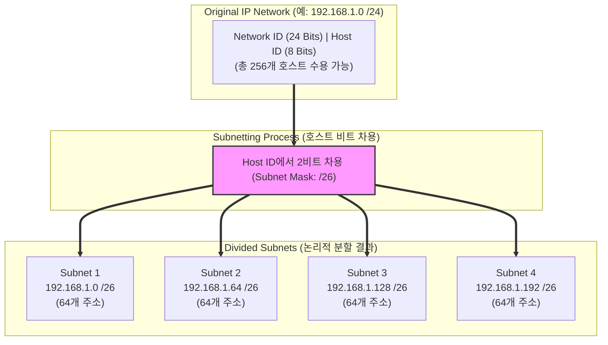

# 서브네팅 (Subnetting)

---

## I. IP 자원 고갈 방지 및 네트워크 성능 최적화를 위한 논리적 분할 기법, 서브네팅의 개요

* **정의**: IP 주소의 효율적 관리와 브로드캐스트 도메인 분할을 위해, IP 주소 체계 내에서 네트워크 ID와 호스트 ID의 경계를 조정하여 하나의 물리적 네트워크를 논리적인 다수의 서브네트워크로 쪼개는 기법
* **필요성 및 특징**:
* **[[IPv4]] 주소 고갈 대응**: 제한된 공인 IP 주소 공간을 효율적으로 배분하여 낭비 최소화
* **브로드캐스트 트래픽 제어**: 네트워크 세분화를 통해 불필요한 브로드캐스트 도메인 축소 및 네트워크 성능 향상
* **보안성 및 관리 효율성**: 서브넷 간 라우팅 제어 및 접근 통제(ACL, VPC Subnet)를 통한 보안 격리 용이

---

## II. 서브네팅의 아키텍처 및 핵심 기술 요소

### 가. 서브네팅의 비트 차용 및 분할 아키텍처

* 기존 호스트 ID 영역에서 비트를 빌려와 서브네트워크 식별자로 할당하고, 이를 통해 서브넷 개수와 각 서브넷당 수용 가능한 호스트 범위를 동적으로 결정함

### 나. 서브네팅의 핵심 기술 및 구성 요소

| 구분 | 요소기술 (키워드) | 세부 설명 |
| --- | --- | --- |
| **식별자** | 서브넷 마스크 (Subnet Mask) | IP 주소에서 네트워크 영역과 호스트 영역을 비트 단위로 구분하는 32비트 마스크 값 |
| **라우팅 표기** | CIDR (Classless Inter-Domain Routing) | 슬래시(`/`) 표기법을 사용하여 네트워크 prefix 길이를 유연하게 지정하는 방식 |
| **가변 분할** | VLSM (Variable Length Subnet Mask) | 네트워크별 요구 호스트 수에 따라 서로 다른 길이의 서브넷 마스크를 적용하는 최적화 기법 |
| **주소 범위** | 네트워크 ID / 브로드캐스트 IP | 서브넷 내에서 가장 첫 번째 주소(네트워크 식별)와 가장 마지막 주소(전체 방송용) |
| **클라우드 연계** | VPC Subnet (클라우드 서브넷) | 퍼블릭/프라이빗 서브넷으로 분리하여 라우팅 테이블 및 NAT 게이트웨이와 연동 |
| **주소 변환** | NAT / PAT | 사설 IP 주소 공간을 공인 IP 주소로 상호 변환하여 외부 인터넷 통신 지원 |
| **차세대 주소** | [[IPv6]] Prefix Delegation | 무한대에 가까운 주소 공간을 바탕으로 구조화된 계층적 서브넷팅 수행 |
| **보안 통제** | NACL / Security Group | 서브넷 경계 및 [[인스턴스]] 레벨에서 트래픽의 허용/차단을 제어하는 보안 규칙 |

---

## III. 전통적 서브네팅과 클라우드 VPC 서브네팅 비교 및 향후 전망

### 가. 전통적 서브네팅 vs 클라우드 VPC 서브네팅 비교

| 비교 항목 | 전통적 네트워크 서브네팅 (On-Premise) | 클라우드 VPC 서브네팅 (Cloud Native) |
| --- | --- | --- |
| **구현 주체** | 네트워크 엔지니어가 물리적 [[라우터]] 및 [[스위치 (Layer 3 Switch)|스위치]] 설정 | 클라우드 콘솔(AWS VPC 등)을 통한 소프트웨어 정의 네트워킹([[SDN(Software Defined Network)|SDN]]) |
| **유연성** | 물리적 케이블 및 장비 제약으로 변경 시 공수 발생 | API 호출을 통한 서브넷 생성, 삭제, CIDR 확장이 실시간 가능 |
| **보안 격리** | VLAN 및 물리적 [[방화벽]] 장비 기반 격리 | 퍼블릭/프라이빗 서브넷, 인터넷 Gateway, NAT Gateway 자동 연계 |
| **주소 제약** | 사설 IP 대역(RFC 1918) 내에서 철저한 수동 계산 필수 | 클라우드 제공자가 제공하는 가상 라우팅 테이블 기반 자동 관리 |

### 나. 향후 전망 및 발전 방향

* **소프트웨어 정의 네트워킹(SDN) 기반 자동화**: [[멀티클라우드]] 및 하이브리드 클라우드 환경에서 복잡한 서브네팅과 라우팅 구성을 AI 기반 오케스트레이션 툴이 자동 설계 및 검증
* **IPv6 네이티브 전환 가속**: 주소 부족 문제에서 완전히 해방된 IPv6 기반의 단순화된 계층형 서브네트워크 아키텍처로 엔터프라이즈 네트워크 전환 확대

---

### 🔗 연관 토픽

- **소속 도메인**: [[00_네트워크_MOC|🌐 네트워크]]
- **세부 분류**: `1. OSI 7계층 & 데이터링크 계층 (L1/L2)`
- **핵심 연관 토픽**:
  - [[라우터]]
  - [[스위치 (Layer 3 Switch)]]
  - [[IPv6]]
  - [[IPv4]]
  - [[Network(3) 레이어]]
