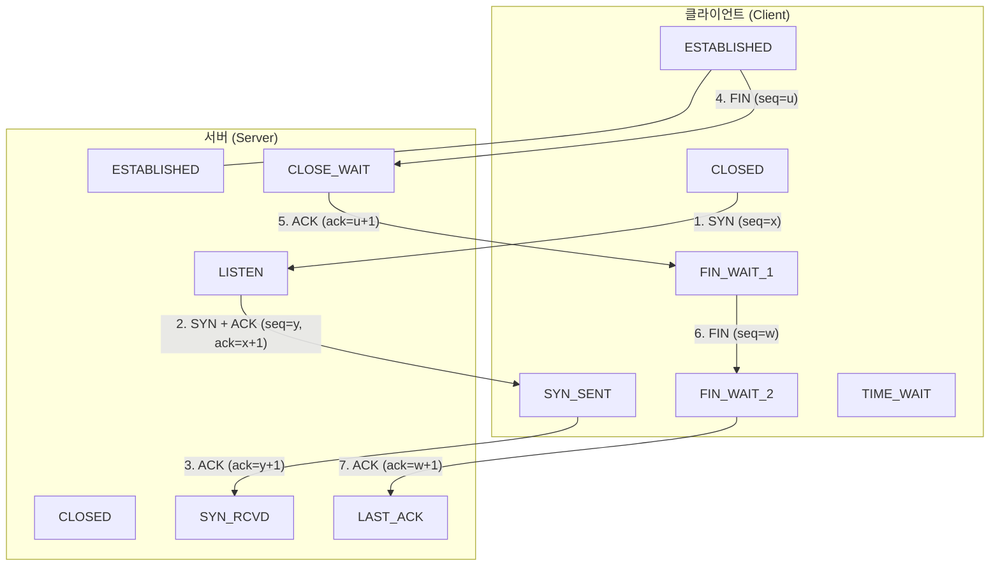

# TCP 연결의 설정 및 해제 (TCP Connection Establishment and Termination)

---

## I. 신뢰성 있는 세션 수립과 자원 정리를 위한 연결 제어 메커니즘, TCP 핸드셰이킹의 개요

* **정의**: [[TCP]] 통신 시 양 끝단([[End-to-End]]) 간에 [[신뢰성]] 있는 데이터 전송을 보장하기 위해 세션을 연결(3-Way Handshake)하고, 통신 완료 후 안전하게 자원을 해제(4-Way Handshake)하는 공학적 제어 절차
* 네트워크 [[HA(High Availability)|가용성]] 확보, 패킷 유실 방지 및 [[세션]] 상태 동기화를 통한 통신 [[무결성]] 보장 목적
* 특징: RFC 9293 표준 기반 연결 지향성, 순서 번호(Sequence Number) 동기화, TCP Fast Open 등을 통한 지연 시간 단축 최적화

---

## II. TCP 연결 설정 및 해제의 아키텍처 및 핵심 구성요소

### 가. TCP 3-Way 및 4-Way Handshake 프로세스

* SYN/ACK 교환으로 3단계 세션을 수립(3-Way)하고, FIN/ACK 교환을 통해 양방향 연결을 독립적으로 해제(4-Way)하는 구조

### 나. TCP 핸드셰이킹의 핵심 기술 및 구성 요소

| 분류 | 요소기술(키워드) | 세부 설명 |
| --- | --- | --- |
| 연결 설정 | SYN / SEQ 번호 | 세션 시작을 알리는 동기화 신호 및 무작위 초기 시퀀스 번호 지정 |
| 연결 설정 | SYN-ACK / ACK | 서버의 수신 응답과 클라이언트의 최종 확인을 통한 세션 수립 완료 |
| 연결 해제 | FIN / 4-Way | 양측의 데이터 전송 종료를 선언하기 위한 4단계 상호 연결 종료 절차 |
| 연결 해제 | TIME_WAIT | 잔여 지연 패킷 처리를 위해 연결 종료 후 일정 시간 소켓을 유지하는 대기 상태 |
| 최적화 기술 | TCP Fast Open (TFO) | 쿠키를 활용하여 최초 3-Way 핸드셰이크 과정에서 데이터 동시 전송(지연 감소) |
| 표준 규격 | RFC 9293 (STD 7) | 기존 분산되어 있던 TCP 관련 규격(RFC 793 등)을 통합한 최신 표준 반영 |
| 장애 방지 | RST (Reset) 패킷 | 비정상적인 세션 강제 종료, 포트 미개방 등 오류 상황 발생 시 즉시 리셋 |
| 최신 트렌드 | QUIC 0-RTT 핸드셰이크 | TCP 핸드셰이크 한계를 극복하기 위해 UDP 기반으로 전송·[[암호화]] 통합 설계 |

---

## III. 전통적 TCP 핸드셰이크 vs 최신 QUIC 연결 설정 비교 및 동향

| 비교 항목 | 전통적 TCP 핸드셰이크 (3-Way / 4-Way) | 최신 QUIC 연결 설정 (0-RTT / 1-RTT) |
| --- | --- | --- |
| **핸드셰이크 지연** | TCP 1회 + TLS 설정으로 인한 다중 왕복 지연 발생 | 전송 계층과 보안(TLS 1.3) 통합으로 1-RTT 또는 0-RTT 구현 |
| **연결 마이그레이션** | IP/포트 변경 시 세션 끊어짐 (재연결 필요) | 커넥션 ID 기반으로 네트워크 변경 시에도 세션 무중단 유지 |
| **헤어핀 및 HOL 블로킹** | 패킷 유실 시 후속 스트림 전체 대기 (TCP HOL Blocking) | 독립적 스트림 처리로 단일 패킷 유실의 영향 최소화 |

* 최근 [[클라우드 네이티브]] 및 고성능 웹 환경에서는 TCP Fast Open 적용 외에도, TCP 핸드셰이크의 구조적 한계를 극복하기 위해 UDP 기반의 QUIC 프로토콜을 통한 0-RTT 연결 설정 표준으로 빠르게 전환되는 추세임

---

### 🔗 연관 토픽

- **소속 도메인**: [[00_네트워크_MOC|🌐 네트워크]]
- **세부 분류**: `3. 전송 계층 & 트래픽 / 혼잡 제어 (L4)`
- **핵심 연관 토픽**:
  - [[TCP]]
  - [[무결성]]
  - [[End-to-End]]
  - [[신뢰성]]
  - [[세션]]
