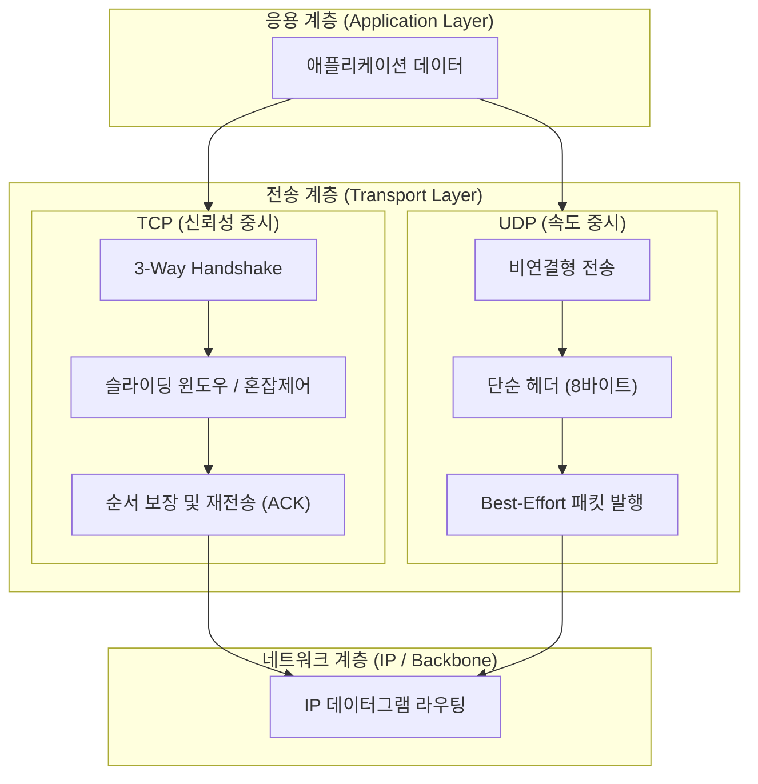

# TCP와 UDP 비교

---

## I. 신뢰성 중심 전송과 속도 중심 전송의 대표적 L4 프로토콜, TCP와 UDP 비교의 개요

* **정의**: OSI 7계층 중 전송계층(Layer 4)에 위치하며, 데이터 전송의 신뢰성을 보장하는 연결지향형 [[TCP]](Transmission Control Protocol)와 속도와 효율성을 중시하는 비연결형 UDP(User Datagram Protocol)의 특성 비교 및 상황별 선택 기준 기술
* 네트워크 트래픽 특성([[신뢰성]] vs 실시간성)에 따른 최적의 통신 인프라 구성 및 대규모 분산 환경 최적화 목적
* 특징: TCP의 3-Way Handshake 및 흐름·[[혼잡 제어]], UDP의 단순 구조 기반 무연결 고속 전송, 차세대 QUIC 프로토콜의 대두

---

## II. TCP와 UDP의 아키텍처 및 핵심 구성요소

### 가. TCP와 UDP의 패킷 전송 아키텍처 및 동작 원리

* 응용 계층의 데이터가 전송 계층에서 신뢰성 중심의 TCP 경로(연결 설정, 재전송 제어)나 속도 중심의 UDP 경로(단순 헤더, Best-Effort)로 분기되어 네트워크를 통해 전송되는 구조

### 나. TCP와 UDP의 핵심 기술 및 구성 요소

| 분류 | 요소기술(키워드) | 세부 설명 |
| --- | --- | --- |
| 연결 제어 | 3-Way / 4-Way Handshake | TCP의 신뢰성 있는 [[세션]] 수립 및 정상 종료 제어 메커니즘 |
| 신뢰성 보장 | 순서 번호 및 ACK | TCP의 패킷 유실 감지 및 누락 데이터 자동 재전송 기능 |
| 흐름 제어 | 슬라이딩 윈도우 (Sliding Window) | TCP 수신측 버퍼 오버플로우 방지를 위한 동적 송신량 조절 |
| 혼잡 제어 | 느린 시작 / BBRv3 | 네트워크 대역폭 포화 방지를 위한 TCP 송신율 제어 [[알고리즘]] |
| 구조적 특징 | 비연결형 (Connectionless) | UDP의 사전 세션 수립 과정 생략으로 인한 오버헤드 최소화 |
| 전송 보장 | Best-Effort Delivery | UDP의 패킷 순서 불보장 및 유실 복구 기능 미제공 특성 |
| 표준 규격 | RFC 9293 (STD 7) | 기존 분산된 TCP 규격을 통합한 최신 표준 명세 |
| 최신 트렌드 | QUIC (UDP 기반 통합) | UDP 기반 위에서 TCP의 신뢰성과 TLS 암호화를 동시에 제공하는 규격 |

---

## III. TCP와 UDP의 상세 비교 및 최신 동향

| 비교 항목 | TCP (Transmission Control Protocol) | UDP (User Datagram Protocol) |
| --- | --- | --- |
| **연결 방식** | 연결지향형 (Connection-oriented) | 비연결형 (Connectionless) |
| **신뢰성 및 순서** | ACK 기반 신뢰성 보장, 순서 번호 부여 | 신뢰성 미보장, 패킷 순서 바뀔 수 있음 |
| **속도 및 오버헤드** | 핸드셰이크 및 제어 헤더(20바이트 이상)로 상대적 저속 | 단순 헤더(8바이트)로 초고속 전송 가능 |
| **흐름/혼잡 제어** | 지원 (Sliding Window, Congestion Window) | 미지원 (애플리케이션 계층에서 자체 처리 필요) |
| **주요 활용 분야** | 웹(HTTP/1.1, 2), 파일 전송(FTP), 이메일(SMTP) | 실시간 스트리밍, 온라인 게임, [[DNS(Domain Name System)|DNS]], VoIP |

* 전통적으로 신뢰성의 TCP와 속도의 UDP가 명확히 이분화되었으나, 최근에는 UDP의 고속성과 TCP의 신뢰성을 결합한 **QUIC(RFC 9000)** 프로토콜이 [[HTTP 3|HTTP/3]] 표준으로 채택되며 웹 전송 표준의 패러다임이 전환되고 있음

---

### 🔗 연관 토픽

- **소속 도메인**: [[00_네트워크_MOC|🌐 네트워크]]
- **세부 분류**: `1. OSI 7계층 & 데이터링크 계층 (L1/L2)`
- **핵심 연관 토픽**:
  - [[TCP]]
  - [[HTTP 3|HTTP/3]]
  - [[DNS(Domain Name System)]]
  - [[세션]]
  - [[혼잡 제어]]
