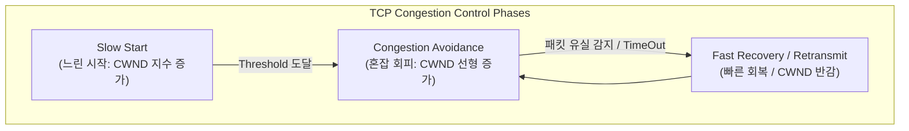

# TCP 혼잡제어 (TCP Congestion Control)

---

## I. 네트워크 대역폭 포화 방지와 공정성 유지를 위한 L4 전송 제어 기술, TCP 혼잡제어의 개요

* **정의**: 네트워크 내 라우터와 링크의 과부하(Congestion)를 방지하기 위해, 송신 측이 수신 측의 버퍼 여유 공간뿐만 아니라 네트워크 상태를 고려하여 전송 데이터 양을 동적으로 조절하는 핵심 제어 메커니즘
* 패킷 유실 방지, 네트워크 자원의 공정 분배 및 전송 효율성(Throughput) 극대화 목적
* 특징: AIMD 기반 윈도우 조절, 느린 시작 및 혼잡 회피 단계, 최신 BBRv3 등 모델 기반 대역폭 추정 진화

---

## II. TCP 혼잡제어의 아키텍처 및 핵심 구성요소

### 가. TCP 혼잡제어 상태 전이 및 동작 원리

* 연결 초기 느린 시작(Slow Start)을 통해 지수적으로 윈도우 크기(CWND)를 키우고, 임계값(SSTHRESH) 도달 시 혼잡 회피(Congestion Avoidance)로 전환하여 선형 증가하며, 패킷 유실 감지 시 급격히 윈도우를 축소하여 안정성을 유지하는 구조

### 나. TCP 혼잡제어의 핵심 기술 및 구성 요소

| 분류 | 요소기술(키워드) | 세부 설명 |
| --- | --- | --- |
| 제어 변수 | 혼잡 윈도우 (CWND) | 네트워크 상황을 반영하여 송신 측이 허용하는 최대 전송 패킷 수 |
| 핵심 [[알고리즘]] | 느린 시작 (Slow Start) | 초기 연결 시 CWND를 1에서 시작하여 ACK 수신마다 지수적 증가 |
| 핵심 알고리즘 | 혼잡 회피 (Congestion Avoidance) | 임계값(SSTHRESH) 초과 시 CWND를 매 RTT마다 1개씩 선형 증가 |
| 손실 대응 | 빠른 재전송 / 빠른 회복 | 중복 ACK 3회 수신 시 타임아웃 대기 없이 즉시 재전송 및 CWND 조정 |
| 최신 알고리즘 | BBR (Bottleneck Bandwidth and RTT) | 손실 기반 제어의 한계를 극복하고 대역폭과 왕복 지연을 측정하여 제어 |
| 최신 표준 | HyStart++ | 느린 시작 단계에서 지연 기반 혼잡 조기 탐지 및 오버슈팅 방지 |
| 패킷 마킹 | ECN (Explicit Congestion Notification) | [[라우터]] 패킷 유실 전 명시적 혼잡 표식을 통해 사전 송신율 조절 |
| 최신 트렌드 | AI/ML 기반 [[혼잡 제어]] | [[강화학습]] 기반으로 시시각각 변하는 동적 네트워크 환경에 대응하는 제어 |

---

## III. 전통적 손실 기반 혼잡제어 vs 최신 모델 기반(BBR) 혼잡제어 비교 및 동향

| 비교 항목 | 전통적 손실 기반 혼잡제어 (CUBIC 등) | 최신 모델 기반 혼잡제어 (BBRv3 등) |
| --- | --- | --- |
| **혼잡 감지 기준** | 패킷 손실(Packet Loss) 및 타임아웃 발생 여부 | 병목 대역폭(Bottleneck Bandwidth)과 최소 RTT 측정 |
| **고대역폭-지연 망** | 버퍼bloat 현상 발생 및 대역폭 활용 효율 저하 | 고속·대형 네트워크에서 최대 대역폭 고속 활용 가능 |
| **공정성 및 안정성** | 손실 발생 시 과도한 CWND 축소로 속도 급감 | 안정적인 전송 유지 및 지연 시간(Latency) 최소화 |

* 최근 클라우드 데이터센터 및 5G/6G 대규모 백본망의 고도화에 따라, 단순 패킷 유실에 반응하는 전통적 CUBIC 방식에서 벗어나 실시간 대역폭과 지연을 정밀 추정하는 BBR 기반 지능형 혼잡제어 체계가 표준으로 자리 잡고 있음

---

### 🔗 연관 토픽

- **소속 도메인**: [[00_네트워크_MOC|🌐 네트워크]]
- **세부 분류**: `3. 전송 계층 & 트래픽 / 혼잡 제어 (L4)`
- **핵심 연관 토픽**:
  - [[혼잡 제어]]
  - [[라우터]]
  - [[강화학습]]
  - [[Traffic Shaping (트래픽 쉐이핑)]]
  - [[Traffic Policing (트래픽 정책처리)]]
