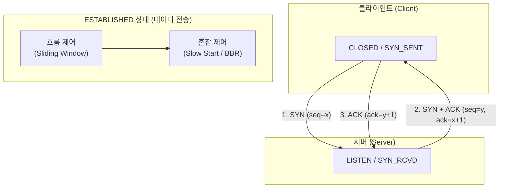

# 전송 제어 프로토콜 (TCP, Transmission Control Protocol)

---

## I. 신뢰성 있는 연결지향형 전송을 제공하는 L4 표준 프로토콜, TCP의 개요

* **정의**: OSI 7계층 중 전송계층(Layer 4)에 위치하며, 네트워크 양 끝단([[End-to-End]]) 간에 [[신뢰성]] 있고 순서화된 바이트 스트림 전송을 보장하는 연결지향형 표준 [[프로토콜]]
* 데이터 손실 방지 및 순서 보장, 흐름 제어 및 혼잡 제어를 통한 네트워크 안정성 확보 목적
* 특징: 3-Way Handshake 연결 설정, 슬라이딩 윈도우 기반 흐름 제어, RFC 9293 기반 통합 표준(STD 7) 체계

---

## II. TCP의 연결 제어 아키텍처 및 핵심 기술 요소

### 가. TCP의 3-Way Handshake 및 연결 제어 프로세스

* 클라이언트와 서버 간 SYN 및 ACK 패킷 교환을 통해 3단계로 세션을 수립(3-Way Handshake)하고, 이후 슬라이딩 윈도우 및 혼잡 제어를 거쳐 안전한 데이터 스트림을 전송하는 구조

### 나. TCP의 핵심 기술 및 구성 요소

| 분류 | 요소기술(키워드) | 세부 설명 |
| --- | --- | --- |
| 연결 제어 | 3-Way / 4-Way Handshake | SYN/ACK 교환을 통한 신뢰성 있는 [[세션]] 수립 및 FIN 기반 정상 종료 |
| 신뢰성 보장 | 순서 번호 및 ACK (Sequence/Acknowledge) | 패킷 손실 감지 및 누락된 데이터의 재전송(Retransmission) 보장 |
| 흐름 제어 | 슬라이딩 윈도우 (Sliding Window) | 수신측 버퍼 오버플로우 방지를 위해 송신량 동적 조절 |
| [[혼잡 제어]] | 느린 시작 / 혼잡 회피 (Slow Start / Congestion Avoidance) | 네트워크 대역폭 포화 방지를 위한 CWND(Congestion Window) 제어 |
| 표준 통합 | RFC 9293 (STD 7) | 기존 분산되어 있던 TCP 관련 규격(RFC 793 등)을 단일 표준으로 통합 |
| 고성능 확장 | SACK 및 Window Scaling | 선택적 ACK를 통한 불필요한 재전송 최소화 및 대역폭 확장 |
| 최신 혼잡제어 | BBRv3 / HyStart++ | 모델 기반 대역폭 추정 및 지연 기반 느린 시작 탈출 고도화 |
| 최신 표준 | RFC 9768 (AccECN) | 명시적 혼잡 통보(ECN) 피드백 정밀도 향상을 위한 최신 표준 적용 |

---

## III. TCP vs UDP 비교 및 최신 진화 동향

| 비교 항목 | TCP (Transmission Control Protocol) | UDP (User Datagram Protocol) |
| --- | --- | --- |
| **연결 방식** | 연결지향형 (Connection-oriented) | 비연결형 (Connectionless) |
| **신뢰성** | 응답(ACK) 및 재전송을 통한 높은 신뢰성 보장 | 패킷 유실 가능성 존재 (Best-effort delivery) |
| **속도 및 오버헤드** | 핸드셰이크 및 헤더 크기(20바이트 이상)로 상대적 저속 | 단순 구조로 오버헤드가 적고 실시간 전송에 유리 |
| **주요 활용 영역** | 웹(HTTP/HTTPS), 파일 전송(FTP), 이메일(SMTP) | 실시간 스트리밍, 온라인 게임, [[DNS(Domain Name System)|DNS]], VoIP |

* 최근 QUIC 등 UDP 기반 전송 프로토콜이 확산되는 추세이나, RFC 9293 통합 표준 정립과 BBRv3 및 AccECN(RFC 9768) 등 지능형 혼잡 제어 기술 도입을 통해 대규모 [[백본망]] 및 신뢰성 필수 엔터프라이즈 영역에서 지속적으로 고도화되는 중

---

### 🔗 연관 토픽

- **소속 도메인**: [[00_네트워크_MOC|🌐 네트워크]]
- **세부 분류**: `1. OSI 7계층 & 데이터링크 계층 (L1/L2)`
- **핵심 연관 토픽**:
  - [[프로토콜]]
  - [[DNS(Domain Name System)]]
  - [[혼잡 제어]]
  - [[BGP|BGP(Border Gateway Protocol)]]
  - [[전송 계층|전송 계층 (Transport Layer)]]
