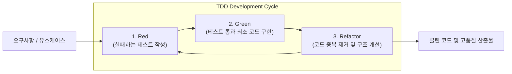

# TDD (Test-Driven Development, 테스트 주도 개발)

---

## I. 고품질 코드 생산과 결함 조기 예방을 위한 반복적 개발 방법론, TDD의 개요

* **정의**: 실제 코드를 작성하기 전에 실패하는 단위 테스트를 먼저 작성하고, 이를 통과하는 최소한의 코드를 구현한 뒤 리팩토링을 수행하는 반복 주기의 애자일([[Agile]]) 소프트웨어 개발 방식
* 소프트웨어 품질 확보, 결함 조기 발견(Shift-Left) 및 리팩토링을 통한 유지보수성 극대화 목적
* 특징: Red-Green-Refactor 3단계 사이클 반복, 높은 [[코드 커버리지]] 보장, 실행 가능한 명세서 역할

---

## II. TDD의 아키텍처 및 핵심 구성요소

### 가. TDD의 Red-Green-Refactor 사이클 및 동작 원리

* 구현하고자 하는 기능의 테스트 케이스를 먼저 작성하여 실패(Red) 상태를 확인하고, 테스트를 통과할 최소한의 코드 작성(Green) 후 중복 제거 및 리팩토링(Refactor)을 수행하는 구조

### 나. TDD의 핵심 기술 및 구성 요소

| 분류 | 요소기술(키워드) | 세부 설명 |
| --- | --- | --- |
| 개발 사이클 | Red-Green-Refactor | 테스트 실패 -> 성공 -> 코드 개선의 3단계 반복 주기 |
| 테스트 도구 | JUnit / PyTest / Jest | 언어별 [[단위 테스트]] 및 자동화 검증 [[프레임워크]] |
| 격리 기법 | Mock / Stub 객체 | 외부 의존성(DB, API 등)을 분리하여 독립적 테스트 수행 |
| 설계 원칙 | FIRST 원칙 | Fast(빠름), Isolated(고립), Repeatable(반복가능), Self-validating(자가검증), Timely(적시) |
| 품질 지표 | 코드 커버리지 (Coverage) | 테스트 코드가 실제 소스코드를 실행하는 비율 측정 (Line/Branch) |
| 자동화 연계 | CI/CD 파이프라인 연계 | 코드 푸시 시 자동으로 단위 테스트를 수행하여 품질 빌드 보장 |
| 리팩토링 | 코드 스멜 제거 | 중복 코드, 긴 메서드 등을 정비하여 설계 유연성 유지 |
| 최신 트렌드 | AI 기반 테스트 생성 | [[초거대 언어 모델|LLM]]을 활용한 단위 테스트 케이스 및 테스트 코드 자동 스캐폴딩 |

---

### III. 전통적 TDD vs AI 기반 지능형 TDD 비교 및 동향

| 비교 항목 | 전통적 TDD (Manual TDD) | AI 기반 지능형 TDD (GenAI TDD) |
| --- | --- | --- |
| **테스트 작성 주체** | 개발자가 수동으로 테스트 케이스 및 스텁 작성 | LLM(생성형 AI) 기반 단위 테스트 및 모의 객체 자동 생성 |
| **초기 진입 장벽** | 높은 러닝 커브와 테스트 코드 작성 시간 소요로 도입 부담 | 자연어 기반 시나리오를 테스트 코드로 즉시 변환하여 장벽 완화 |
| **품질 및 보완성** | 개발자 역량에 따라 엣지 케이스([[EDGE|Edge]] Case) 누락 가능 | AI가 예외 상황 및 누락된 테스트 케이스를 능동적으로 보완 |

* 최근 생성형 AI 기술의 발전과 함께, 개발자가 직접 작성하던 수동적 TDD 방식을 넘어 LLM이 테스트 케이스를 자동 제안하고 CI/CD와 결합하여 검증 자동화를 극대화하는 지능형 개발 체계로 진화 중

---

### 🔗 연관 토픽

- **소속 도메인**: [[00_소프트웨어공학_MOC|🏗️ 소프트웨어공학]]
- **세부 분류**: `2. 애자일(Agile) & 지속적 통합/배포(CI/CD)`
- **핵심 연관 토픽**:
  - [[단위 테스트]]
  - [[탐색적 테스트]]
  - [[소프트웨어 테스트 원리|테스트 원리]]
  - [[소프트웨어 테스트|소프트웨어 테스트 (Software Test)]]
  - [[Clean Architecture]]
