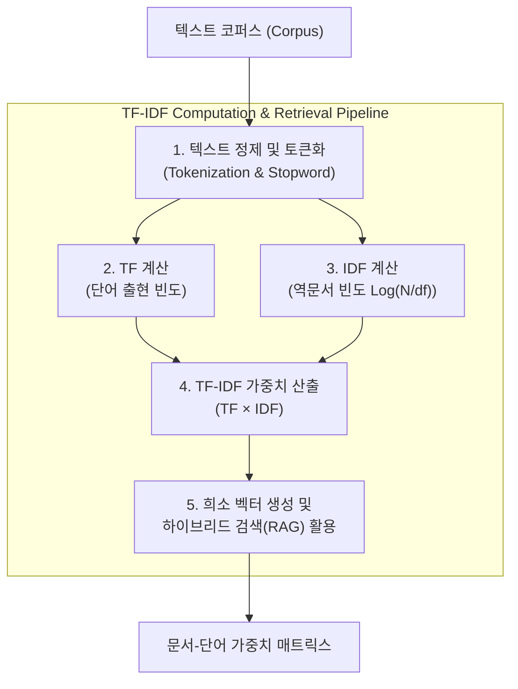

# TF-IDF (Term Frequency - Inverse Document Frequency)

---

## I. 문서 내 키워드 중요도 산정을 위한 통계적 가중치 모델, TF-IDF의 개요

* **정의**: 특정 문서 내 단어의 등장 빈도(TF)와 전체 문서 집합 내에서 해당 단어가 나타나는 문서의 비율의 역수(IDF)를 곱하여, 문서 집합 내에서 특정 단어가 가지는 상대적 중요도를 수치화하는 텍스트 마이닝 및 정보 검색(IR) 기법
* 불용어(Stopwords)의 영향력을 낮추고 문서의 핵심 특징을 나타내는 고유 키워드를 추출하기 위한 목적
* 특징: 통계적 빈도 기반 가중치 부여, 비정형 텍스트의 벡터화(Vectorization) 지원, 검색 엔진 및 텍스트 분류의 근간 모델

---

## II. TF-IDF의 개념도 및 핵심 기술 요소

### 가. TF-IDF 산정 프로세스 및 동작 원리

* 원본 텍스트를 토큰화한 후 개별 문서 내 빈도(TF)와 전체 문서에서의 희소성(IDF)을 산출하여 두 값을 곱한 최종 TF-IDF 가중치 벡터를 생성하는 구조

### 나. TF-IDF의 핵심 기술 및 구성 요소

| 분류 | 요소기술(키워드) | 세부 설명 |
| --- | --- | --- |
| 빈도 지표 | 단어 빈도 (TF, Term Frequency) | 특정 문서 내에서 특정 단어가 등장하는 횟수 (정규화 적용 가능) |
| 희소성 지표 | 역문서 빈도 (IDF, Inverse Document Frequency) | 전체 문서 수($N$)를 해당 단어가 포함된 문서 수($df$)로 나눈 값의 로그($\log(N/df)$) |
| 가중치 산출 | TF-IDF 결합 가중치 | TF와 IDF 값을 곱하여 자주 나오지만 변별력이 낮은 단어의 가중치 하향 조정 |
| 벡터 표현 | 희소 벡터 (Sparse Vector) | 고차원의 단어 사전 기반으로 문서 내 단어의 중요도 점수를 배열 형태로 표현 |
| 발전 [[알고리즘]] | BM25 (Best Matching 25) | TF의 포화(Saturation) 문제와 문서 길이 정규화를 개선한 확장 검색 모델 |
| 검색 결합 | 하이브리드 검색 (Hybrid Search) | [[딥러닝]] 임베딩(Dense)과 TF-IDF/BM25(Sparse)를 결합하여 검색 정확도 극대화 |
| 활용 영역 | 키워드 추출 및 문서 분류 | 텍스트 요약, [[유사도]] 측정, 문서 군집화 및 스팸 필터링 등에 활용 |
| 구현 도구 | Scikit-learn / Lucene | Python의 scikit-learn TfidfVectorizer 및 아파치 루신(Lucene) 기반 인덱싱 |

---

## III. 전통적 Sparse Retrieval(TF-IDF) vs 최신 Dense Retrieval(Embedding) 비교 및 동향

| 비교 항목 | 전통적 Sparse Retrieval (TF-IDF / BM25) | 최신 Dense Retrieval (Vector Embedding) |
| --- | --- | --- |
| **작동 원리** | 정확한 단어 매칭 및 통계적 빈도 기반 가중치 산정 | 신경망(Transformer 등) 기반 의미(Semantic) 벡터 공간 매칭 |
| **장점** | 고유명사, 전문 용어 등 정확한 키워드 매칭 검색에 매우 강함 | 동의어, 유의어 및 문맥적 의미 파악 능력이 우수함 |
| **한계점** | 어휘 불일치(Vocabulary Mismatch) 문제 및 의미 이해 취약 | 희귀 단어 매칭 정확도 저조 및 고성능 연산 비용 소요 |
| **최신 트렌드** | RAG(검색증강생성) 시스템에서 두 방식의 장점을 결합한 **하이브리드 검색(Hybrid Search)** 체계로 표준화 |  |

* 최근 생성형 AI 및 [[초거대 언어 모델|LLM]] 기반 RAG 환경에서는 순수 통계적 방식의 한계를 극복하기 위해, 전통적 TF-IDF/BM25(Sparse)와 딥러닝 임베딩(Dense)을 상호 보완하여 검색 성능을 극대화하는 **하이브리드 검색 아키텍처**로 진화 중

---

### 🔗 연관 토픽

- **소속 도메인**: [[00_인공지능_MOC|🤖 인공지능]]
- **세부 분류**: `1. 수학 · 통계학 & 데이터 전처리`
- **핵심 연관 토픽**:
  - [[유사도|유사도(Similarity)]]
  - [[자연어처리|자연어처리 (NLP)]]
  - [[표현 학습]]
  - [[딥러닝]]
  - [[초거대 언어 모델|초거대 언어 모델(Large Language Model)]]
