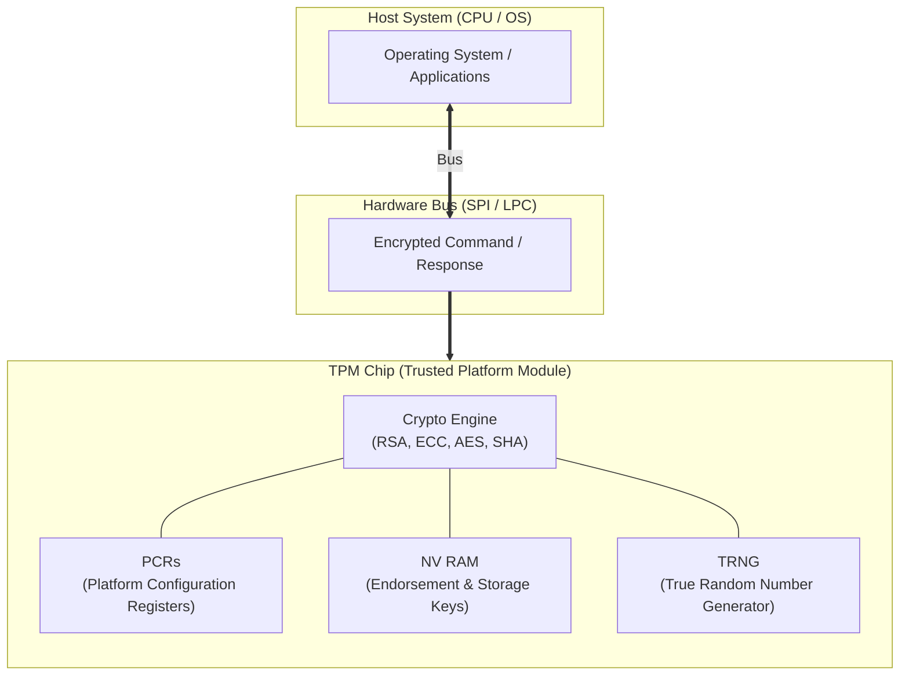

# TPM (Trusted Platform Module)

---

## I. 하드웨어 기반 무결성 검증 및 암호 키 보호를 위한 보안 프로세서, TPM의 개요

* **정의**: 국제 표준화 기구(ISO/IEC 11889) 및 TCG(Trusted Computing Group)에서 제정한 하드웨어 기반의 [[암호화]] 크립토 프로세서로, 시스템의 부팅 및 운영 단계에서 무결성을 검증하고 암호 키를 안전하게 보관하는 보안 칩
* 펌웨어 위·변조 방지, 루트 오브 트러스트(Root of Trust) 제공 및 제어권 탈취 공격(Ransomware, Bootkit) 차단 목적
* 특징: 물리적 독립 하드웨어 기반 격리, PCR(Platform Configuration Registers)을 이용한 상태 측정, 안전한 키 생성 및 저장

---

## II. TPM의 아키텍처 및 핵심 기술 요소

### 가. TPM의 하드웨어 아키텍처 및 동작 원리

* 호스트 시스템이 SPI/LPC 버스를 통해 TPM과 암호화된 명령을 교환하며, TPM 내부의 암호 엔진과 PCR 및 NV RAM을 통해 [[무결성]] 측정 및 키 관리를 수행하는 구조

### 나. TPM의 핵심 기술 및 구성 요소

| 분류 | 요소기술(키워드) | 세부 설명 |
| --- | --- | --- |
| 신뢰 기점 | 루트 오브 트러스트 (Root of Trust) | 시스템 부팅 시 하드웨어 수준에서 신뢰할 수 있는 최초의 실행 및 검증 지점 제공 |
| 무결성 검증 | PCR (Platform Configuration Registers) | 부팅 단계별(BIOS, 부트로더, OS) 시스템 상태 및 해시값을 누적 저장하는 레지스터 |
| 암호 연산 | 암호화 코프로세서 (Crypto Engine) | [[RSA (Rivest Shamir Adleman)|RSA]], [[ECC]], [[AES]], SHA 등 고속 암/복호화 및 해시 연산을 하드웨어 가속으로 수행 |
| 키 관리 | EK / SRK / AIK | Endorsement Key(칩 고유 식별), Storage Root Key(키 관리), Attestation Key(인증) 관리 |
| 난수 생성 | TRNG (True Random Number Generator) | 물리적 엔트로피 소스를 활용하여 예측 불가능한 암호학적 난수 생성 |
| 안전 저장소 | 비휘발성 메모리 (NV RAM) | 암호화 키, 플랫폼 자격 증명 및 정책 데이터를 안전하게 보관하는 내부 저장 공간 |
| [[가상화]] 구현 | fTPM (Firmware TPM) | 별도의 물리 칩 없이 [[CPU]]의 펌웨어 영역 내에서 TPM 기능을 가상화하여 구현 (AMD fTPM 등) |
| 최신 트렌드 | 포스트 퀀텀(PQC) TPM 준비 | 양자 컴퓨터의 암호 체계 해체 위협에 대응하기 위한 격자 기반 PQC [[알고리즘]] 수용 진화 |

---

### III. 전용 하드웨어 TPM vs 펌웨어 TPM(fTPM) 비교 및 동향

| 비교 항목 | 전용 하드웨어 TPM (dTPM) | 펌웨어 TPM (fTPM) | TEE / Secure Element (SE) |
| --- | --- | --- | --- |
| **구현 방식** | 메인보드 상에 장착된 독립된 물리 보안 칩 | CPU 내부 펌웨어 및 하이퍼바이저 영역에서 구동 | SoC 내부의 격리된 하드웨어 보안 영역 (TrustZone 등) |
| **보안 강도** | 물리적 공격(Side-channel) 방어 가능 (최상) | 물리적 칩 탈취 시 상대적으로 취약할 수 있음 | 모바일 환경에 최적화된 고성능 격리 제공 |
| **적용 영역** | 엔터프라이즈 서버, 고보안 PC, 산업용 장비 | 일반 소비자용 PC (Windows 11 필수 요건 충족) | 스마트폰, 결제 단말기, 임베디드 기기 |

* 최근 제어 권한 탈취 및 [[랜섬웨어]] 공격이 고도화됨에 따라, Windows 11 등 OS 표준 사양으로서의 TPM 보급이 일반화되었으며, 향후 [[양자 암호]] 체계 전환에 대비한 **PQC(Post-Quantum Cryptography) 기반 하드웨어 보안 모듈**로의 고도화가 가속화되고 있음

---

### 🔗 연관 토픽

- **소속 도메인**: [[00_보안_MOC|🛡️ 보안]]
- **세부 분류**: `1. 정보보안 원칙 & 거버넌스 · 인증`
- **핵심 연관 토픽**:
  - [[암호화|암호화 (Encryption)]]
  - [[RSA (Rivest Shamir Adleman)]]
  - [[AES]]
  - [[ECC|ECC(Elliptic Curve Cryptography)]]
  - [[양자 암호|양자 암호(Quantum Cryptography)]]
